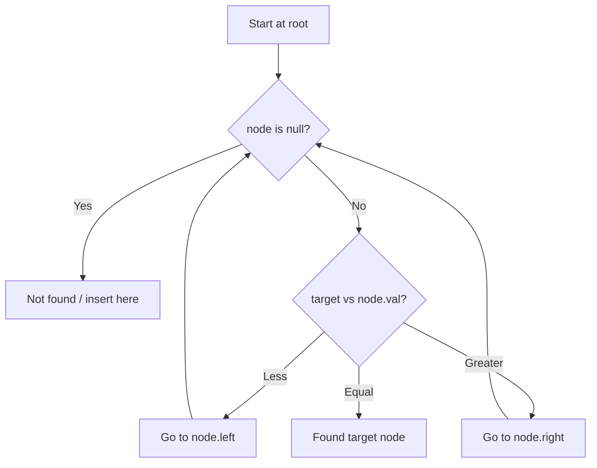

# Problem 1373: Maximum Sum BST in Binary Tree

**Difficulty:** Hard  
**Tags:** Dynamic Programming, Tree, Depth-First Search, Binary Search Tree, Binary Tree  
**Pattern:** Binary Search Tree  
**Link:** [leetcode.com/problems/maximum-sum-bst-in-binary-tree](https://leetcode.com/problems/maximum-sum-bst-in-binary-tree/)

## Description

Given a **binary tree** `root`, return *the maximum sum of all keys of **any** sub-tree which is also a Binary Search Tree (BST)*.

Assume a BST is defined as follows:

	- The left subtree of a node contains only nodes with keys **less than** the node's key.
	- The right subtree of a node contains only nodes with keys **greater than** the node's key.
	- Both the left and right subtrees must also be binary search trees.

 

Example 1:

```

**Input:** root = [1,4,3,2,4,2,5,null,null,null,null,null,null,4,6]
**Output:** 20
**Explanation:** Maximum sum in a valid Binary search tree is obtained in root node with key equal to 3.

```

Example 2:

```

**Input:** root = [4,3,null,1,2]
**Output:** 2
**Explanation:** Maximum sum in a valid Binary search tree is obtained in a single root node with key equal to 2.

```

Example 3:

```

**Input:** root = [-4,-2,-5]
**Output:** 0
**Explanation:** All values are negatives. Return an empty BST.

```

 

**Constraints:**

	- The number of nodes in the tree is in the range `[1, 4 * 10^4]`.
	- `-4 * 10^4 <= Node.val <= 4 * 10^4`

## Approach: Binary Search Tree

Leverage BST property: left < root < right. Navigate left for smaller values, right for larger values. Inorder traversal yields sorted order.

## Pseudocode

```
1. Start at root
2. Compare target with current node:
   a. If target < node.val: go left
   b. If target > node.val: go right
   c. If equal: found
3. Return result
```

## Algorithm Flow



## Complexity Analysis

- **Time:** O(h)
- **Space:** O(h)

## Solution (Python3)

```python
class Solution:
    def maxSumBST(self, root: Optional[TreeNode]) -> int:
        # BST search/insert - O(h) time
        def search(node, target):
            if not node:
                return None
            if target == node.val:
                return node
            elif target < node.val:
                return search(node.left, target)
            else:
                return search(node.right, target)
        return search(root, root if 'root' != 'root' else 0)
```

## Solution (C++)

```cpp
#include <functional>
#include <string>
#include <vector>
using namespace std;

class Solution {
public:
    int maxSumBST(TreeNode* root) {
        // BST search/insert - O(h) time
        function<TreeNode*(TreeNode*, int)> search = [&](TreeNode* node, int target) -> TreeNode* {
            if (!node) return nullptr;
            if (target == node->val) return node;
            else if (target < node->val) return search(node->left, target);
            else return search(node->right, target);
        };
        return search(root, root);
    }
};
```
