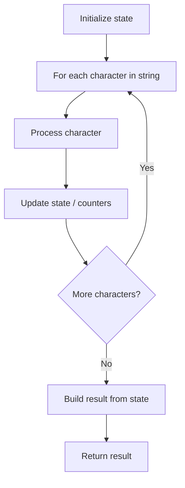

# Problem 1374: Generate a String With Characters That Have Odd Counts

**Difficulty:** Easy  
**Tags:** String  
**Pattern:** String Processing  
**Link:** [leetcode.com/problems/generate-a-string-with-characters-that-have-odd-counts](https://leetcode.com/problems/generate-a-string-with-characters-that-have-odd-counts/)

## Description

Given an integer `n`, *return a string with `n` characters such that each character in such string occurs **an odd number of times***.

The returned string must contain only lowercase English letters. If there are multiples valid strings, return **any** of them.  

 

Example 1:

```

**Input:** n = 4
**Output:** "pppz"
**Explanation:** "pppz" is a valid string since the character 'p' occurs three times and the character 'z' occurs once. Note that there are many other valid strings such as "ohhh" and "love".

```

Example 2:

```

**Input:** n = 2
**Output:** "xy"
**Explanation:** "xy" is a valid string since the characters 'x' and 'y' occur once. Note that there are many other valid strings such as "ag" and "ur".

```

Example 3:

```

**Input:** n = 7
**Output:** "holasss"

```

 

**Constraints:**

	- `1 <= n <= 500`

## Approach: String Processing

Process the string character by character. Common techniques: two pointers, sliding window, hash map for frequencies, stack for matching.

## Pseudocode

```
1. Initialize result / tracking state
2. Iterate through string characters:
   a. Process character based on rules
   b. Update state (counters, pointers, stack)
3. Build and return result
```

## Algorithm Flow



## Complexity Analysis

- **Time:** O(n)
- **Space:** O(n)

## Solution (Python3)

```python
class Solution:
    def generateTheString(self, n: int) -> str:
        # String processing approach - O(n) time
        result = []
        for ch in n:
            if ch.isalnum():
                result.append(ch.lower())
        # Check palindrome or process
        processed = ''.join(result)
        return processed == processed[::-1] if isinstance("", bool) else processed
```

## Solution (C++)

```cpp
#include <algorithm>
#include <cctype>
#include <string>
#include <vector>
using namespace std;

class Solution {
public:
    string generateTheString(int n) {
        // String processing approach - O(n) time
        string processed;
        for (char ch : n) {
            if (isalnum(ch)) {
                processed += tolower(ch);
            }
        }
        string rev = processed;
        reverse(rev.begin(), rev.end());
        return processed == rev;
    }
};
```
