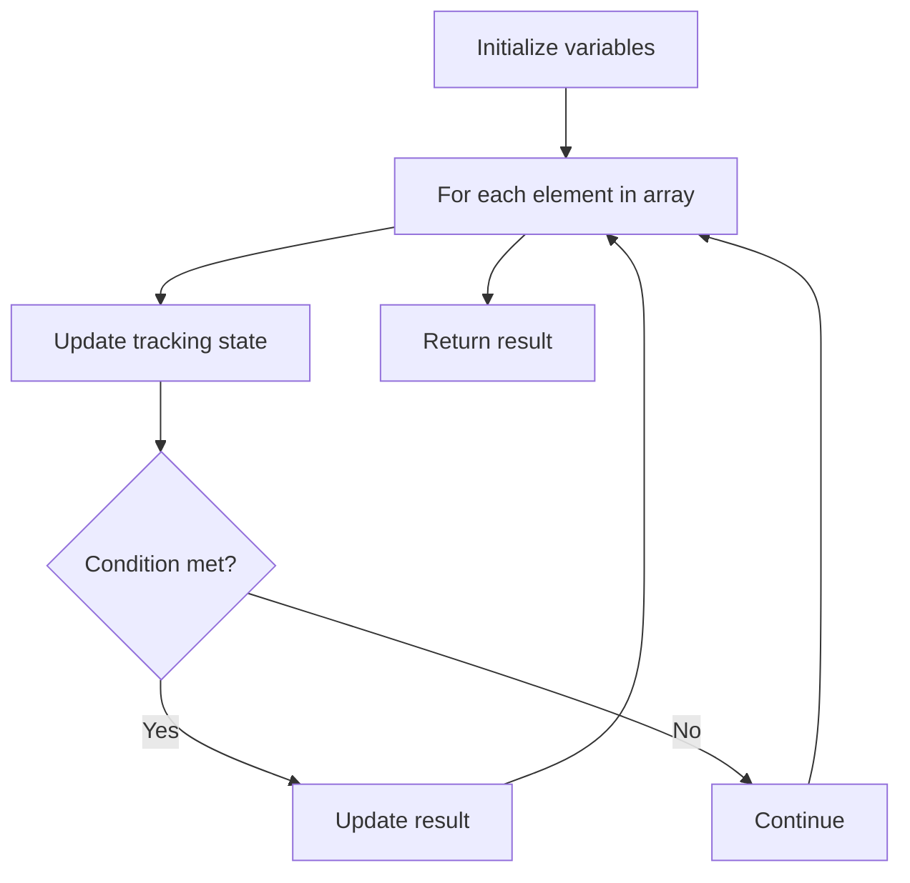

# Problem 1375: Number of Times Binary String Is Prefix-Aligned

**Difficulty:** Medium  
**Tags:** Array  
**Pattern:** Array Processing  
**Link:** [leetcode.com/problems/number-of-times-binary-string-is-prefix-aligned](https://leetcode.com/problems/number-of-times-binary-string-is-prefix-aligned/)

## Description

You have a **1-indexed** binary string of length `n` where all the bits are `0` initially. We will flip all the bits of this binary string (i.e., change them from `0` to `1`) one by one. You are given a **1-indexed** integer array `flips` where `flips[i]` indicates that the bit at index `flips[i]` will be flipped in the `i^th` step.

A binary string is **prefix-aligned** if, after the `i^th` step, all the bits in the **inclusive** range `[1, i]` are ones and all the other bits are zeros.

Return *the number of times the binary string is **prefix-aligned** during the flipping process*.

 

Example 1:

```

**Input:** flips = [3,2,4,1,5]
**Output:** 2
**Explanation:** The binary string is initially "00000".
After applying step 1: The string becomes "00100", which is not prefix-aligned.
After applying step 2: The string becomes "01100", which is not prefix-aligned.
After applying step 3: The string becomes "01110", which is not prefix-aligned.
After applying step 4: The string becomes "11110", which is prefix-aligned.
After applying step 5: The string becomes "11111", which is prefix-aligned.
We can see that the string was prefix-aligned 2 times, so we return 2.

```

Example 2:

```

**Input:** flips = [4,1,2,3]
**Output:** 1
**Explanation:** The binary string is initially "0000".
After applying step 1: The string becomes "0001", which is not prefix-aligned.
After applying step 2: The string becomes "1001", which is not prefix-aligned.
After applying step 3: The string becomes "1101", which is not prefix-aligned.
After applying step 4: The string becomes "1111", which is prefix-aligned.
We can see that the string was prefix-aligned 1 time, so we return 1.

```

 

**Constraints:**

	- `n == flips.length`
	- `1 <= n <= 5 * 10^4`
	- `flips` is a permutation of the integers in the range `[1, n]`.

## Approach: Array Processing

Process the array with a linear scan, tracking state variables. Look for patterns: running maximum/minimum, counting, or transformations.

## Pseudocode

```
1. Initialize tracking variables
2. Iterate through array:
   a. Update tracking state
   b. Check conditions
   c. Update result
3. Return result
```

## Algorithm Flow



## Complexity Analysis

- **Time:** O(n)
- **Space:** O(1)

## Solution (Python3)

```python
class Solution:
    def numTimesAllBlue(self, flips: List[int]) -> int:
        # Array processing - O(n) time
        result = 0
        for i in range(len(flips)):
            # Process element
            pass
        return result
```

## Solution (C++)

```cpp
#include <string>
#include <vector>
using namespace std;

class Solution {
public:
    int numTimesAllBlue(vector<int>& flips) {
        // Array processing - O(n) time
        for (int i = 0; i < (int)flips.size(); i++) {
            // Process element
        }
        return 0;
    }
};
```
