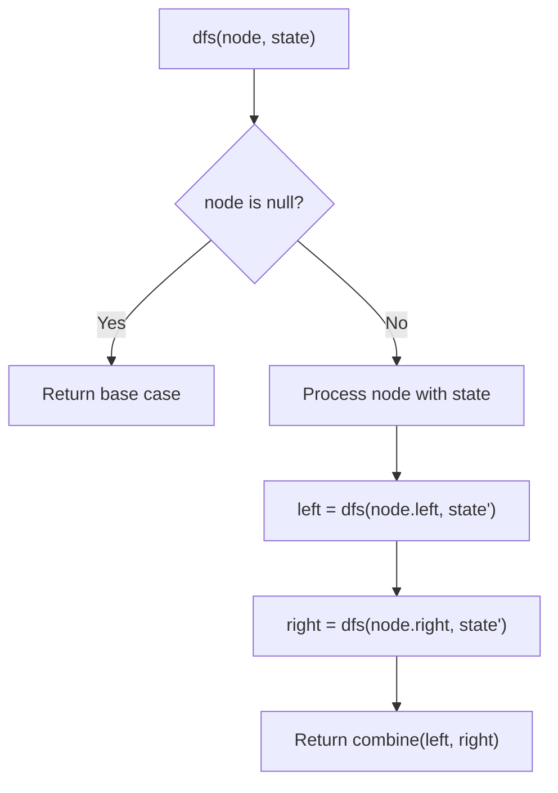
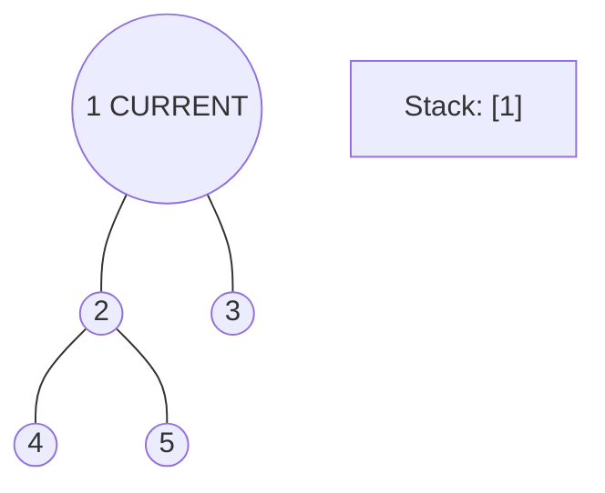
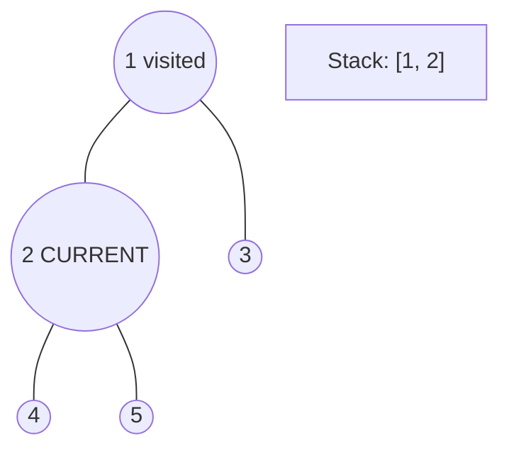
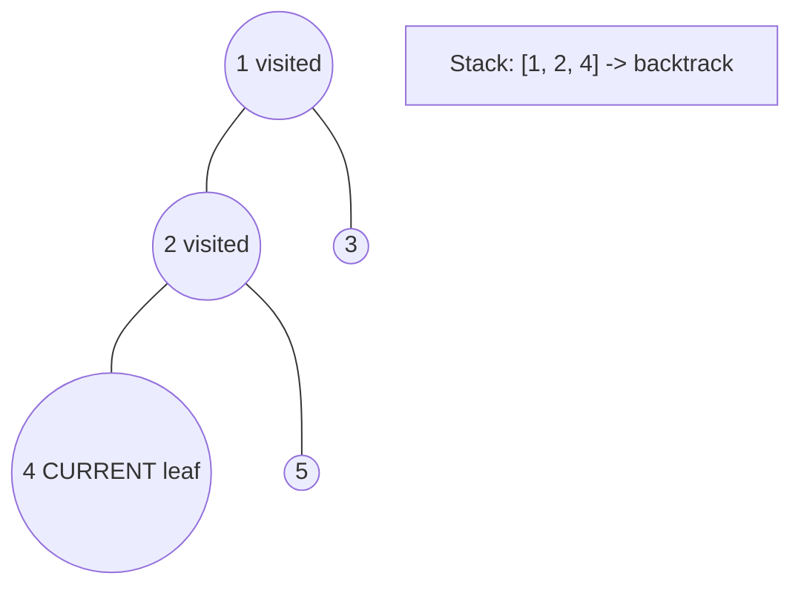
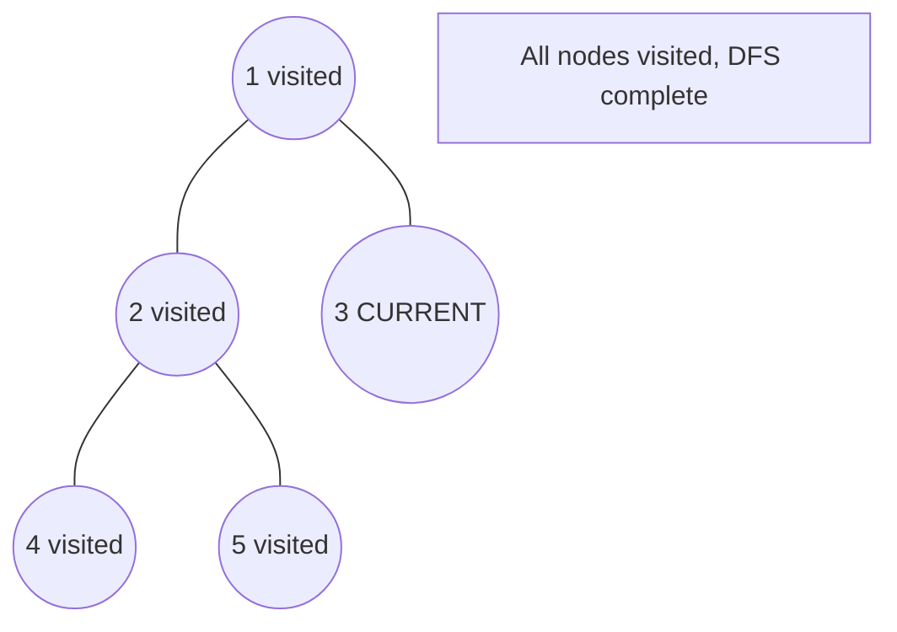

# Problem 1376: Time Needed to Inform All Employees

**Difficulty:** Medium  
**Tags:** Tree, Depth-First Search, Breadth-First Search  
**Pattern:** DFS Tree Traversal  
**Link:** [leetcode.com/problems/time-needed-to-inform-all-employees](https://leetcode.com/problems/time-needed-to-inform-all-employees/)

## Description

A company has `n` employees with a unique ID for each employee from `0` to `n - 1`. The head of the company is the one with `headID`.

Each employee has one direct manager given in the `manager` array where `manager[i]` is the direct manager of the `i-th` employee, `manager[headID] = -1`. Also, it is guaranteed that the subordination relationships have a tree structure.

The head of the company wants to inform all the company employees of an urgent piece of news. He will inform his direct subordinates, and they will inform their subordinates, and so on until all employees know about the urgent news.

The `i-th` employee needs `informTime[i]` minutes to inform all of his direct subordinates (i.e., After informTime[i] minutes, all his direct subordinates can start spreading the news).

Return *the number of minutes* needed to inform all the employees about the urgent news.

 

Example 1:

```

**Input:** n = 1, headID = 0, manager = [-1], informTime = [0]
**Output:** 0
**Explanation:** The head of the company is the only employee in the company.

```

Example 2:

```

**Input:** n = 6, headID = 2, manager = [2,2,-1,2,2,2], informTime = [0,0,1,0,0,0]
**Output:** 1
**Explanation:** The head of the company with id = 2 is the direct manager of all the employees in the company and needs 1 minute to inform them all.
The tree structure of the employees in the company is shown.

```

 

**Constraints:**

	- `1 <= n <= 10^5`
	- `0 <= headID < n`
	- `manager.length == n`
	- `0 <= manager[i] < n`
	- `manager[headID] == -1`
	- `informTime.length == n`
	- `0 <= informTime[i] <= 1000`
	- `informTime[i] == 0` if employee `i` has no subordinates.
	- It is **guaranteed** that all the employees can be informed.

## Approach: DFS Tree Traversal

Perform depth-first search on the tree. Recurse on left and right subtrees, combining results bottom-up. Track state (path, depth, sum) during traversal.

## Pseudocode

```
1. Define dfs(node, state):
   a. Base case: if null, return default
   b. Process node with current state
   c. left_result = dfs(node.left, updated_state)
   d. right_result = dfs(node.right, updated_state)
   e. Return combine(left_result, right_result)
2. Return dfs(root, initial_state)
```

## Algorithm Flow



## Visual State Transitions

**DFS Tree Traversal Step-by-Step:**

**Frame 1: Start at root**


**Frame 2: Go left - visit node 2**


**Frame 3: Go left - visit node 4 (leaf)**


**Frame 4: Backtrack, visit node 5, then node 3**



## Complexity Analysis

- **Time:** O(n)
- **Space:** O(h)

## Solution (Python3)

```python
class Solution:
    def numOfMinutes(self, n: int, headID: int, manager: List[int], informTime: List[int]) -> int:
        # DFS on binary tree - O(n) time, O(h) space
        def dfs(node):
            if not node:
                return 0
            left = dfs(node.left)
            right = dfs(node.right)
            return 1 + max(left, right)
        
        result = dfs(n)
        return result
```

## Solution (C++)

```cpp
#include <algorithm>
#include <functional>
#include <string>
#include <vector>
using namespace std;

class Solution {
public:
    int numOfMinutes(int n, int headID, vector<int>& manager, vector<int>& informTime) {
        // DFS on binary tree - O(n) time, O(h) space
        function<int(TreeNode*)> dfs = [&](TreeNode* node) -> int {
            if (!node) return 0;
            int left = dfs(node->left);
            int right = dfs(node->right);
            return 1 + max(left, right);
        };
        return dfs(n);
    }
};
```
