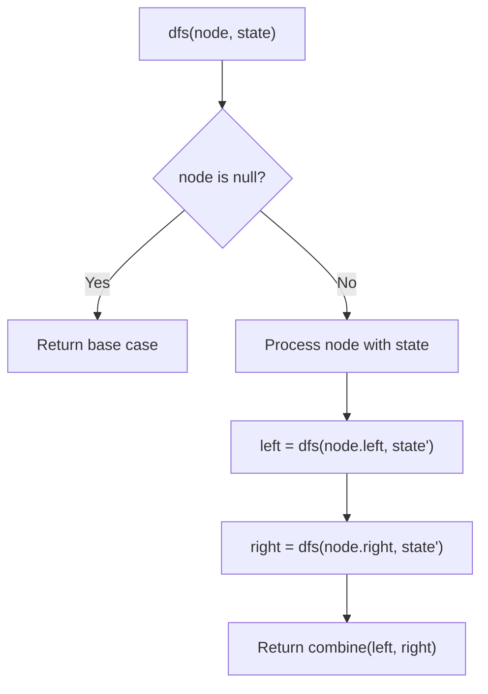
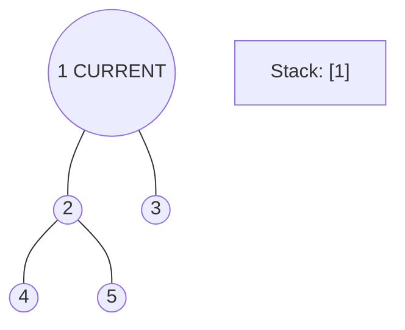
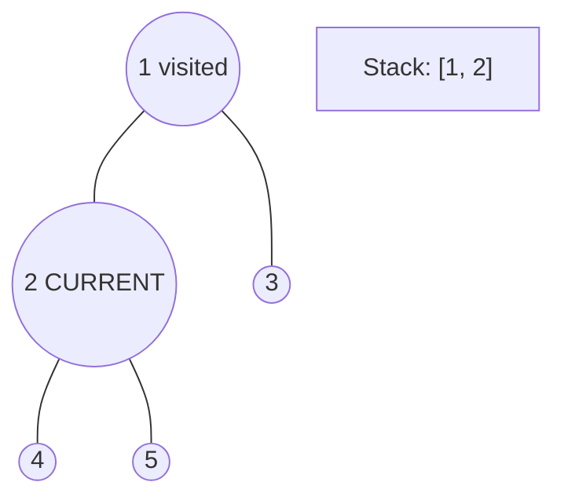
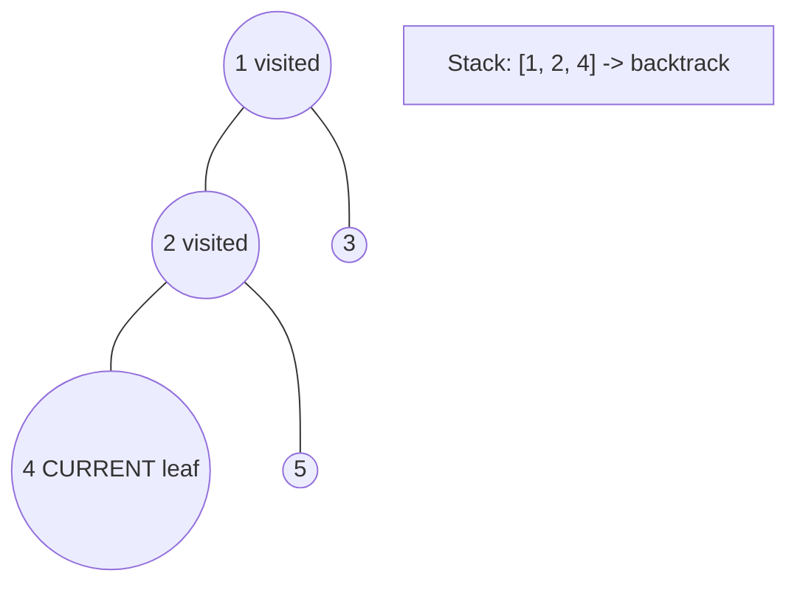
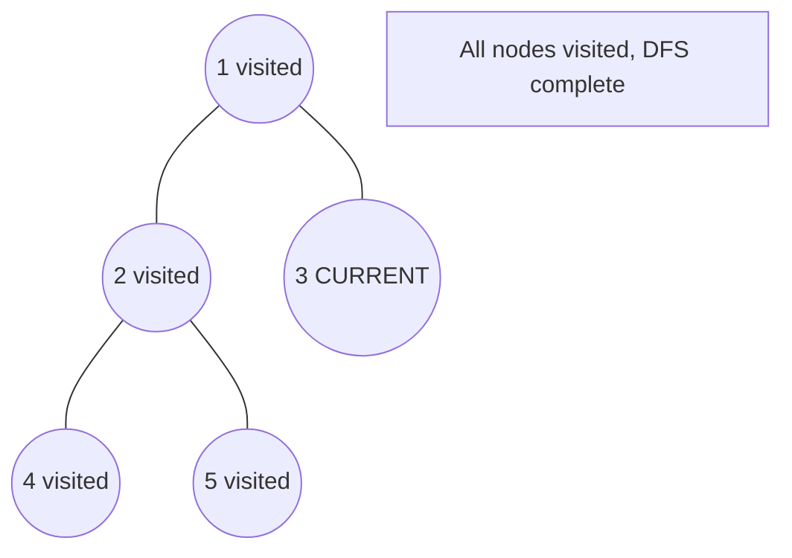

# Problem 1377: Frog Position After T Seconds

**Difficulty:** Hard  
**Tags:** Tree, Depth-First Search, Breadth-First Search, Graph Theory  
**Pattern:** DFS Tree Traversal  
**Link:** [leetcode.com/problems/frog-position-after-t-seconds](https://leetcode.com/problems/frog-position-after-t-seconds/)

## Description

Given an undirected tree consisting of `n` vertices numbered from `1` to `n`. A frog starts jumping from **vertex 1**. In one second, the frog jumps from its current vertex to another **unvisited** vertex if they are directly connected. The frog can not jump back to a visited vertex. In case the frog can jump to several vertices, it jumps randomly to one of them with the same probability. Otherwise, when the frog can not jump to any unvisited vertex, it jumps forever on the same vertex.

The edges of the undirected tree are given in the array `edges`, where `edges[i] = [ai, bi]` means that exists an edge connecting the vertices `ai` and `bi`.

*Return the probability that after `t` seconds the frog is on the vertex `target`. *Answers within `10^-5` of the actual answer will be accepted.

 

Example 1:

```

**Input:** n = 7, edges = [[1,2],[1,3],[1,7],[2,4],[2,6],[3,5]], t = 2, target = 4
**Output:** 0.16666666666666666 
**Explanation:** The figure above shows the given graph. The frog starts at vertex 1, jumping with 1/3 probability to the vertex 2 after **second 1** and then jumping with 1/2 probability to vertex 4 after **second 2**. Thus the probability for the frog is on the vertex 4 after 2 seconds is 1/3 * 1/2 = 1/6 = 0.16666666666666666. 

```

Example 2:

****

```

**Input:** n = 7, edges = [[1,2],[1,3],[1,7],[2,4],[2,6],[3,5]], t = 1, target = 7
**Output:** 0.3333333333333333
**Explanation: **The figure above shows the given graph. The frog starts at vertex 1, jumping with 1/3 = 0.3333333333333333 probability to the vertex 7 after **second 1**. 

```

 

**Constraints:**

	- `1 <= n <= 100`
	- `edges.length == n - 1`
	- `edges[i].length == 2`
	- `1 <= ai, bi <= n`
	- `1 <= t <= 50`
	- `1 <= target <= n`

## Approach: DFS Tree Traversal

Perform depth-first search on the tree. Recurse on left and right subtrees, combining results bottom-up. Track state (path, depth, sum) during traversal.

## Pseudocode

```
1. Define dfs(node, state):
   a. Base case: if null, return default
   b. Process node with current state
   c. left_result = dfs(node.left, updated_state)
   d. right_result = dfs(node.right, updated_state)
   e. Return combine(left_result, right_result)
2. Return dfs(root, initial_state)
```

## Algorithm Flow



## Visual State Transitions

**DFS Tree Traversal Step-by-Step:**

**Frame 1: Start at root**


**Frame 2: Go left - visit node 2**


**Frame 3: Go left - visit node 4 (leaf)**


**Frame 4: Backtrack, visit node 5, then node 3**



## Complexity Analysis

- **Time:** O(n)
- **Space:** O(h)

## Solution (Python3)

```python
class Solution:
    def frogPosition(self, n: int, edges: List[List[int]], t: int, target: int) -> float:
        # DFS on binary tree - O(n) time, O(h) space
        def dfs(node):
            if not node:
                return 0
            left = dfs(node.left)
            right = dfs(node.right)
            return 1 + max(left, right)
        
        result = dfs(n)
        return result
```

## Solution (C++)

```cpp
#include <algorithm>
#include <functional>
#include <string>
#include <vector>
using namespace std;

class Solution {
public:
    double frogPosition(int n, vector<vector<int>>& edges, int t, int target) {
        // DFS on binary tree - O(n) time, O(h) space
        function<int(TreeNode*)> dfs = [&](TreeNode* node) -> int {
            if (!node) return 0;
            int left = dfs(node->left);
            int right = dfs(node->right);
            return 1 + max(left, right);
        };
        return dfs(n);
    }
};
```
