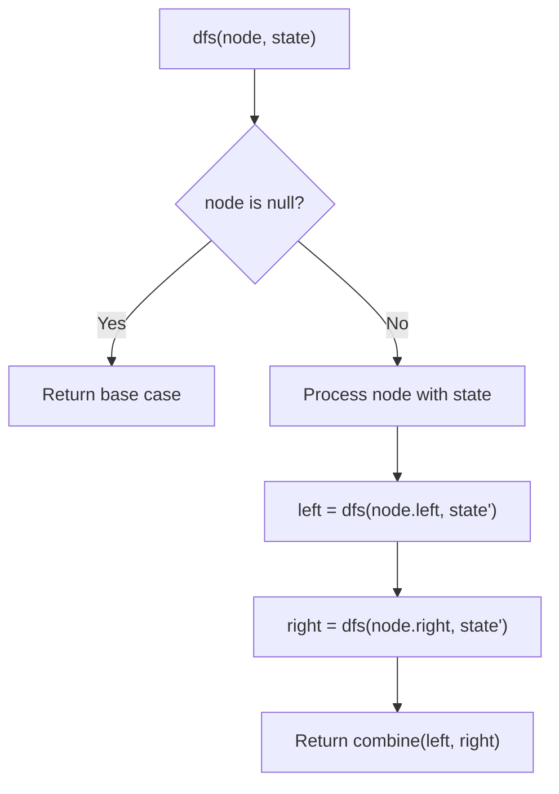
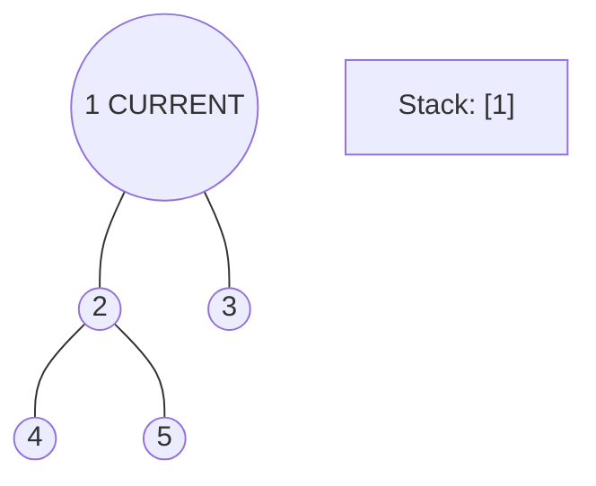
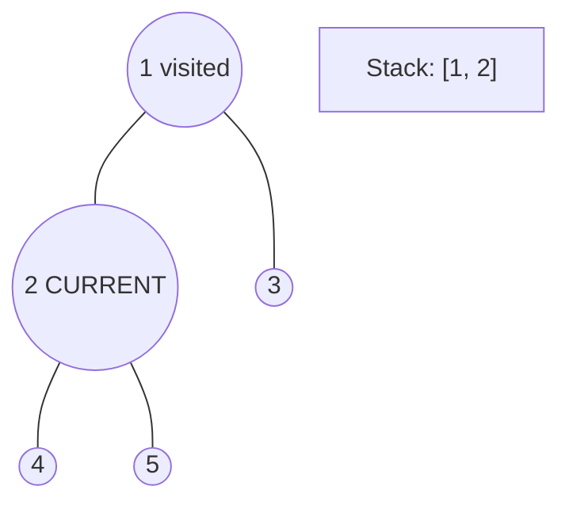
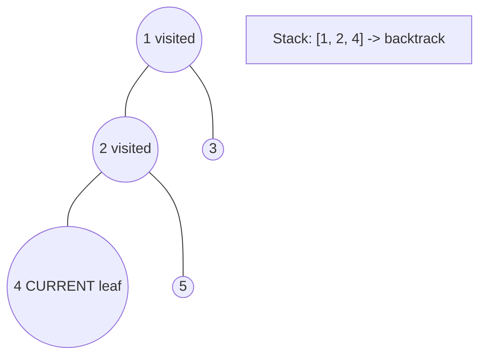
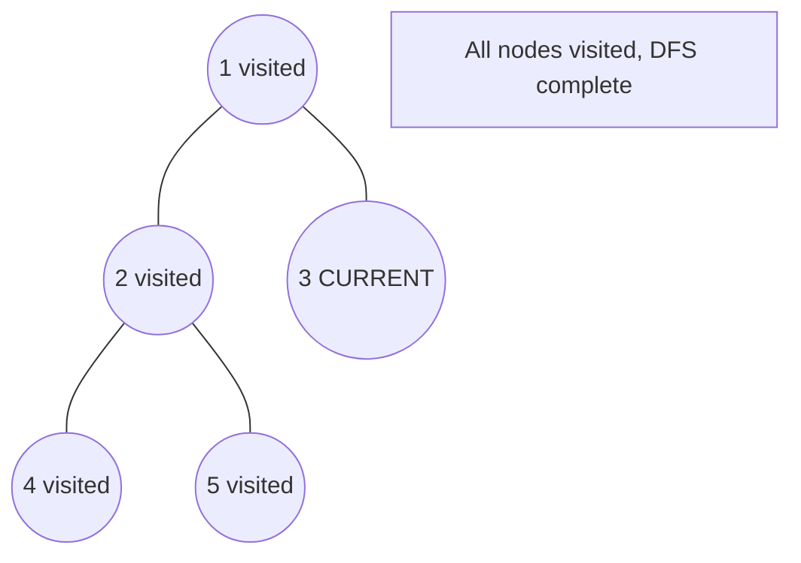

# Problem 1379: Find a Corresponding Node of a Binary Tree in a Clone of That Tree

**Difficulty:** Easy  
**Tags:** Tree, Depth-First Search, Breadth-First Search, Binary Tree  
**Pattern:** DFS Tree Traversal  
**Link:** [leetcode.com/problems/find-a-corresponding-node-of-a-binary-tree-in-a-clone-of-that-tree](https://leetcode.com/problems/find-a-corresponding-node-of-a-binary-tree-in-a-clone-of-that-tree/)

## Description

Given two binary trees `original` and `cloned` and given a reference to a node `target` in the original tree.

The `cloned` tree is a **copy of** the `original` tree.

Return *a reference to the same node* in the `cloned` tree.

**Note** that you are **not allowed** to change any of the two trees or the `target` node and the answer **must be** a reference to a node in the `cloned` tree.

 

Example 1:

```

**Input:** tree = [7,4,3,null,null,6,19], target = 3
**Output:** 3
**Explanation:** In all examples the original and cloned trees are shown. The target node is a green node from the original tree. The answer is the yellow node from the cloned tree.

```

Example 2:

```

**Input:** tree = [7], target =  7
**Output:** 7

```

Example 3:

```

**Input:** tree = [8,null,6,null,5,null,4,null,3,null,2,null,1], target = 4
**Output:** 4

```

 

**Constraints:**

	- The number of nodes in the `tree` is in the range `[1, 10^4]`.
	- The values of the nodes of the `tree` are unique.
	- `target` node is a node from the `original` tree and is not `null`.

 

**Follow up:** Could you solve the problem if repeated values on the tree are allowed?

## Approach: DFS Tree Traversal

Perform depth-first search on the tree. Recurse on left and right subtrees, combining results bottom-up. Track state (path, depth, sum) during traversal.

## Pseudocode

```
1. Define dfs(node, state):
   a. Base case: if null, return default
   b. Process node with current state
   c. left_result = dfs(node.left, updated_state)
   d. right_result = dfs(node.right, updated_state)
   e. Return combine(left_result, right_result)
2. Return dfs(root, initial_state)
```

## Algorithm Flow



## Visual State Transitions

**DFS Tree Traversal Step-by-Step:**

**Frame 1: Start at root**


**Frame 2: Go left - visit node 2**


**Frame 3: Go left - visit node 4 (leaf)**


**Frame 4: Backtrack, visit node 5, then node 3**



## Complexity Analysis

- **Time:** O(n)
- **Space:** O(h)

## Solution (Python3)

```python
class Solution:
    def getTargetCopy(self, original: TreeNode, cloned: TreeNode, target: TreeNode) -> TreeNode:
        # DFS on binary tree - O(n) time, O(h) space
        def dfs(node):
            if not node:
                return 0
            left = dfs(node.left)
            right = dfs(node.right)
            return 1 + max(left, right)
        
        result = dfs(original)
        return result
```

## Solution (C++)

```cpp
#include <algorithm>
#include <functional>
#include <string>
#include <vector>
using namespace std;

class Solution {
public:
    TreeNode* getTargetCopy(TreeNode* original, TreeNode* cloned, TreeNode* target) {
        // DFS on binary tree - O(n) time, O(h) space
        function<int(TreeNode*)> dfs = [&](TreeNode* node) -> int {
            if (!node) return 0;
            int left = dfs(node->left);
            int right = dfs(node->right);
            return 1 + max(left, right);
        };
        return dfs(original);
    }
};
```
