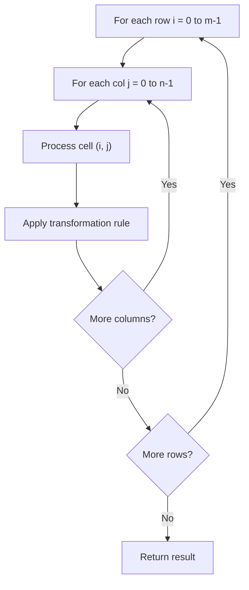

# Problem 1380: Lucky Numbers in a Matrix

**Difficulty:** Easy  
**Tags:** Array, Matrix  
**Pattern:** Matrix / 2D Array  
**Link:** [leetcode.com/problems/lucky-numbers-in-a-matrix](https://leetcode.com/problems/lucky-numbers-in-a-matrix/)

## Description

Given an `m x n` matrix of **distinct **numbers, return *all **lucky numbers** in the matrix in **any **order*.

A **lucky number** is an element of the matrix such that it is the minimum element in its row and maximum in its column.

 

Example 1:

```

**Input:** matrix = [[3,7,8],[9,11,13],[15,16,17]]
**Output:** [15]
**Explanation:** 15 is the only lucky number since it is the minimum in its row and the maximum in its column.

```

Example 2:

```

**Input:** matrix = [[1,10,4,2],[9,3,8,7],[15,16,17,12]]
**Output:** [12]
**Explanation:** 12 is the only lucky number since it is the minimum in its row and the maximum in its column.

```

Example 3:

```

**Input:** matrix = [[7,8],[1,2]]
**Output:** [7]
**Explanation:** 7 is the only lucky number since it is the minimum in its row and the maximum in its column.

```

 

**Constraints:**

	- `m == mat.length`
	- `n == mat[i].length`
	- `1 <= n, m <= 50`
	- `1 <= matrix[i][j] <= 10^5`.
	- All elements in the matrix are distinct.

## Approach: Matrix / 2D Array

Process the matrix row by row or column by column. Common patterns: rotation, spiral traversal, in-place modification, transposition.

## Pseudocode

```
1. For each row i:
   For each column j:
     Process cell (i, j) based on neighbors or rules
2. Handle boundary conditions
3. Return modified matrix or computed result
```

## Algorithm Flow



## Complexity Analysis

- **Time:** O(m * n)
- **Space:** O(1) extra

## Solution (Python3)

```python
class Solution:
    def luckyNumbers(self, matrix: List[List[int]]) -> List[int]:
        # Matrix manipulation - O(m*n) time
        if not matrix:
            return []
        m, n = len(matrix), len(matrix[0])
        # Process matrix in-place or build result
        for i in range(m):
            for j in range(n):
                pass  # Process matrix[i][j]
        return []
```

## Solution (C++)

```cpp
#include <string>
#include <vector>
using namespace std;

class Solution {
public:
    vector<int> luckyNumbers(vector<vector<int>>& matrix) {
        // Matrix manipulation - O(m*n) time
        if (matrix.empty()) return {};
        int m = matrix.size(), n = matrix[0].size();
        for (int i = 0; i < m; i++) {
            for (int j = 0; j < n; j++) {
                // Process matrix[i][j]
            }
        }
        return {};
    }
};
```
