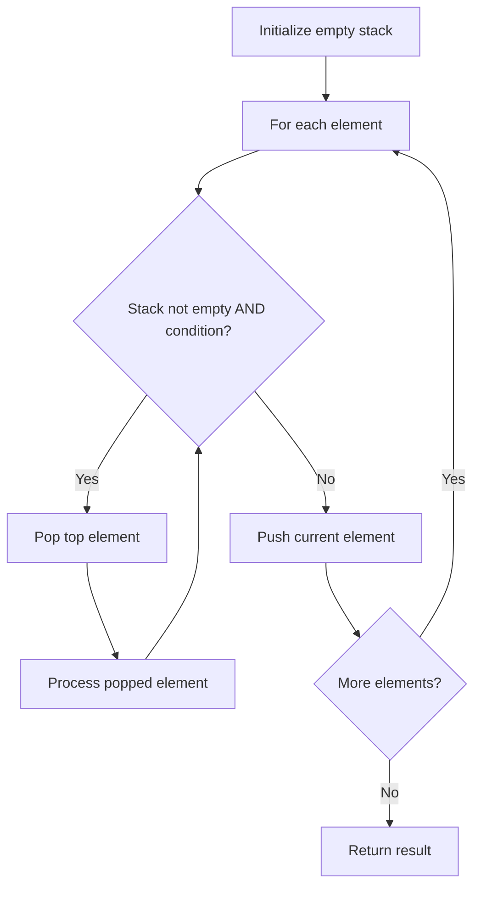

# Problem 1381: Design a Stack With Increment Operation

**Difficulty:** Medium  
**Tags:** Array, Stack, Design  
**Pattern:** Stack  
**Link:** [leetcode.com/problems/design-a-stack-with-increment-operation](https://leetcode.com/problems/design-a-stack-with-increment-operation/)

## Description

Design a stack that supports increment operations on its elements.

Implement the `CustomStack` class:

	- `CustomStack(int maxSize)` Initializes the object with `maxSize` which is the maximum number of elements in the stack.
	- `void push(int x)` Adds `x` to the top of the stack if the stack has not reached the `maxSize`.
	- `int pop()` Pops and returns the top of the stack or `-1` if the stack is empty.
	- `void inc(int k, int val)` Increments the bottom `k` elements of the stack by `val`. If there are less than `k` elements in the stack, increment all the elements in the stack.

 

Example 1:

```

**Input**
["CustomStack","push","push","pop","push","push","push","increment","increment","pop","pop","pop","pop"]
[[3],[1],[2],[],[2],[3],[4],[5,100],[2,100],[],[],[],[]]
**Output**
[null,null,null,2,null,null,null,null,null,103,202,201,-1]
**Explanation**
CustomStack stk = new CustomStack(3); // Stack is Empty []
stk.push(1);                          // stack becomes [1]
stk.push(2);                          // stack becomes [1, 2]
stk.pop();                            // return 2 --> Return top of the stack 2, stack becomes [1]
stk.push(2);                          // stack becomes [1, 2]
stk.push(3);                          // stack becomes [1, 2, 3]
stk.push(4);                          // stack still [1, 2, 3], Do not add another elements as size is 4
stk.increment(5, 100);                // stack becomes [101, 102, 103]
stk.increment(2, 100);                // stack becomes [201, 202, 103]
stk.pop();                            // return 103 --> Return top of the stack 103, stack becomes [201, 202]
stk.pop();                            // return 202 --> Return top of the stack 202, stack becomes [201]
stk.pop();                            // return 201 --> Return top of the stack 201, stack becomes []
stk.pop();                            // return -1 --> Stack is empty return -1.

```

 

**Constraints:**

	- `1 <= maxSize, x, k <= 1000`
	- `0 <= val <= 100`
	- At most `1000` calls will be made to each method of `increment`, `push` and `pop` each separately.

## Approach: Stack

Use a stack (LIFO) to process elements. Push elements when they might be needed later; pop when a matching or resolving condition is found. Common uses: parentheses matching, expression evaluation, next greater element.

## Pseudocode

```
1. Initialize empty stack
2. For each element:
   a. While stack is not empty and condition met:
      - Pop and process top element
   b. Push current element onto stack
3. Process remaining elements in stack if needed
4. Return result
```

## Algorithm Flow



## Complexity Analysis

- **Time:** O(n)
- **Space:** O(n)

## Solution (Python3)

```python
class CustomStack:
    def __init__(self, maxSize: int):
        # Initialize data structure
        self.maxSize = maxSize

    def push(self, x: int) -> None:
        return None

    def pop(self) -> int:
        return 0

    def increment(self, k: int, val: int) -> None:
        return None

```

## Solution (C++)

```cpp
#include <stack>
#include <string>
#include <unordered_map>
#include <vector>
using namespace std;

class CustomStack {
public:
    CustomStack(int maxSize) {
        // Initialize
    }

    void push(int x) {
        return ;
    }

    int pop() {
        return 0;
    }

    void increment(int k, int val) {
        return ;
    }

};
```
