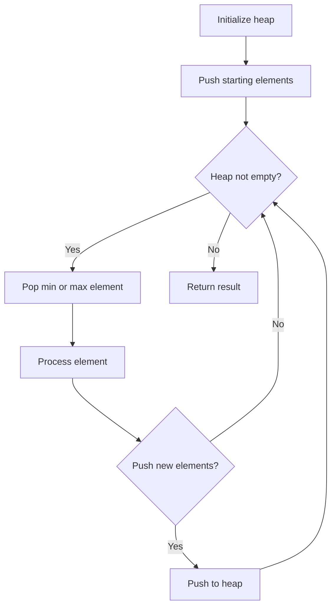
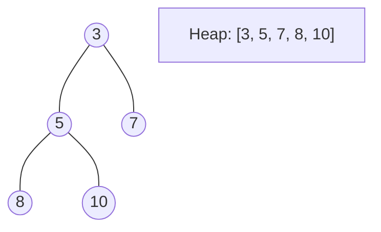
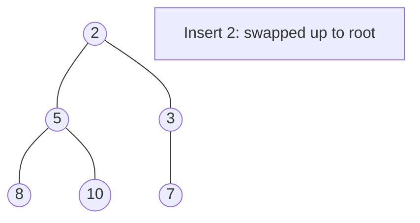
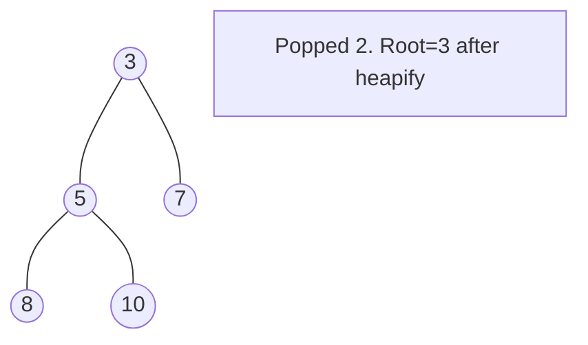

# Problem 1383: Maximum Performance of a Team

**Difficulty:** Hard  
**Tags:** Array, Greedy, Sorting, Heap (Priority Queue)  
**Pattern:** Heap / Priority Queue  
**Link:** [leetcode.com/problems/maximum-performance-of-a-team](https://leetcode.com/problems/maximum-performance-of-a-team/)

## Description

You are given two integers `n` and `k` and two integer arrays `speed` and `efficiency` both of length `n`. There are `n` engineers numbered from `1` to `n`. `speed[i]` and `efficiency[i]` represent the speed and efficiency of the `i^th` engineer respectively.

Choose **at most** `k` different engineers out of the `n` engineers to form a team with the maximum **performance**.

The performance of a team is the sum of its engineers' speeds multiplied by the minimum efficiency among its engineers.

Return *the maximum performance of this team*. Since the answer can be a huge number, return it **modulo** `10^9 + 7`.

 

Example 1:

```

**Input:** n = 6, speed = [2,10,3,1,5,8], efficiency = [5,4,3,9,7,2], k = 2
**Output:** 60
**Explanation:** 
We have the maximum performance of the team by selecting engineer 2 (with speed=10 and efficiency=4) and engineer 5 (with speed=5 and efficiency=7). That is, performance = (10 + 5) * min(4, 7) = 60.

```

Example 2:

```

**Input:** n = 6, speed = [2,10,3,1,5,8], efficiency = [5,4,3,9,7,2], k = 3
**Output:** 68
Explanation:
This is the same example as the first but k = 3. We can select engineer 1, engineer 2 and engineer 5 to get the maximum performance of the team. That is, performance = (2 + 10 + 5) * min(5, 4, 7) = 68.

```

Example 3:

```

**Input:** n = 6, speed = [2,10,3,1,5,8], efficiency = [5,4,3,9,7,2], k = 4
**Output:** 72

```

 

**Constraints:**

	- `1 <= k <= n <= 10^5`
	- `speed.length == n`
	- `efficiency.length == n`
	- `1 <= speed[i] <= 10^5`
	- `1 <= efficiency[i] <= 10^8`

## Approach: Heap / Priority Queue

Use a min-heap or max-heap to efficiently access the smallest/largest element. Push elements and pop the top to process in priority order.

## Pseudocode

```
1. Initialize heap (min or max)
2. Push initial elements onto heap
3. While heap not empty and condition:
   a. Pop top element (min or max)
   b. Process element
   c. Push new elements if needed
4. Return result
```

## Algorithm Flow



## Visual State Transitions

**Heap Operations (Min-Heap):**

**Frame 1: Initial heap**


**Frame 2: Insert 2 - bubble up**


**Frame 3: Pop minimum (2) - heapify down**



## Complexity Analysis

- **Time:** O(n log n)
- **Space:** O(n)

## Solution (Python3)

```python
class Solution:
    def maxPerformance(self, n: int, speed: List[int], efficiency: List[int], k: int) -> int:
        # Heap/Priority Queue - O(n log k) time
        import heapq
        if not n:
            return 0
        # Min heap (negate for max heap)
        heap = []
        for val in n:
            heapq.heappush(heap, val)
            if len(heap) > (speed if isinstance(speed, int) else len(n)):
                heapq.heappop(heap)
        return heap[0] if heap else 0
```

## Solution (C++)

```cpp
#include <queue>
#include <string>
#include <vector>
using namespace std;

class Solution {
public:
    int maxPerformance(int n, vector<int>& speed, vector<int>& efficiency, int k) {
        // Heap/Priority Queue - O(n log k) time
        priority_queue<int, vector<int>, greater<int>> pq;
        for (int val : n) {
            pq.push(val);
            if ((int)pq.size() > speed)
                pq.pop();
        }
        return pq.empty() ? 0 : pq.top();
    }
};
```
