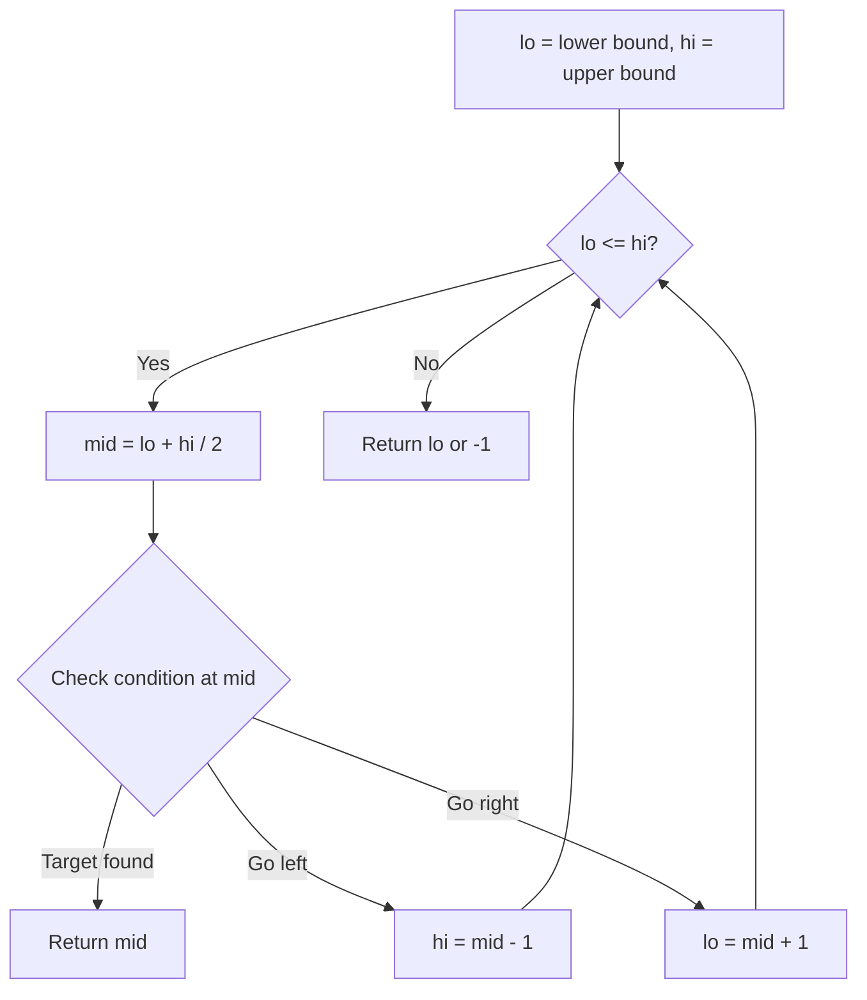
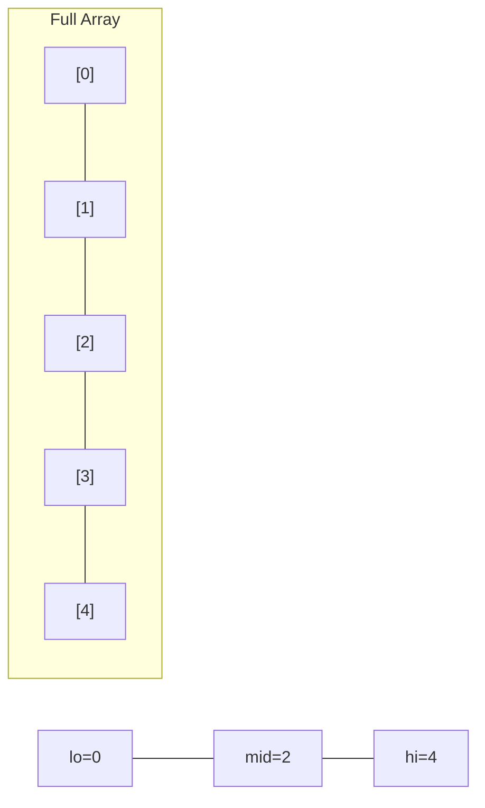
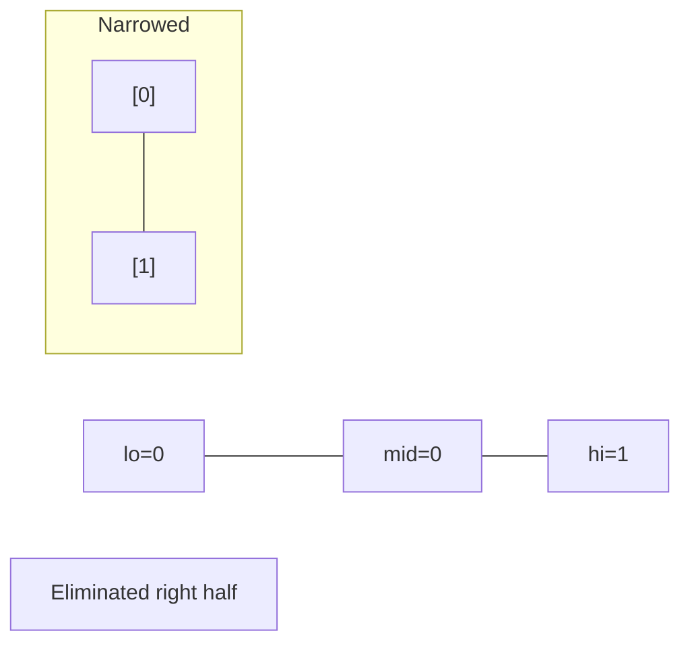
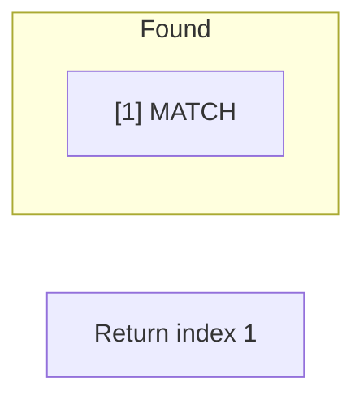

# Problem 1385: Find the Distance Value Between Two Arrays

**Difficulty:** Easy  
**Tags:** Array, Two Pointers, Binary Search, Sorting  
**Pattern:** Binary Search  
**Link:** [leetcode.com/problems/find-the-distance-value-between-two-arrays](https://leetcode.com/problems/find-the-distance-value-between-two-arrays/)

## Description

Given two integer arrays `arr1` and `arr2`, and the integer `d`, *return the distance value between the two arrays*.

The distance value is defined as the number of elements `arr1[i]` such that there is not any element `arr2[j]` where `|arr1[i]-arr2[j]| <= d`.

 

Example 1:

```

**Input:** arr1 = [4,5,8], arr2 = [10,9,1,8], d = 2
**Output:** 2
**Explanation:** 
For arr1[0]=4 we have: 
|4-10|=6 > d=2 
|4-9|=5 > d=2 
|4-1|=3 > d=2 
|4-8|=4 > d=2 
For arr1[1]=5 we have: 
|5-10|=5 > d=2 
|5-9|=4 > d=2 
|5-1|=4 > d=2 
|5-8|=3 > d=2
For arr1[2]=8 we have:
**|8-10|=2 <= d=2**
**|8-9|=1 <= d=2**
|8-1|=7 > d=2
**|8-8|=0 <= d=2**

```

Example 2:

```

**Input:** arr1 = [1,4,2,3], arr2 = [-4,-3,6,10,20,30], d = 3
**Output:** 2

```

Example 3:

```

**Input:** arr1 = [2,1,100,3], arr2 = [-5,-2,10,-3,7], d = 6
**Output:** 1

```

 

**Constraints:**

	- `1 <= arr1.length, arr2.length <= 500`
	- `-1000 <= arr1[i], arr2[j] <= 1000`
	- `0 <= d <= 100`

## Approach: Binary Search

Use binary search to halve the search space each iteration. Define the search range [lo, hi], compute mid, and decide which half to keep based on the problem's monotonic condition.

## Pseudocode

```
1. lo = lower_bound, hi = upper_bound
2. While lo <= hi (or lo < hi):
   a. mid = (lo + hi) // 2
   b. If condition(mid) is satisfied: record answer, search left half
   c. Else: search right half
3. Return answer
```

## Algorithm Flow



## Visual State Transitions

**Binary Search Step-by-Step:**

**Frame 1: Initial search space**


**Frame 2: Compare mid, narrow search**


**Frame 3: Found target**



## Complexity Analysis

- **Time:** O(log n)
- **Space:** O(1)

## Solution (Python3)

```python
class Solution:
    def findTheDistanceValue(self, arr1: List[int], arr2: List[int], d: int) -> int:
        # Binary search - O(log n) time, O(1) space
        lo, hi = 0, len(arr1) - 1
        while lo <= hi:
            mid = lo + (hi - lo) // 2
            if arr1[mid] == arr2:
                return mid
            elif arr1[mid] < arr2:
                lo = mid + 1
            else:
                hi = mid - 1
        return 0
```

## Solution (C++)

```cpp
#include <string>
#include <vector>
using namespace std;

class Solution {
public:
    int findTheDistanceValue(vector<int>& arr1, vector<int>& arr2, int d) {
        // Binary search - O(log n) time, O(1) space
        int lo = 0, hi = arr1.size() - 1;
        while (lo <= hi) {
            int mid = lo + (hi - lo) / 2;
            if (arr1[mid] == arr2) {
                return mid;
            } else if (arr1[mid] < arr2) {
                lo = mid + 1;
            } else {
                hi = mid - 1;
            }
        }
        return 0;
    }
};
```
