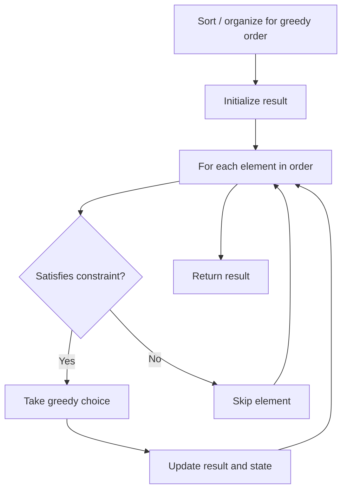

# Problem 1386: Cinema Seat Allocation

**Difficulty:** Medium  
**Tags:** Array, Hash Table, Greedy, Bit Manipulation  
**Pattern:** Greedy  
**Link:** [leetcode.com/problems/cinema-seat-allocation](https://leetcode.com/problems/cinema-seat-allocation/)

## Description

A cinema has `n` rows of seats, numbered from 1 to `n` and there are ten seats in each row, labelled from 1 to 10 as shown in the figure above.

Given the array `reservedSeats` containing the numbers of seats already reserved, for example, `reservedSeats[i] = [3,8]` means the seat located in row **3** and labelled with **8** is already reserved.

*Return the maximum number of four-person groups you can assign on the cinema seats.* A four-person group occupies four adjacent seats **in one single row**. Seats across an aisle (such as [3,3] and [3,4]) are not considered to be adjacent, but there is an exceptional case on which an aisle split a four-person group, in that case, the aisle split a four-person group in the middle, which means to have two people on each side.

 

Example 1:

```

**Input:** n = 3, reservedSeats = [[1,2],[1,3],[1,8],[2,6],[3,1],[3,10]]
**Output:** 4
**Explanation:** The figure above shows the optimal allocation for four groups, where seats mark with blue are already reserved and contiguous seats mark with orange are for one group.

```

Example 2:

```

**Input:** n = 2, reservedSeats = [[2,1],[1,8],[2,6]]
**Output:** 2

```

Example 3:

```

**Input:** n = 4, reservedSeats = [[4,3],[1,4],[4,6],[1,7]]
**Output:** 4

```

 

**Constraints:**

	- `1 <= n <= 10^9`
	- `1 <= reservedSeats.length <= min(10*n, 10^4)`
	- `reservedSeats[i].length == 2`
	- `1 <= reservedSeats[i][0] <= n`
	- `1 <= reservedSeats[i][1] <= 10`
	- All `reservedSeats[i]` are distinct.

## Approach: Greedy

Make the locally optimal choice at each step, trusting it leads to a global optimum. Greedy works when the problem has the greedy-choice property and optimal substructure.

## Pseudocode

```
1. Sort or organize data for greedy ordering
2. Initialize result
3. For each element in greedy order:
   a. If element satisfies constraint:
      - Take the greedy choice
      - Update result and state
4. Return result
```

## Algorithm Flow



## Complexity Analysis

- **Time:** O(n log n)
- **Space:** O(1)

## Solution (Python3)

```python
class Solution:
    def maxNumberOfFamilies(self, n: int, reservedSeats: List[List[int]]) -> int:
        # Greedy approach - O(n) time
        result = 0
        curr_max = 0
        for i in range(len(n)):
            if isinstance(n[i], int):
                curr_max = max(curr_max, n[i])
                result = max(result, curr_max)
            else:
                result += 1
        return result
```

## Solution (C++)

```cpp
#include <algorithm>
#include <string>
#include <vector>
using namespace std;

class Solution {
public:
    int maxNumberOfFamilies(int n, vector<vector<int>>& reservedSeats) {
        // Greedy approach - O(n) time
        int result = 0, curr_max = 0;
        for (int i = 0; i < (int)n.size(); i++) {
            curr_max = max(curr_max, n[i]);
            result = max(result, curr_max);
        }
        return result;
    }
};
```
