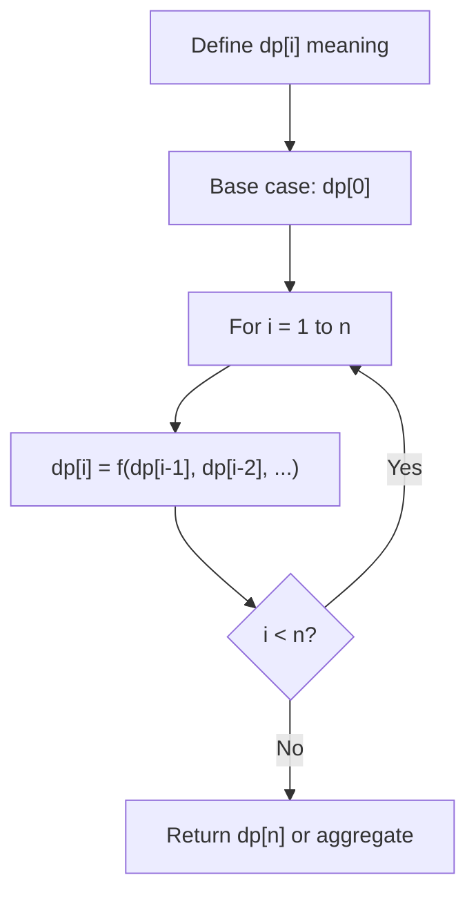
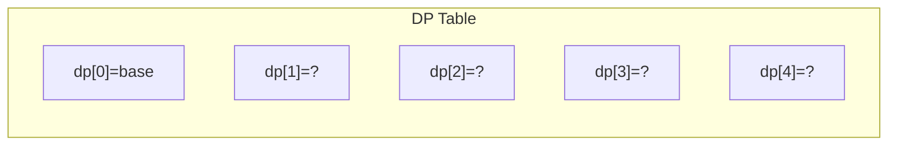
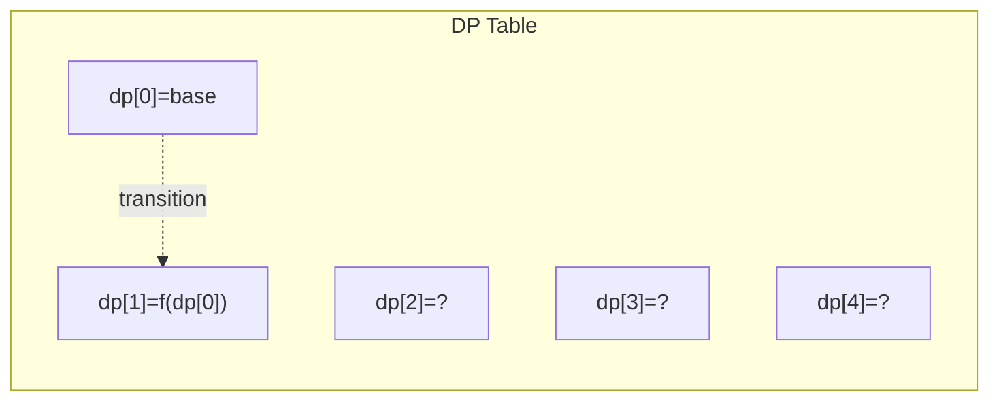
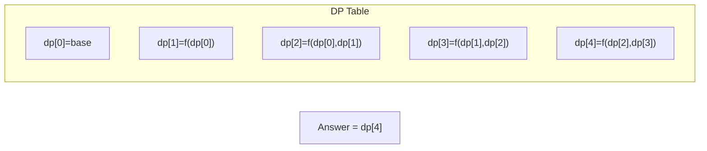

# Problem 1387: Sort Integers by The Power Value

**Difficulty:** Medium  
**Tags:** Dynamic Programming, Memoization, Sorting  
**Pattern:** Dynamic Programming (1D)  
**Link:** [leetcode.com/problems/sort-integers-by-the-power-value](https://leetcode.com/problems/sort-integers-by-the-power-value/)

## Description

The power of an integer `x` is defined as the number of steps needed to transform `x` into `1` using the following steps:

	- if `x` is even then `x = x / 2`
	- if `x` is odd then `x = 3 * x + 1`

For example, the power of `x = 3` is `7` because `3` needs `7` steps to become `1` (`3 --> 10 --> 5 --> 16 --> 8 --> 4 --> 2 --> 1`).

Given three integers `lo`, `hi` and `k`. The task is to sort all integers in the interval `[lo, hi]` by the power value in **ascending order**, if two or more integers have **the same** power value sort them by **ascending order**.

Return the `k^th` integer in the range `[lo, hi]` sorted by the power value.

Notice that for any integer `x` `(lo <= x <= hi)` it is **guaranteed** that `x` will transform into `1` using these steps and that the power of `x` is will **fit** in a 32-bit signed integer.

 

Example 1:

```

**Input:** lo = 12, hi = 15, k = 2
**Output:** 13
**Explanation:** The power of 12 is 9 (12 --> 6 --> 3 --> 10 --> 5 --> 16 --> 8 --> 4 --> 2 --> 1)
The power of 13 is 9
The power of 14 is 17
The power of 15 is 17
The interval sorted by the power value [12,13,14,15]. For k = 2 answer is the second element which is 13.
Notice that 12 and 13 have the same power value and we sorted them in ascending order. Same for 14 and 15.

```

Example 2:

```

**Input:** lo = 7, hi = 11, k = 4
**Output:** 7
**Explanation:** The power array corresponding to the interval [7, 8, 9, 10, 11] is [16, 3, 19, 6, 14].
The interval sorted by power is [8, 10, 11, 7, 9].
The fourth number in the sorted array is 7.

```

 

**Constraints:**

	- `1 <= lo <= hi <= 1000`
	- `1 <= k <= hi - lo + 1`

## Approach: Dynamic Programming (1D)

Break the problem into overlapping subproblems. Define dp[i] as the optimal value for the subproblem ending at or considering index i. Build the solution bottom-up, using previously computed dp values.

## Pseudocode

```
1. Define dp[i] = optimal value for subproblem i
2. Base case: dp[0] = initial value
3. For i from 1 to n:
   a. dp[i] = recurrence(dp[i-1], dp[i-2], ...)
4. Return dp[n] or max/min of dp
```

## Algorithm Flow



## Visual State Transitions

**1D Dynamic Programming Table Build:**

**Frame 1: Initialize base cases**


**Frame 2: Fill dp[1] from dp[0]**


**Frame 3: Fill remaining cells**



## Complexity Analysis

- **Time:** O(n)
- **Space:** O(n)

## Solution (Python3)

```python
class Solution:
    def getKth(self, lo: int, hi: int, k: int) -> int:
        # Dynamic programming (1D) - O(n) time, O(n) space
        if not lo:
            return 0
        n = len(lo) if isinstance(lo, list) else lo
        dp = [0] * (n + 1)
        dp[0] = 1  # base case
        for i in range(1, n + 1):
            dp[i] = dp[i-1]  # transition (customize per problem)
            if i >= 2:
                dp[i] += dp[i-2]
        return dp[n]
```

## Solution (C++)

```cpp
#include <string>
#include <vector>
using namespace std;

class Solution {
public:
    int getKth(int lo, int hi, int k) {
        // Dynamic programming (1D) - O(n) time, O(n) space
        int n = lo;
        if (n <= 0) return 0;
        vector<int> dp(n + 1, 0);
        dp[0] = 1;
        for (int i = 1; i <= n; i++) {
            dp[i] = dp[i-1];
            if (i >= 2) dp[i] += dp[i-2];
        }
        return dp[n];
    }
};
```
