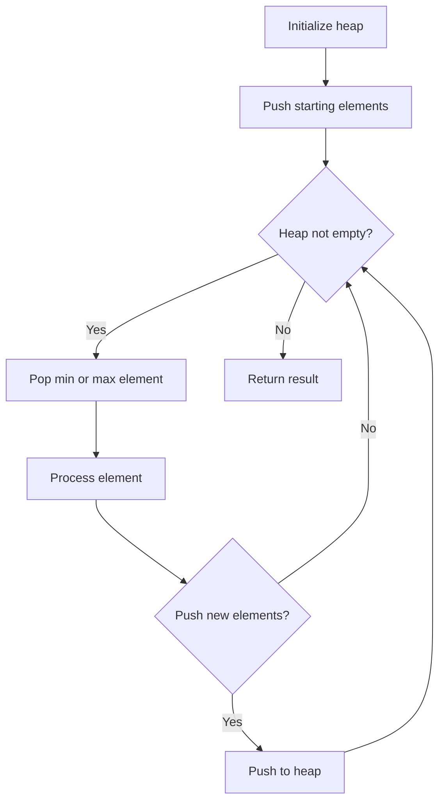
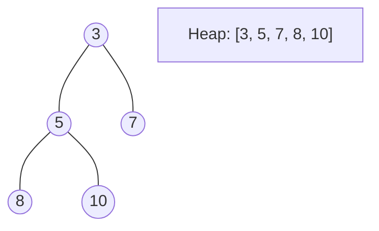
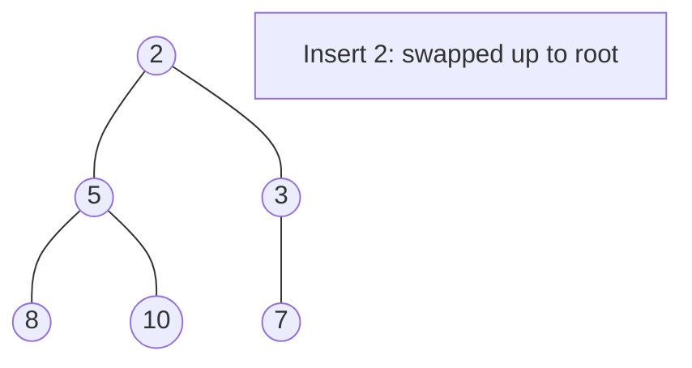
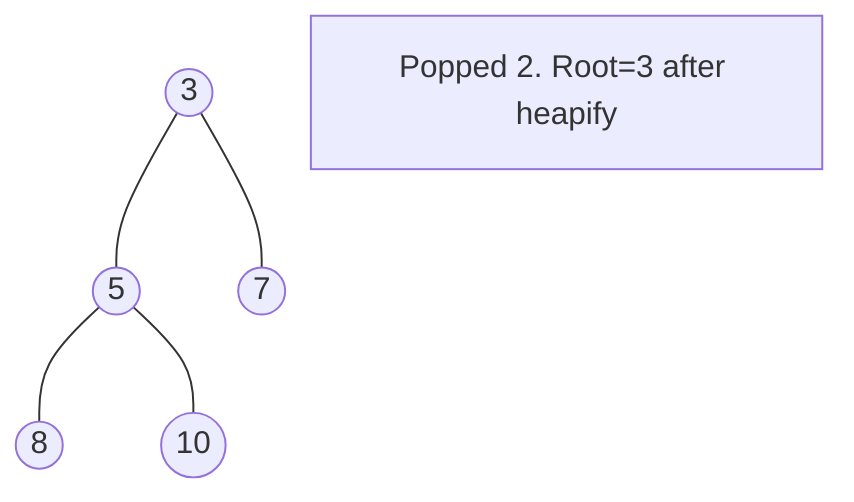

# Problem 1388: Pizza With 3n Slices

**Difficulty:** Hard  
**Tags:** Array, Dynamic Programming, Greedy, Heap (Priority Queue)  
**Pattern:** Heap / Priority Queue  
**Link:** [leetcode.com/problems/pizza-with-3n-slices](https://leetcode.com/problems/pizza-with-3n-slices/)

## Description

There is a pizza with `3n` slices of varying size, you and your friends will take slices of pizza as follows:

	- You will pick **any** pizza slice.
	- Your friend Alice will pick the next slice in the anti-clockwise direction of your pick.
	- Your friend Bob will pick the next slice in the clockwise direction of your pick.
	- Repeat until there are no more slices of pizzas.

Given an integer array `slices` that represent the sizes of the pizza slices in a clockwise direction, return *the maximum possible sum of slice sizes that you can pick*.

 

Example 1:

```

**Input:** slices = [1,2,3,4,5,6]
**Output:** 10
**Explanation:** Pick pizza slice of size 4, Alice and Bob will pick slices with size 3 and 5 respectively. Then Pick slices with size 6, finally Alice and Bob will pick slice of size 2 and 1 respectively. Total = 4 + 6.

```

Example 2:

```

**Input:** slices = [8,9,8,6,1,1]
**Output:** 16
**Explanation:** Pick pizza slice of size 8 in each turn. If you pick slice with size 9 your partners will pick slices of size 8.

```

 

**Constraints:**

	- `3 * n == slices.length`
	- `1 <= slices.length <= 500`
	- `1 <= slices[i] <= 1000`

## Approach: Heap / Priority Queue

Use a min-heap or max-heap to efficiently access the smallest/largest element. Push elements and pop the top to process in priority order.

## Pseudocode

```
1. Initialize heap (min or max)
2. Push initial elements onto heap
3. While heap not empty and condition:
   a. Pop top element (min or max)
   b. Process element
   c. Push new elements if needed
4. Return result
```

## Algorithm Flow



## Visual State Transitions

**Heap Operations (Min-Heap):**

**Frame 1: Initial heap**


**Frame 2: Insert 2 - bubble up**


**Frame 3: Pop minimum (2) - heapify down**



## Complexity Analysis

- **Time:** O(n log n)
- **Space:** O(n)

## Solution (Python3)

```python
class Solution:
    def maxSizeSlices(self, slices: List[int]) -> int:
        # Heap/Priority Queue - O(n log k) time
        import heapq
        if not slices:
            return 0
        # Min heap (negate for max heap)
        heap = []
        for val in slices:
            heapq.heappush(heap, val)
            if len(heap) > (slices if isinstance(slices, int) else len(slices)):
                heapq.heappop(heap)
        return heap[0] if heap else 0
```

## Solution (C++)

```cpp
#include <queue>
#include <string>
#include <vector>
using namespace std;

class Solution {
public:
    int maxSizeSlices(vector<int>& slices) {
        // Heap/Priority Queue - O(n log k) time
        priority_queue<int, vector<int>, greater<int>> pq;
        for (int val : slices) {
            pq.push(val);
            if ((int)pq.size() > slices)
                pq.pop();
        }
        return pq.empty() ? 0 : pq.top();
    }
};
```
