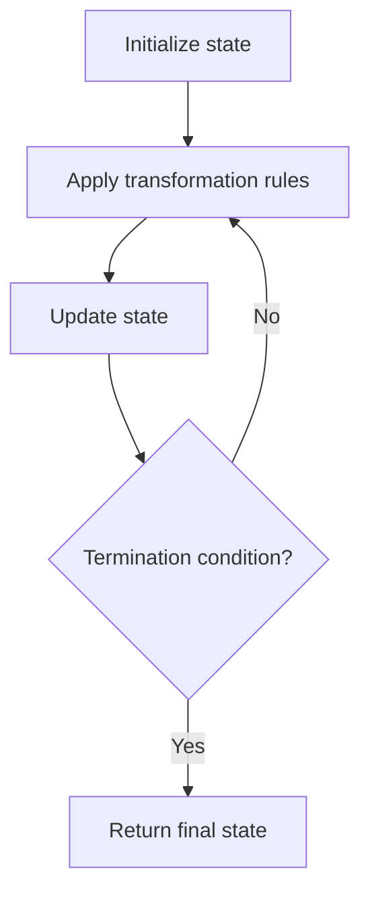

# Problem 1389: Create Target Array in the Given Order

**Difficulty:** Easy  
**Tags:** Array, Simulation  
**Pattern:** Simulation  
**Link:** [leetcode.com/problems/create-target-array-in-the-given-order](https://leetcode.com/problems/create-target-array-in-the-given-order/)

## Description

Given two arrays of integers `nums` and `index`. Your task is to create *target* array under the following rules:

	- Initially *target* array is empty.
	- From left to right read nums[i] and index[i], insert at index `index[i]` the value `nums[i]` in *target* array.
	- Repeat the previous step until there are no elements to read in `nums` and `index.`

Return the *target* array.

It is guaranteed that the insertion operations will be valid.

 

Example 1:

```

**Input:** nums = [0,1,2,3,4], index = [0,1,2,2,1]
**Output:** [0,4,1,3,2]
**Explanation:**
nums       index     target
0            0        [0]
1            1        [0,1]
2            2        [0,1,2]
3            2        [0,1,3,2]
4            1        [0,4,1,3,2]

```

Example 2:

```

**Input:** nums = [1,2,3,4,0], index = [0,1,2,3,0]
**Output:** [0,1,2,3,4]
**Explanation:**
nums       index     target
1            0        [1]
2            1        [1,2]
3            2        [1,2,3]
4            3        [1,2,3,4]
0            0        [0,1,2,3,4]

```

Example 3:

```

**Input:** nums = [1], index = [0]
**Output:** [1]

```

 

**Constraints:**

	- `1 <= nums.length, index.length <= 100`
	- `nums.length == index.length`
	- `0 <= nums[i] <= 100`
	- `0 <= index[i] <= i`

## Approach: Simulation

Simulate the process described in the problem step by step. Follow the rules exactly, tracking state at each step.

## Pseudocode

```
1. Initialize state (grid, pointers, counters)
2. For each step / iteration:
   a. Apply the transformation rules
   b. Update state
   c. Check termination condition
3. Return final state or result
```

## Algorithm Flow



## Complexity Analysis

- **Time:** O(n) or O(n * k)
- **Space:** O(n)

## Solution (Python3)

```python
class Solution:
    def createTargetArray(self, nums: List[int], index: List[int]) -> List[int]:
        # Simulation approach - follow the rules step by step
        result = []
        for i in range(len(nums) if isinstance(nums, list) else nums):
            # Simulate each step
            pass
        return result
```

## Solution (C++)

```cpp
#include <string>
#include <vector>
using namespace std;

class Solution {
public:
    vector<int> createTargetArray(vector<int>& nums, vector<int>& index) {
        // Simulation approach
        int n = nums.size();
        for (int i = 0; i < n; i++) {
            // Simulate each step
        }
        return {};
    }
};
```
