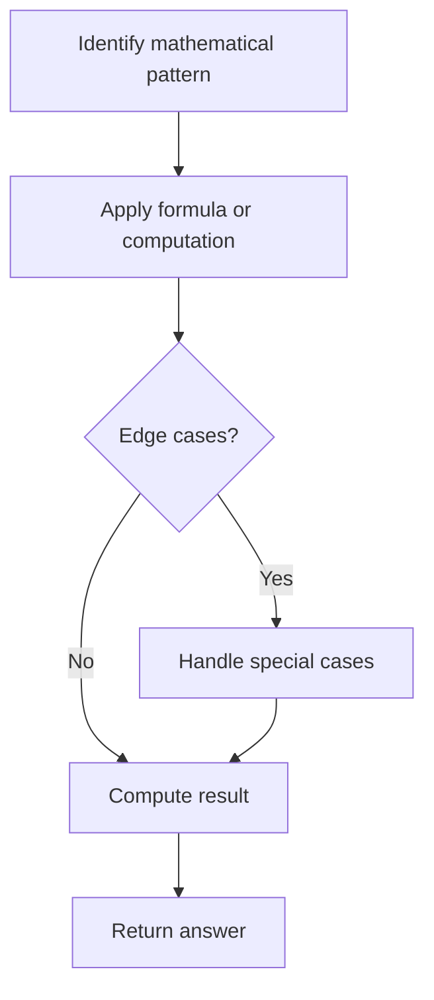

# Problem 1390: Four Divisors

**Difficulty:** Medium  
**Tags:** Array, Math  
**Pattern:** Math  
**Link:** [leetcode.com/problems/four-divisors](https://leetcode.com/problems/four-divisors/)

## Description

Given an integer array `nums`, return *the sum of divisors of the integers in that array that have exactly four divisors*. If there is no such integer in the array, return `0`.

 

Example 1:

```

**Input:** nums = [21,4,7]
**Output:** 32
**Explanation:** 
21 has 4 divisors: 1, 3, 7, 21
4 has 3 divisors: 1, 2, 4
7 has 2 divisors: 1, 7
The answer is the sum of divisors of 21 only.

```

Example 2:

```

**Input:** nums = [21,21]
**Output:** 64

```

Example 3:

```

**Input:** nums = [1,2,3,4,5]
**Output:** 0

```

 

**Constraints:**

	- `1 <= nums.length <= 10^4`
	- `1 <= nums[i] <= 10^5`

## Approach: Math

Apply mathematical properties, formulas, or number-theoretic concepts. Look for patterns, modular arithmetic, or closed-form solutions.

## Pseudocode

```
1. Identify the mathematical pattern or formula
2. Apply computation:
   - Modular arithmetic for large numbers
   - GCD/LCM for divisibility
   - Sieve for primes
3. Handle edge cases
4. Return result
```

## Algorithm Flow



## Complexity Analysis

- **Time:** O(n) or O(sqrt(n))
- **Space:** O(1)

## Solution (Python3)

```python
class Solution:
    def sumFourDivisors(self, nums: List[int]) -> int:
        # Mathematical approach
        result = 0
        x = nums
        while x != 0:
            result = result * 10 + x % 10
            x //= 10 if isinstance(x, int) else 1
        return result
```

## Solution (C++)

```cpp
#include <string>
#include <vector>
using namespace std;

class Solution {
public:
    int sumFourDivisors(vector<int>& nums) {
        // Mathematical approach
        long long result = 0;
        int x = nums;
        while (x != 0) {
            result = result * 10 + x % 10;
            x /= 10;
        }
        return (int)result;
    }
};
```
