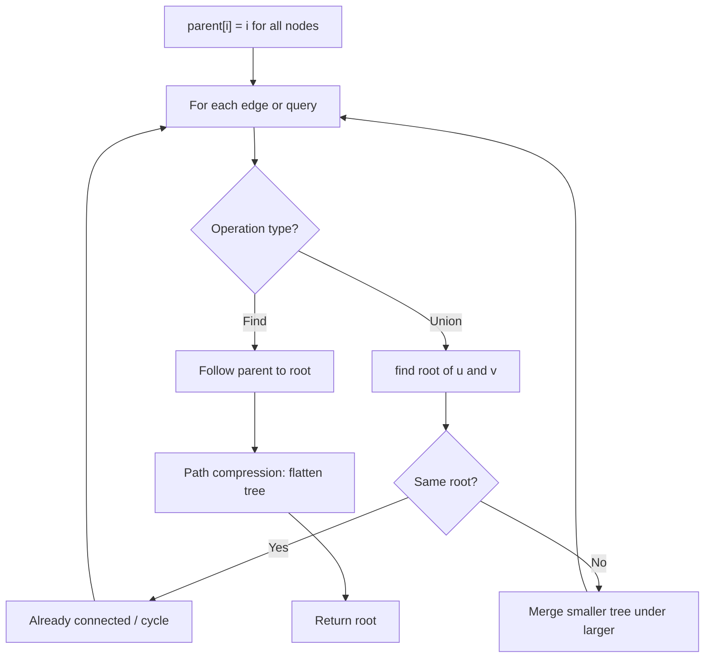
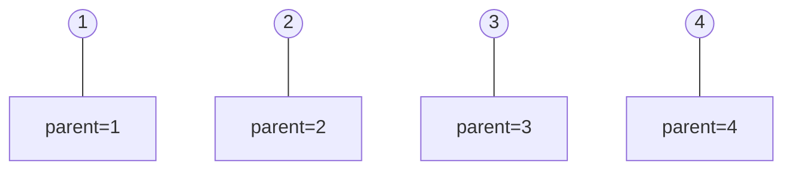
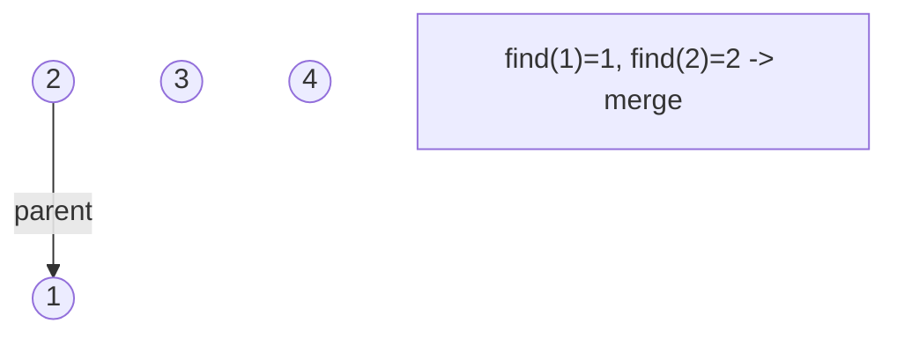
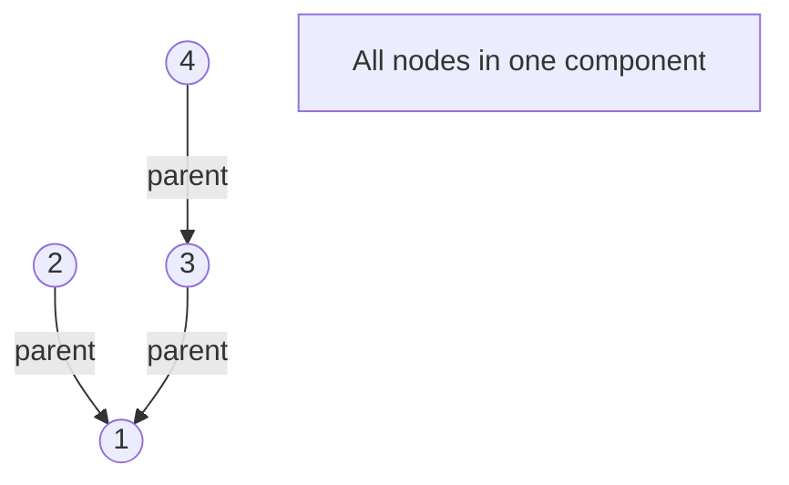
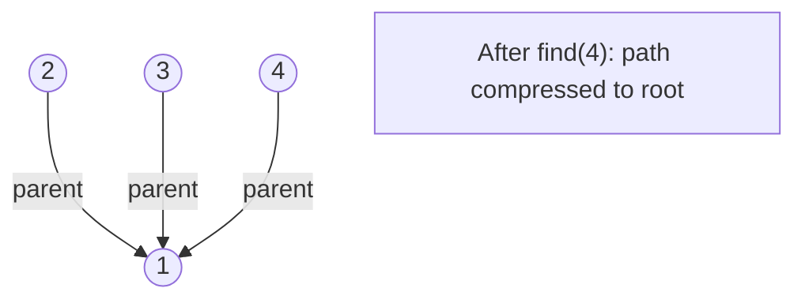

# Problem 1391: Check if There is a Valid Path in a Grid

**Difficulty:** Medium  
**Tags:** Array, Depth-First Search, Breadth-First Search, Union-Find, Matrix  
**Pattern:** Union-Find / Disjoint Set  
**Link:** [leetcode.com/problems/check-if-there-is-a-valid-path-in-a-grid](https://leetcode.com/problems/check-if-there-is-a-valid-path-in-a-grid/)

## Description

You are given an `m x n` `grid`. Each cell of `grid` represents a street. The street of `grid[i][j]` can be:

	- `1` which means a street connecting the left cell and the right cell.
	- `2` which means a street connecting the upper cell and the lower cell.
	- `3` which means a street connecting the left cell and the lower cell.
	- `4` which means a street connecting the right cell and the lower cell.
	- `5` which means a street connecting the left cell and the upper cell.
	- `6` which means a street connecting the right cell and the upper cell.

You will initially start at the street of the upper-left cell `(0, 0)`. A valid path in the grid is a path that starts from the upper left cell `(0, 0)` and ends at the bottom-right cell `(m - 1, n - 1)`. **The path should only follow the streets**.

**Notice** that you are **not allowed** to change any street.

Return `true`* if there is a valid path in the grid or *`false`* otherwise*.

 

Example 1:

```

**Input:** grid = [[2,4,3],[6,5,2]]
**Output:** true
**Explanation:** As shown you can start at cell (0, 0) and visit all the cells of the grid to reach (m - 1, n - 1).

```

Example 2:

```

**Input:** grid = [[1,2,1],[1,2,1]]
**Output:** false
**Explanation:** As shown you the street at cell (0, 0) is not connected with any street of any other cell and you will get stuck at cell (0, 0)

```

Example 3:

```

**Input:** grid = [[1,1,2]]
**Output:** false
**Explanation:** You will get stuck at cell (0, 1) and you cannot reach cell (0, 2).

```

 

**Constraints:**

	- `m == grid.length`
	- `n == grid[i].length`
	- `1 <= m, n <= 300`
	- `1 <= grid[i][j] <= 6`

## Approach: Union-Find / Disjoint Set

Use Union-Find with path compression and union by rank to efficiently manage connected components. Find(x) returns the root of x's component; Union(x,y) merges two components.

## Pseudocode

```
1. parent[i] = i for all nodes (each is its own set)
2. find(x): follow parent pointers to root (with path compression)
3. union(x, y): merge sets of x and y by rank
4. Process edges/operations:
   a. For each edge (u, v): union(u, v)
5. Answer queries using find()
```

## Algorithm Flow



## Visual State Transitions

**Union-Find Step-by-Step:**

**Frame 1: Initial - each node is own parent**


**Frame 2: Union(1,2) - merge components**


**Frame 3: Union(3,4) then Union(2,3)**


**Frame 4: Path compression on find(4)**



## Complexity Analysis

- **Time:** O(n * alpha(n))
- **Space:** O(n)

## Solution (Python3)

```python
class Solution:
    def hasValidPath(self, grid: List[List[int]]) -> bool:
        # Union Find (Disjoint Set Union) - O(n * alpha(n))
        parent = list(range(len(grid) + 1 if isinstance(grid, list) else grid + 1))
        rank = [0] * len(parent)
        
        def find(x):
            if parent[x] != x:
                parent[x] = find(parent[x])
            return parent[x]
        
        def union(x, y):
            px, py = find(x), find(y)
            if px == py:
                return False
            if rank[px] < rank[py]:
                px, py = py, px
            parent[py] = px
            if rank[px] == rank[py]:
                rank[px] += 1
            return True
        
        components = len(parent)
        # Process edges/connections
        return components
```

## Solution (C++)

```cpp
#include <functional>
#include <numeric>
#include <string>
#include <vector>
using namespace std;

class Solution {
public:
    bool hasValidPath(vector<vector<int>>& grid) {
        // Union Find (DSU) - O(n * alpha(n))
        int n = grid.size();
        vector<int> parent(n + 1), rnk(n + 1, 0);
        iota(parent.begin(), parent.end(), 0);
        function<int(int)> find = [&](int x) -> int {
            return parent[x] == x ? x : parent[x] = find(parent[x]);
        };
        auto unite = [&](int x, int y) -> bool {
            int px = find(x), py = find(y);
            if (px == py) return false;
            if (rnk[px] < rnk[py]) swap(px, py);
            parent[py] = px;
            if (rnk[px] == rnk[py]) rnk[px]++;
            return true;
        };
        int components = n;
        return components;
    }
};
```
