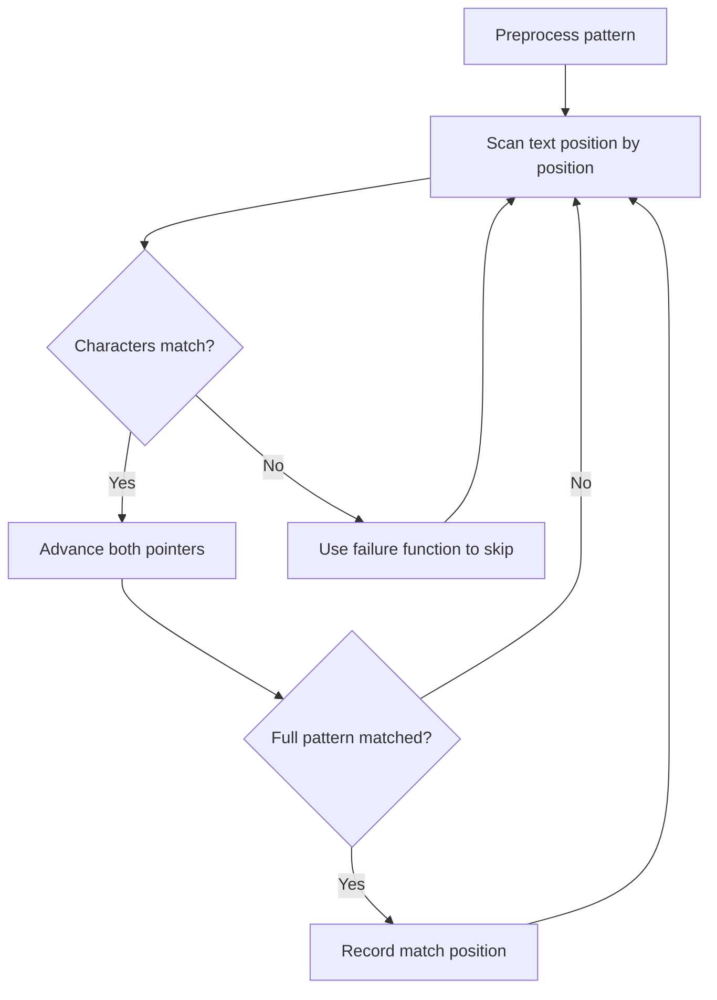

# Problem 1392: Longest Happy Prefix

**Difficulty:** Hard  
**Tags:** String, Rolling Hash, String Matching, Hash Function  
**Pattern:** String Matching  
**Link:** [leetcode.com/problems/longest-happy-prefix](https://leetcode.com/problems/longest-happy-prefix/)

## Description

A string is called a **happy prefix** if is a **non-empty** prefix which is also a suffix (excluding itself).

Given a string `s`, return *the **longest happy prefix** of* `s`. Return an empty string `""` if no such prefix exists.

 

Example 1:

```

**Input:** s = "level"
**Output:** "l"
**Explanation:** s contains 4 prefix excluding itself ("l", "le", "lev", "leve"), and suffix ("l", "el", "vel", "evel"). The largest prefix which is also suffix is given by "l".

```

Example 2:

```

**Input:** s = "ababab"
**Output:** "abab"
**Explanation:** "abab" is the largest prefix which is also suffix. They can overlap in the original string.

```

 

**Constraints:**

	- `1 <= s.length <= 10^5`
	- `s` contains only lowercase English letters.

## Approach: String Matching

Find pattern occurrences in text. Use KMP, Rabin-Karp, or Z-algorithm for efficient matching beyond brute force.

## Pseudocode

```
1. Preprocess pattern (build failure function / hash)
2. Scan text with pattern:
   a. Compare characters
   b. On mismatch: use preprocessed data to skip
   c. On full match: record position
3. Return matches
```

## Algorithm Flow



## Complexity Analysis

- **Time:** O(n + m)
- **Space:** O(m)

## Solution (Python3)

```python
class Solution:
    def longestPrefix(self, s: str) -> str:
        # String matching (KMP/Rolling Hash) - O(n+m) time
        if not s or not s:
            return ""
        n, m = len(s), len(s)
        # Build failure function for KMP
        fail = [0] * m
        j = 0
        for i in range(1, m):
            while j > 0 and s[i] != s[j]:
                j = fail[j-1]
            if s[i] == s[j]:
                j += 1
            fail[i] = j
        # Search
        j = 0
        for i in range(n):
            while j > 0 and s[i] != s[j]:
                j = fail[j-1]
            if s[i] == s[j]:
                j += 1
            if j == m:
                return i - m + 1
        return -1
```

## Solution (C++)

```cpp
#include <string>
#include <vector>
using namespace std;

class Solution {
public:
    string longestPrefix(string& s) {
        // String matching (KMP) - O(n+m) time
        int n = s.size(), m = s.size();
        if (m == 0) return 0;
        vector<int> fail(m, 0);
        for (int i = 1, j = 0; i < m; i++) {
            while (j > 0 && s[i] != s[j]) j = fail[j-1];
            if (s[i] == s[j]) j++;
            fail[i] = j;
        }
        for (int i = 0, j = 0; i < n; i++) {
            while (j > 0 && s[i] != s[j]) j = fail[j-1];
            if (s[i] == s[j]) j++;
            if (j == m) return i - m + 1;
        }
        return -1;
    }
};
```
