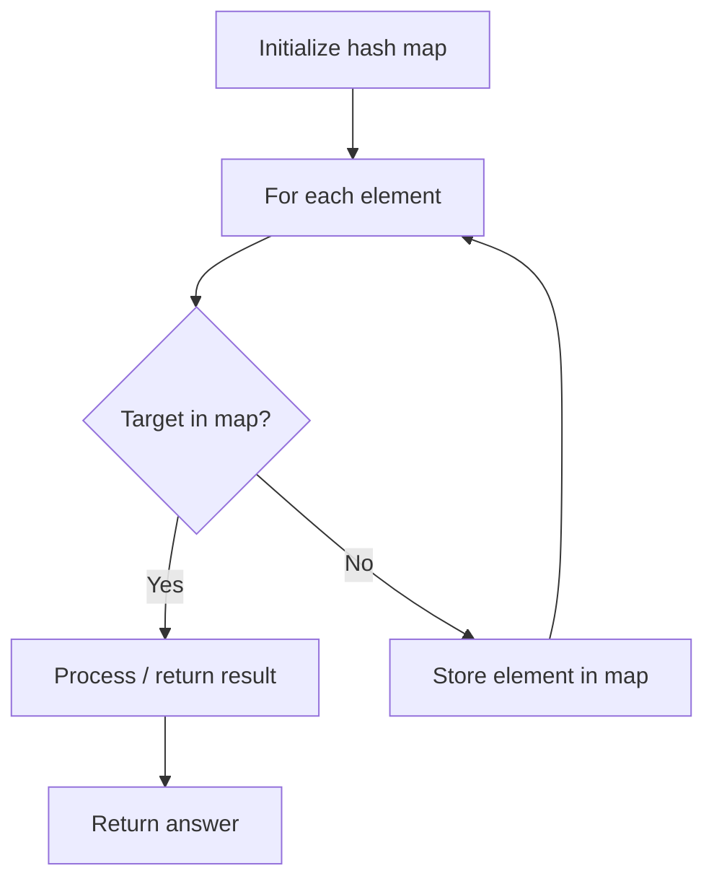

# Problem 1394: Find Lucky Integer in an Array

**Difficulty:** Easy  
**Tags:** Array, Hash Table, Counting  
**Pattern:** Hash Map Lookup  
**Link:** [leetcode.com/problems/find-lucky-integer-in-an-array](https://leetcode.com/problems/find-lucky-integer-in-an-array/)

## Description

Given an array of integers `arr`, a **lucky integer** is an integer that has a frequency in the array equal to its value.

Return *the largest **lucky integer** in the array*. If there is no **lucky integer** return `-1`.

 

Example 1:

```

**Input:** arr = [2,2,3,4]
**Output:** 2
**Explanation:** The only lucky number in the array is 2 because frequency[2] == 2.

```

Example 2:

```

**Input:** arr = [1,2,2,3,3,3]
**Output:** 3
**Explanation:** 1, 2 and 3 are all lucky numbers, return the largest of them.

```

Example 3:

```

**Input:** arr = [2,2,2,3,3]
**Output:** -1
**Explanation:** There are no lucky numbers in the array.

```

 

**Constraints:**

	- `1 <= arr.length <= 500`
	- `1 <= arr[i] <= 500`

## Approach: Hash Map Lookup

Use a hash map (dictionary) to store elements for O(1) lookup. Iterate through the input, checking membership or counting frequencies in the map.

## Pseudocode

```
1. Initialize hash map
2. Iterate through elements:
   a. Check if target/complement exists in map
   b. If found: process result
   c. Otherwise: store element in map
3. Return result
```

## Algorithm Flow



## Complexity Analysis

- **Time:** O(n)
- **Space:** O(n)

## Solution (Python3)

```python
class Solution:
    def findLucky(self, arr: List[int]) -> int:
        # Hash map approach - O(n) time, O(n) space
        seen = {}
        for i, val in enumerate(arr):
            complement = arr - val
            if complement in seen:
                return [seen[complement], i]
            seen[val] = i
        return 0
```

## Solution (C++)

```cpp
#include <string>
#include <unordered_map>
#include <vector>
using namespace std;

class Solution {
public:
    int findLucky(vector<int>& arr) {
        // Hash map approach - O(n) time, O(n) space
        unordered_map<int, int> seen;
        for (int i = 0; i < arr.size(); i++) {
            int complement = arr - arr[i];
            if (seen.count(complement)) {
                return {seen[complement], i};
            }
            seen[arr[i]] = i;
        }
        return 0;
    }
};
```
