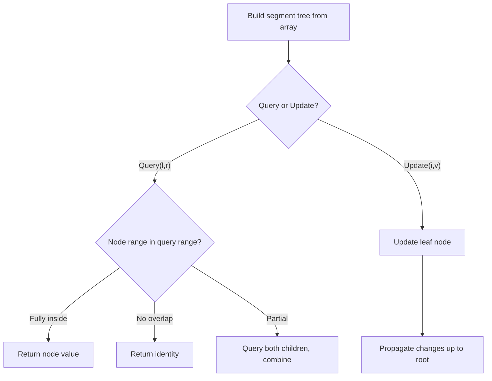

# Problem 1395: Count Number of Teams

**Difficulty:** Medium  
**Tags:** Array, Dynamic Programming, Binary Indexed Tree, Segment Tree  
**Pattern:** Segment Tree  
**Link:** [leetcode.com/problems/count-number-of-teams](https://leetcode.com/problems/count-number-of-teams/)

## Description

There are `n` soldiers standing in a line. Each soldier is assigned a **unique** `rating` value.

You have to form a team of 3 soldiers amongst them under the following rules:

	- Choose 3 soldiers with index (`i`, `j`, `k`) with rating (`rating[i]`, `rating[j]`, `rating[k]`).
	- A team is valid if: (`rating[i] < rating[j] < rating[k]`) or (`rating[i] > rating[j] > rating[k]`) where (`0 <= i < j < k < n`).

Return the number of teams you can form given the conditions. (soldiers can be part of multiple teams).

 

Example 1:

```

**Input:** rating = [2,5,3,4,1]
**Output:** 3
**Explanation:** We can form three teams given the conditions. (2,3,4), (5,4,1), (5,3,1). 

```

Example 2:

```

**Input:** rating = [2,1,3]
**Output:** 0
**Explanation:** We can't form any team given the conditions.

```

Example 3:

```

**Input:** rating = [1,2,3,4]
**Output:** 4

```

 

**Constraints:**

	- `n == rating.length`
	- `3 <= n <= 1000`
	- `1 <= rating[i] <= 10^5`
	- All the integers in `rating` are **unique**.

## Approach: Segment Tree

Build a segment tree for range queries (sum, min, max) with point or range updates. Each node covers a range; queries are answered by combining relevant segments.

## Pseudocode

```
1. Build segment tree from array (O(n))
2. Query(l, r):
   - If node range within [l,r]: return node value
   - If no overlap: return identity
   - Else: combine query(left_child) and query(right_child)
3. Update(i, val): update leaf and propagate up
```

## Algorithm Flow



## Complexity Analysis

- **Time:** O(n log n) build, O(log n) query/update
- **Space:** O(n)

## Solution (Python3)

```python
class Solution:
    def numTeams(self, rating: List[int]) -> int:
        # Segment tree for range queries - O(n log n) build, O(log n) query
        n = len(rating)
        tree = [0] * (4 * n)
        
        def build(node, start, end):
            if start == end:
                tree[node] = rating[start]
                return
            mid = (start + end) // 2
            build(2*node, start, mid)
            build(2*node+1, mid+1, end)
            tree[node] = tree[2*node] + tree[2*node+1]
        
        def query(node, start, end, l, r):
            if r < start or end < l:
                return 0
            if l <= start and end <= r:
                return tree[node]
            mid = (start + end) // 2
            return query(2*node, start, mid, l, r) + query(2*node+1, mid+1, end, l, r)
        
        build(1, 0, n-1)
        return 0
```

## Solution (C++)

```cpp
#include <functional>
#include <string>
#include <vector>
using namespace std;

class Solution {
public:
    int numTeams(vector<int>& rating) {
        // Segment tree for range queries
        int n = rating.size();
        vector<int> tree(4 * n, 0);
        function<void(int, int, int)> build = [&](int node, int s, int e) {
            if (s == e) { tree[node] = rating[s]; return; }
            int mid = (s + e) / 2;
            build(2*node, s, mid);
            build(2*node+1, mid+1, e);
            tree[node] = tree[2*node] + tree[2*node+1];
        };
        function<int(int, int, int, int, int)> query = [&](int node, int s, int e, int l, int r) -> int {
            if (r < s || e < l) return 0;
            if (l <= s && e <= r) return tree[node];
            int mid = (s + e) / 2;
            return query(2*node, s, mid, l, r) + query(2*node+1, mid+1, e, l, r);
        };
        build(1, 0, n-1);
        return 0;
    }
};
```
