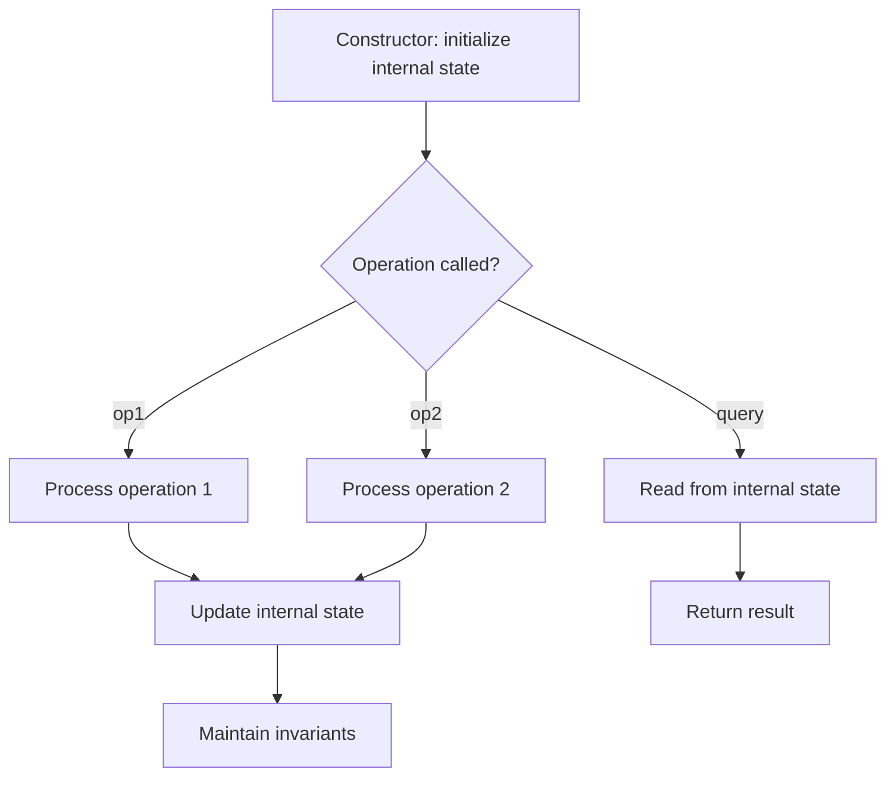

# Problem 1396: Design Underground System

**Difficulty:** Medium  
**Tags:** Hash Table, String, Design  
**Pattern:** Design / Hash Map  
**Link:** [leetcode.com/problems/design-underground-system](https://leetcode.com/problems/design-underground-system/)

## Description

An underground railway system is keeping track of customer travel times between different stations. They are using this data to calculate the average time it takes to travel from one station to another.

Implement the `UndergroundSystem` class:

	- `void checkIn(int id, string stationName, int t)`

	
		A customer with a card ID equal to `id`, checks in at the station `stationName` at time `t`.
		- A customer can only be checked into one place at a time.
	
	
	- `void checkOut(int id, string stationName, int t)`
	
		A customer with a card ID equal to `id`, checks out from the station `stationName` at time `t`.
	
	
	- `double getAverageTime(string startStation, string endStation)`
	
		Returns the average time it takes to travel from `startStation` to `endStation`.
		- The average time is computed from all the previous traveling times from `startStation` to `endStation` that happened **directly**, meaning a check in at `startStation` followed by a check out from `endStation`.
		- The time it takes to travel from `startStation` to `endStation` **may be different** from the time it takes to travel from `endStation` to `startStation`.
		- There will be at least one customer that has traveled from `startStation` to `endStation` before `getAverageTime` is called.
	
	

You may assume all calls to the `checkIn` and `checkOut` methods are consistent. If a customer checks in at time `t1` then checks out at time `t2`, then `t1 < t2`. All events happen in chronological order.

 

Example 1:

```

**Input**
["UndergroundSystem","checkIn","checkIn","checkIn","checkOut","checkOut","checkOut","getAverageTime","getAverageTime","checkIn","getAverageTime","checkOut","getAverageTime"]
[[],[45,"Leyton",3],[32,"Paradise",8],[27,"Leyton",10],[45,"Waterloo",15],[27,"Waterloo",20],[32,"Cambridge",22],["Paradise","Cambridge"],["Leyton","Waterloo"],[10,"Leyton",24],["Leyton","Waterloo"],[10,"Waterloo",38],["Leyton","Waterloo"]]

**Output**
[null,null,null,null,null,null,null,14.00000,11.00000,null,11.00000,null,12.00000]

**Explanation**
UndergroundSystem undergroundSystem = new UndergroundSystem();
undergroundSystem.checkIn(45, "Leyton", 3);
undergroundSystem.checkIn(32, "Paradise", 8);
undergroundSystem.checkIn(27, "Leyton", 10);
undergroundSystem.checkOut(45, "Waterloo", 15);  // Customer 45 "Leyton" -> "Waterloo" in 15-3 = 12
undergroundSystem.checkOut(27, "Waterloo", 20);  // Customer 27 "Leyton" -> "Waterloo" in 20-10 = 10
undergroundSystem.checkOut(32, "Cambridge", 22); // Customer 32 "Paradise" -> "Cambridge" in 22-8 = 14
undergroundSystem.getAverageTime("Paradise", "Cambridge"); // return 14.00000. One trip "Paradise" -> "Cambridge", (14) / 1 = 14
undergroundSystem.getAverageTime("Leyton", "Waterloo");    // return 11.00000. Two trips "Leyton" -> "Waterloo", (10 + 12) / 2 = 11
undergroundSystem.checkIn(10, "Leyton", 24);
undergroundSystem.getAverageTime("Leyton", "Waterloo");    // return 11.00000
undergroundSystem.checkOut(10, "Waterloo", 38);  // Customer 10 "Leyton" -> "Waterloo" in 38-24 = 14
undergroundSystem.getAverageTime("Leyton", "Waterloo");    // return 12.00000. Three trips "Leyton" -> "Waterloo", (10 + 12 + 14) / 3 = 12

```

Example 2:

```

**Input**
["UndergroundSystem","checkIn","checkOut","getAverageTime","checkIn","checkOut","getAverageTime","checkIn","checkOut","getAverageTime"]
[[],[10,"Leyton",3],[10,"Paradise",8],["Leyton","Paradise"],[5,"Leyton",10],[5,"Paradise",16],["Leyton","Paradise"],[2,"Leyton",21],[2,"Paradise",30],["Leyton","Paradise"]]

**Output**
[null,null,null,5.00000,null,null,5.50000,null,null,6.66667]

**Explanation**
UndergroundSystem undergroundSystem = new UndergroundSystem();
undergroundSystem.checkIn(10, "Leyton", 3);
undergroundSystem.checkOut(10, "Paradise", 8); // Customer 10 "Leyton" -> "Paradise" in 8-3 = 5
undergroundSystem.getAverageTime("Leyton", "Paradise"); // return 5.00000, (5) / 1 = 5
undergroundSystem.checkIn(5, "Leyton", 10);
undergroundSystem.checkOut(5, "Paradise", 16); // Customer 5 "Leyton" -> "Paradise" in 16-10 = 6
undergroundSystem.getAverageTime("Leyton", "Paradise"); // return 5.50000, (5 + 6) / 2 = 5.5
undergroundSystem.checkIn(2, "Leyton", 21);
undergroundSystem.checkOut(2, "Paradise", 30); // Customer 2 "Leyton" -> "Paradise" in 30-21 = 9
undergroundSystem.getAverageTime("Leyton", "Paradise"); // return 6.66667, (5 + 6 + 9) / 3 = 6.66667

```

 

**Constraints:**

	- `1 <= id, t <= 10^6`
	- `1 <= stationName.length, startStation.length, endStation.length <= 10`
	- All strings consist of uppercase and lowercase English letters and digits.
	- There will be at most `2 * 10^4` calls **in total** to `checkIn`, `checkOut`, and `getAverageTime`.
	- Answers within `10^-5` of the actual value will be accepted.

## Approach: Design / Hash Map

Track checkins by id, accumulate (total_time, count) per route pair.

## Pseudocode

```
1. Choose data structures for internal state
2. Implement constructor: initialize state
3. Implement each operation:
   - Maintain invariants
   - Optimize for target time complexity
4. Handle edge cases
```

## Algorithm Flow



## Complexity Analysis

- **Time:** O(1) per operation
- **Space:** O(n)

## Solution (Python3)

```python
from collections import defaultdict

class UndergroundSystem:
    def __init__(self):
        self.checkins = {}
        self.totals = defaultdict(lambda: [0, 0])

    def checkIn(self, id, stationName, t):
        self.checkins[id] = (stationName, t)

    def checkOut(self, id, stationName, t):
        start, t0 = self.checkins.pop(id)
        key = (start, stationName)
        self.totals[key][0] += t - t0
        self.totals[key][1] += 1

    def getAverageTime(self, startStation, endStation):
        total, count = self.totals[(startStation, endStation)]
        return total / count
```

## Solution (C++)

```cpp
#include <string>
#include <vector>
using namespace std;

class UndergroundSystem {
public:
    UndergroundSystem() {
        // Initialize
    }

    void checkIn(int id, string& stationName, int t) {
        return ;
    }

    void checkOut(int id, string& stationName, int t) {
        return ;
    }

    double getAverageTime(string& startStation, string& endStation) {
        return 0.0;
    }

};
```
