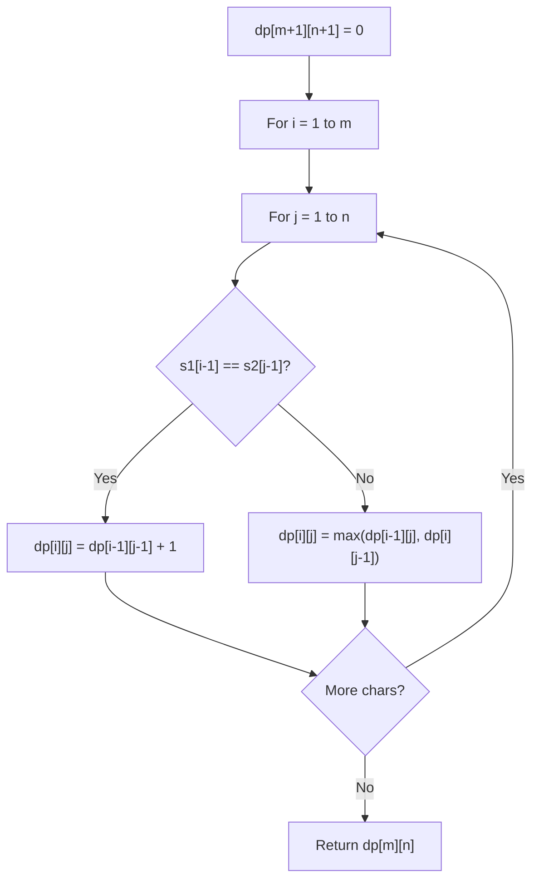

# Problem 1397: Find All Good Strings

**Difficulty:** Hard  
**Tags:** String, Dynamic Programming, String Matching  
**Pattern:** Dynamic Programming (String)  
**Link:** [leetcode.com/problems/find-all-good-strings](https://leetcode.com/problems/find-all-good-strings/)

## Description

Given the strings `s1` and `s2` of size `n` and the string `evil`, return *the number of **good** strings*.

A **good** string has size `n`, it is alphabetically greater than or equal to `s1`, it is alphabetically smaller than or equal to `s2`, and it does not contain the string `evil` as a substring. Since the answer can be a huge number, return this **modulo** `10^9 + 7`.

 

Example 1:

```

**Input:** n = 2, s1 = "aa", s2 = "da", evil = "b"
**Output:** 51 
**Explanation:** There are 25 good strings starting with 'a': "aa","ac","ad",...,"az". Then there are 25 good strings starting with 'c': "ca","cc","cd",...,"cz" and finally there is one good string starting with 'd': "da". 

```

Example 2:

```

**Input:** n = 8, s1 = "leetcode", s2 = "leetgoes", evil = "leet"
**Output:** 0 
**Explanation:** All strings greater than or equal to s1 and smaller than or equal to s2 start with the prefix "leet", therefore, there is not any good string.

```

Example 3:

```

**Input:** n = 2, s1 = "gx", s2 = "gz", evil = "x"
**Output:** 2

```

 

**Constraints:**

	- `s1.length == n`
	- `s2.length == n`
	- `s1 <= s2`
	- `1 <= n <= 500`
	- `1 <= evil.length <= 50`
	- All strings consist of lowercase English letters.

## Approach: Dynamic Programming (String)

Compare or match two strings using a 2D DP table. dp[i][j] represents the answer for substrings s1[0..i-1] and s2[0..j-1]. Common patterns: LCS, edit distance, regex matching.

## Pseudocode

```
1. Create dp[m+1][n+1]
2. Initialize base cases
3. For i from 1 to m:
   For j from 1 to n:
     If s1[i-1] == s2[j-1]: dp[i][j] = dp[i-1][j-1] + 1
     Else: dp[i][j] = best of (dp[i-1][j], dp[i][j-1], dp[i-1][j-1])
4. Return dp[m][n]
```

## Algorithm Flow



## Complexity Analysis

- **Time:** O(m * n)
- **Space:** O(m * n)

## Solution (Python3)

```python
class Solution:
    def findGoodStrings(self, n: int, s1: str, s2: str, evil: str) -> int:
        # String DP - O(m*n) time and space
        m, n = len(n), len(s1)
        dp = [[0] * (n + 1) for _ in range(m + 1)]
        for i in range(1, m + 1):
            for j in range(1, n + 1):
                if n[i-1] == s1[j-1]:
                    dp[i][j] = dp[i-1][j-1] + 1
                else:
                    dp[i][j] = max(dp[i-1][j], dp[i][j-1])
        return dp[m][n]
```

## Solution (C++)

```cpp
#include <algorithm>
#include <string>
#include <vector>
using namespace std;

class Solution {
public:
    int findGoodStrings(int n, string& s1, string& s2, string& evil) {
        // String DP - O(m*n) time and space
        int m = n.size(), n = s1.size();
        vector<vector<int>> dp(m + 1, vector<int>(n + 1, 0));
        for (int i = 1; i <= m; i++) {
            for (int j = 1; j <= n; j++) {
                if (n[i-1] == s1[j-1])
                    dp[i][j] = dp[i-1][j-1] + 1;
                else
                    dp[i][j] = max(dp[i-1][j], dp[i][j-1]);
            }
        }
        return dp[m][n];
    }
};
```
