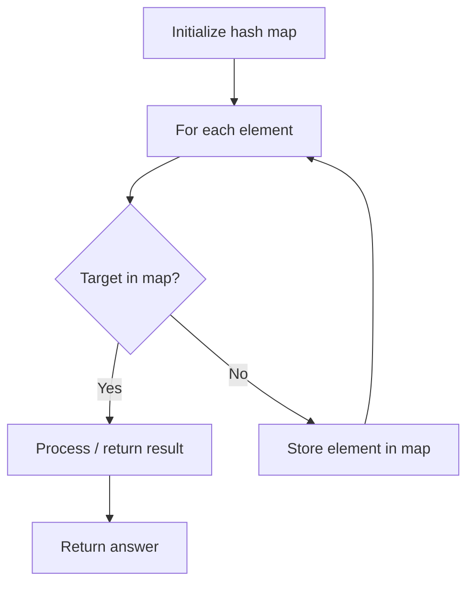

# Problem 1399: Count Largest Group

**Difficulty:** Easy  
**Tags:** Hash Table, Math  
**Pattern:** Hash Map Lookup  
**Link:** [leetcode.com/problems/count-largest-group](https://leetcode.com/problems/count-largest-group/)

## Description

You are given an integer `n`.

We need to group the numbers from `1` to `n` according to the sum of its digits. For example, the numbers 14 and 5 belong to the **same** group, whereas 13 and 3 belong to **different** groups.

Return the number of groups that have the largest size, i.e. the **maximum** number of elements.

 

Example 1:

```

**Input:** n = 13
**Output:** 4
**Explanation:** There are 9 groups in total, they are grouped according sum of its digits of numbers from 1 to 13:
[1,10], [2,11], [3,12], [4,13], [5], [6], [7], [8], [9].
There are 4 groups with largest size.

```

Example 2:

```

**Input:** n = 2
**Output:** 2
**Explanation:** There are 2 groups [1], [2] of size 1.

```

 

**Constraints:**

	- `1 <= n <= 10^4`

## Approach: Hash Map Lookup

Use a hash map (dictionary) to store elements for O(1) lookup. Iterate through the input, checking membership or counting frequencies in the map.

## Pseudocode

```
1. Initialize hash map
2. Iterate through elements:
   a. Check if target/complement exists in map
   b. If found: process result
   c. Otherwise: store element in map
3. Return result
```

## Algorithm Flow



## Complexity Analysis

- **Time:** O(n)
- **Space:** O(n)

## Solution (Python3)

```python
class Solution:
    def countLargestGroup(self, n: int) -> int:
        # Hash map approach - O(n) time, O(n) space
        seen = {}
        for i, val in enumerate(n):
            complement = n - val
            if complement in seen:
                return [seen[complement], i]
            seen[val] = i
        return 0
```

## Solution (C++)

```cpp
#include <string>
#include <unordered_map>
#include <vector>
using namespace std;

class Solution {
public:
    int countLargestGroup(int n) {
        // Hash map approach - O(n) time, O(n) space
        unordered_map<int, int> seen;
        for (int i = 0; i < n.size(); i++) {
            int complement = n - n[i];
            if (seen.count(complement)) {
                return {seen[complement], i};
            }
            seen[n[i]] = i;
        }
        return 0;
    }
};
```
