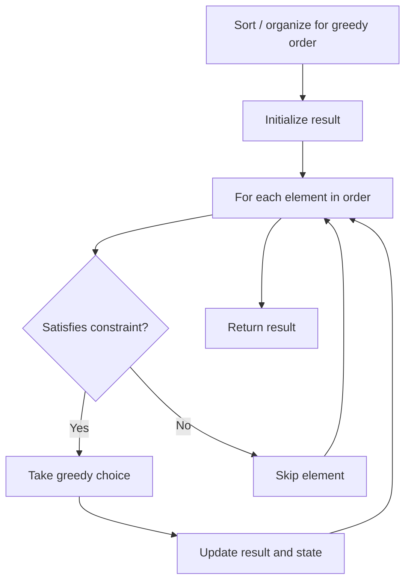

# Problem 1400: Construct K Palindrome Strings

**Difficulty:** Medium  
**Tags:** Hash Table, String, Greedy, Counting  
**Pattern:** Greedy  
**Link:** [leetcode.com/problems/construct-k-palindrome-strings](https://leetcode.com/problems/construct-k-palindrome-strings/)

## Description

Given a string `s` and an integer `k`, return `true` if you can use all the characters in `s` to construct **non-empty** `k` palindrome strings or `false` otherwise.

 

Example 1:

```

**Input:** s = "annabelle", k = 2
**Output:** true
**Explanation:** You can construct two palindromes using all characters in s.
Some possible constructions "anna" + "elble", "anbna" + "elle", "anellena" + "b"

```

Example 2:

```

**Input:** s = "leetcode", k = 3
**Output:** false
**Explanation:** It is impossible to construct 3 palindromes using all the characters of s.

```

Example 3:

```

**Input:** s = "true", k = 4
**Output:** true
**Explanation:** The only possible solution is to put each character in a separate string.

```

 

**Constraints:**

	- `1 <= s.length <= 10^5`
	- `s` consists of lowercase English letters.
	- `1 <= k <= 10^5`

## Approach: Greedy

Make the locally optimal choice at each step, trusting it leads to a global optimum. Greedy works when the problem has the greedy-choice property and optimal substructure.

## Pseudocode

```
1. Sort or organize data for greedy ordering
2. Initialize result
3. For each element in greedy order:
   a. If element satisfies constraint:
      - Take the greedy choice
      - Update result and state
4. Return result
```

## Algorithm Flow



## Complexity Analysis

- **Time:** O(n log n)
- **Space:** O(1)

## Solution (Python3)

```python
class Solution:
    def canConstruct(self, s: str, k: int) -> bool:
        # Greedy approach - O(n) time
        result = 0
        curr_max = 0
        for i in range(len(s)):
            if isinstance(s[i], int):
                curr_max = max(curr_max, s[i])
                result = max(result, curr_max)
            else:
                result += 1
        return result
```

## Solution (C++)

```cpp
#include <algorithm>
#include <string>
#include <vector>
using namespace std;

class Solution {
public:
    bool canConstruct(string& s, int k) {
        // Greedy approach - O(n) time
        int result = 0, curr_max = 0;
        for (int i = 0; i < (int)s.size(); i++) {
            curr_max = max(curr_max, s[i]);
            result = max(result, curr_max);
        }
        return result;
    }
};
```
