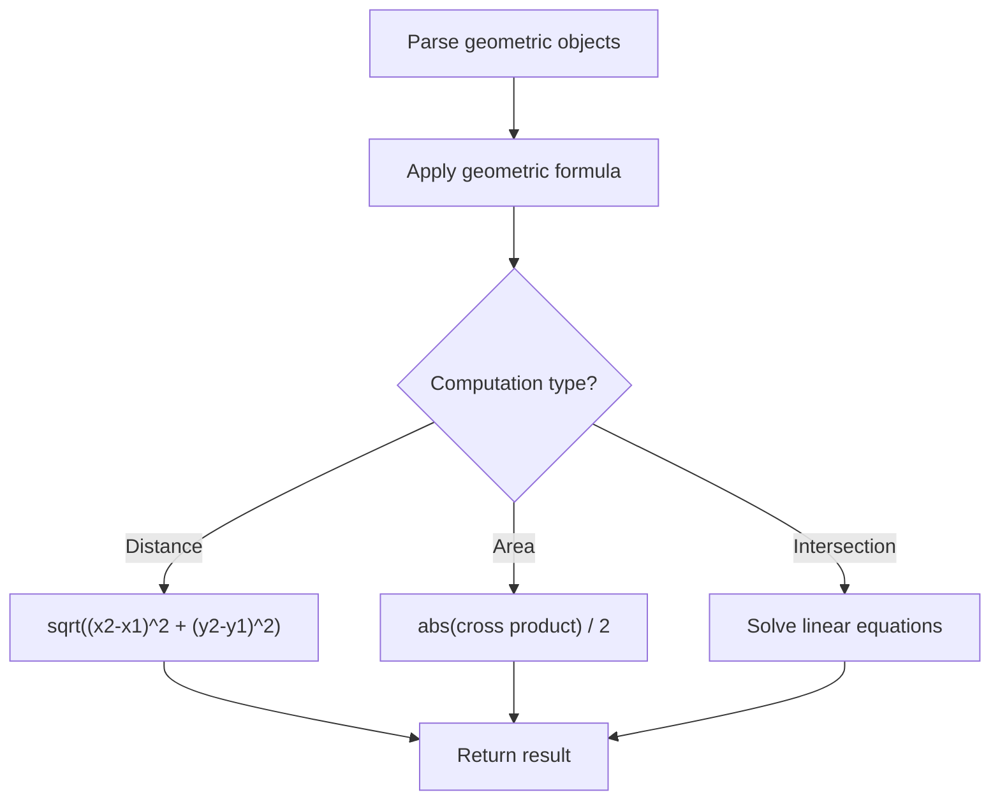

# Problem 1401: Circle and Rectangle Overlapping

**Difficulty:** Medium  
**Tags:** Math, Geometry  
**Pattern:** Geometry  
**Link:** [leetcode.com/problems/circle-and-rectangle-overlapping](https://leetcode.com/problems/circle-and-rectangle-overlapping/)

## Description

You are given a circle represented as `(radius, xCenter, yCenter)` and an axis-aligned rectangle represented as `(x1, y1, x2, y2)`, where `(x1, y1)` are the coordinates of the bottom-left corner, and `(x2, y2)` are the coordinates of the top-right corner of the rectangle.

Return `true`* if the circle and rectangle are overlapped otherwise return *`false`. In other words, check if there is **any** point `(xi, yi)` that belongs to the circle and the rectangle at the same time.

 

Example 1:

```

**Input:** radius = 1, xCenter = 0, yCenter = 0, x1 = 1, y1 = -1, x2 = 3, y2 = 1
**Output:** true
**Explanation:** Circle and rectangle share the point (1,0).

```

Example 2:

```

**Input:** radius = 1, xCenter = 1, yCenter = 1, x1 = 1, y1 = -3, x2 = 2, y2 = -1
**Output:** false

```

Example 3:

```

**Input:** radius = 1, xCenter = 0, yCenter = 0, x1 = -1, y1 = 0, x2 = 0, y2 = 1
**Output:** true

```

 

**Constraints:**

	- `1 <= radius <= 2000`
	- `-10^4 <= xCenter, yCenter <= 10^4`
	- `-10^4 <= x1 < x2 <= 10^4`
	- `-10^4 <= y1 < y2 <= 10^4`

## Approach: Geometry

Apply geometric formulas: distance, area, cross product, convex hull, line intersection. Handle floating-point precision carefully.

## Pseudocode

```
1. Parse geometric objects (points, lines, shapes)
2. Apply geometric operations:
   - Distance formula
   - Cross/dot product
   - Area computation
3. Handle precision and edge cases
4. Return result
```

## Algorithm Flow



## Complexity Analysis

- **Time:** O(n^2) or O(n log n)
- **Space:** O(n)

## Solution (Python3)

```python
class Solution:
    def checkOverlap(self, radius: int, xCenter: int, yCenter: int, x1: int, y1: int, x2: int, y2: int) -> bool:
        # Geometry approach
        import math
        result = 0
        for i in range(len(radius)):
            for j in range(i + 1, len(radius)):
                dx = radius[i][0] - radius[j][0]
                dy = radius[i][1] - radius[j][1]
                dist = math.sqrt(dx*dx + dy*dy)
                result = max(result, dist)
        return result
```

## Solution (C++)

```cpp
#include <algorithm>
#include <cmath>
#include <string>
#include <vector>
using namespace std;

class Solution {
public:
    bool checkOverlap(int radius, int xCenter, int yCenter, int x1, int y1, int x2, int y2) {
        // Geometry approach
        double result = 0;
        for (int i = 0; i < (int)radius.size(); i++) {
            for (int j = i + 1; j < (int)radius.size(); j++) {
                double dx = radius[i][0] - radius[j][0];
                double dy = radius[i][1] - radius[j][1];
                result = max(result, sqrt(dx*dx + dy*dy));
            }
        }
        return result;
    }
};
```
