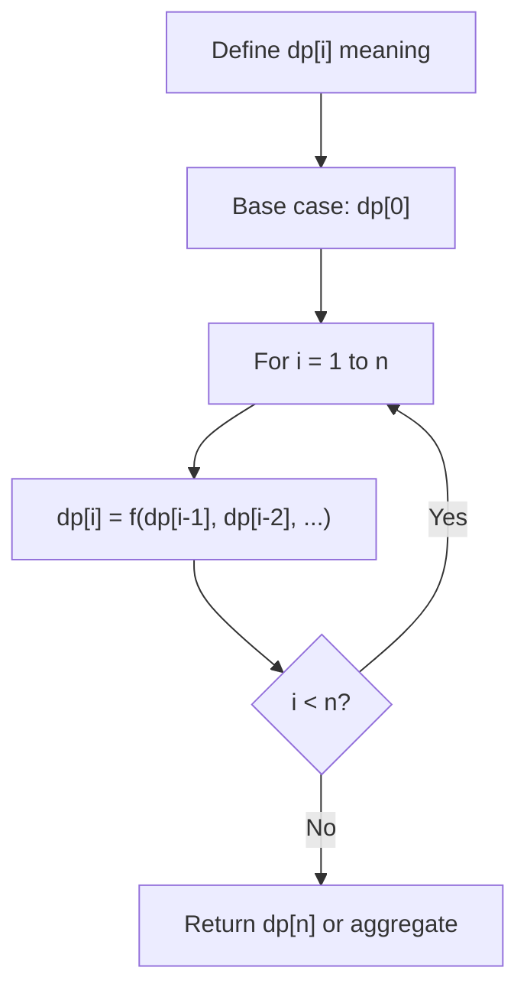
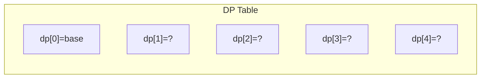
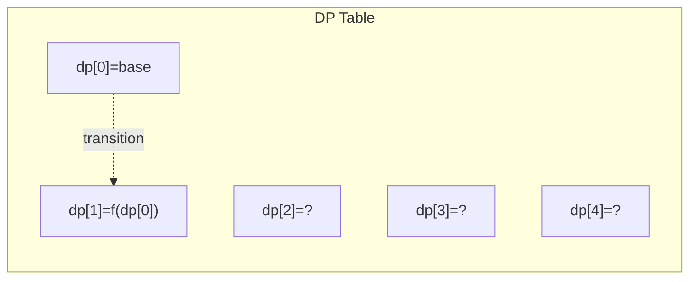
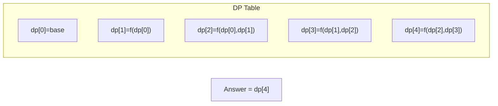

# Problem 1402: Reducing Dishes

**Difficulty:** Hard  
**Tags:** Array, Dynamic Programming, Greedy, Sorting  
**Pattern:** Dynamic Programming (1D)  
**Link:** [leetcode.com/problems/reducing-dishes](https://leetcode.com/problems/reducing-dishes/)

## Description

A chef has collected data on the `satisfaction` level of his `n` dishes. Chef can cook any dish in 1 unit of time.

**Like-time coefficient** of a dish is defined as the time taken to cook that dish including previous dishes multiplied by its satisfaction level i.e. `time[i] * satisfaction[i]`.

Return the maximum sum of **like-time coefficient **that the chef can obtain after preparing some amount of dishes.

Dishes can be prepared in **any **order and the chef can discard some dishes to get this maximum value.

 

Example 1:

```

**Input:** satisfaction = [-1,-8,0,5,-9]
**Output:** 14
**Explanation:** After Removing the second and last dish, the maximum total **like-time coefficient** will be equal to (-1*1 + 0*2 + 5*3 = 14).
Each dish is prepared in one unit of time.
```

Example 2:

```

**Input:** satisfaction = [4,3,2]
**Output:** 20
**Explanation:** Dishes can be prepared in any order, (2*1 + 3*2 + 4*3 = 20)

```

Example 3:

```

**Input:** satisfaction = [-1,-4,-5]
**Output:** 0
**Explanation:** People do not like the dishes. No dish is prepared.

```

 

**Constraints:**

	- `n == satisfaction.length`
	- `1 <= n <= 500`
	- `-1000 <= satisfaction[i] <= 1000`

## Approach: Dynamic Programming (1D)

Break the problem into overlapping subproblems. Define dp[i] as the optimal value for the subproblem ending at or considering index i. Build the solution bottom-up, using previously computed dp values.

## Pseudocode

```
1. Define dp[i] = optimal value for subproblem i
2. Base case: dp[0] = initial value
3. For i from 1 to n:
   a. dp[i] = recurrence(dp[i-1], dp[i-2], ...)
4. Return dp[n] or max/min of dp
```

## Algorithm Flow



## Visual State Transitions

**1D Dynamic Programming Table Build:**

**Frame 1: Initialize base cases**


**Frame 2: Fill dp[1] from dp[0]**


**Frame 3: Fill remaining cells**



## Complexity Analysis

- **Time:** O(n)
- **Space:** O(n)

## Solution (Python3)

```python
class Solution:
    def maxSatisfaction(self, satisfaction: List[int]) -> int:
        # Dynamic programming (1D) - O(n) time, O(n) space
        if not satisfaction:
            return 0
        n = len(satisfaction) if isinstance(satisfaction, list) else satisfaction
        dp = [0] * (n + 1)
        dp[0] = 1  # base case
        for i in range(1, n + 1):
            dp[i] = dp[i-1]  # transition (customize per problem)
            if i >= 2:
                dp[i] += dp[i-2]
        return dp[n]
```

## Solution (C++)

```cpp
#include <string>
#include <vector>
using namespace std;

class Solution {
public:
    int maxSatisfaction(vector<int>& satisfaction) {
        // Dynamic programming (1D) - O(n) time, O(n) space
        int n = satisfaction;
        if (n <= 0) return 0;
        vector<int> dp(n + 1, 0);
        dp[0] = 1;
        for (int i = 1; i <= n; i++) {
            dp[i] = dp[i-1];
            if (i >= 2) dp[i] += dp[i-2];
        }
        return dp[n];
    }
};
```
