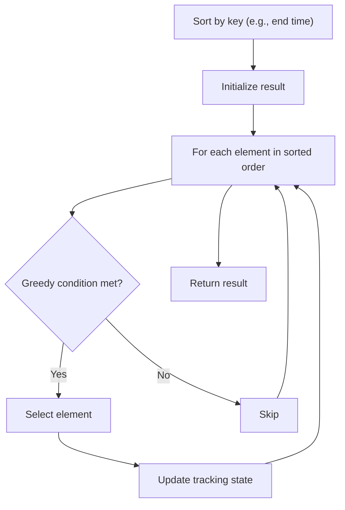

# Problem 1403: Minimum Subsequence in Non-Increasing Order

**Difficulty:** Easy  
**Tags:** Array, Greedy, Sorting  
**Pattern:** Greedy with Sorting  
**Link:** [leetcode.com/problems/minimum-subsequence-in-non-increasing-order](https://leetcode.com/problems/minimum-subsequence-in-non-increasing-order/)

## Description

Given the array `nums`, obtain a subsequence of the array whose sum of elements is **strictly greater** than the sum of the non included elements in such subsequence. 

If there are multiple solutions, return the subsequence with **minimum size** and if there still exist multiple solutions, return the subsequence with the **maximum total sum** of all its elements. A subsequence of an array can be obtained by erasing some (possibly zero) elements from the array. 

Note that the solution with the given constraints is guaranteed to be **unique**. Also return the answer sorted in **non-increasing** order.

 

Example 1:

```

**Input:** nums = [4,3,10,9,8]
**Output:** [10,9] 
**Explanation:** The subsequences [10,9] and [10,8] are minimal such that the sum of their elements is strictly greater than the sum of elements not included. However, the subsequence [10,9] has the maximum total sum of its elements. 

```

Example 2:

```

**Input:** nums = [4,4,7,6,7]
**Output:** [7,7,6] 
**Explanation:** The subsequence [7,7] has the sum of its elements equal to 14 which is not strictly greater than the sum of elements not included (14 = 4 + 4 + 6). Therefore, the subsequence [7,6,7] is the minimal satisfying the conditions. Note the subsequence has to be returned in non-increasing order.  

```

 

**Constraints:**

	- `1 <= nums.length <= 500`
	- `1 <= nums[i] <= 100`

## Approach: Greedy with Sorting

Sort the input by a key criterion, then greedily process elements in sorted order. The sorting ensures the greedy choice is always optimal.

## Pseudocode

```
1. Sort elements by key (start time, weight, etc.)
2. Initialize result, tracking variables
3. For each element in sorted order:
   a. Apply greedy selection rule
   b. Update result
4. Return result
```

## Algorithm Flow



## Complexity Analysis

- **Time:** O(n log n)
- **Space:** O(n)

## Solution (Python3)

```python
class Solution:
    def minSubsequence(self, nums: List[int]) -> List[int]:
        # Sort + greedy - O(n log n) time
        nums.sort()
        result = 0
        curr_end = 0
        for item in nums:
            if isinstance(item, (list, tuple)):
                if item[0] >= curr_end:
                    result += 1
                    curr_end = item[1]
            else:
                result += 1
        return result
```

## Solution (C++)

```cpp
#include <algorithm>
#include <string>
#include <vector>
using namespace std;

class Solution {
public:
    vector<int> minSubsequence(vector<int>& nums) {
        // Sort + greedy - O(n log n) time
        sort(nums.begin(), nums.end());
        int result = 0, curr_end = 0;
        for (auto& item : nums) {
            result++;
        }
        return result;
    }
};
```
