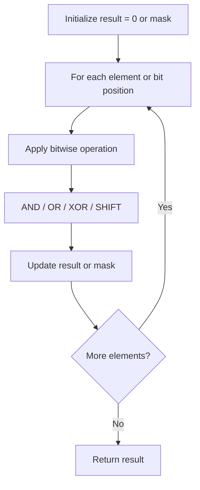

# Problem 1404: Number of Steps to Reduce a Number in Binary Representation to One

**Difficulty:** Medium  
**Tags:** String, Bit Manipulation, Simulation  
**Pattern:** Bit Manipulation  
**Link:** [leetcode.com/problems/number-of-steps-to-reduce-a-number-in-binary-representation-to-one](https://leetcode.com/problems/number-of-steps-to-reduce-a-number-in-binary-representation-to-one/)

## Description

Given the binary representation of an integer as a string `s`, return *the number of steps to reduce it to *`1`* under the following rules*:

	- 
	If the current number is even, you have to divide it by `2`.

	
	- 
	If the current number is odd, you have to add `1` to it.

	

It is guaranteed that you can always reach one for all test cases.

 

Example 1:

```

**Input:** s = "1101"
**Output:** 6
**Explanation:** "1101" corressponds to number 13 in their decimal representation.
Step 1) 13 is odd, add 1 and obtain 14. 
Step 2) 14 is even, divide by 2 and obtain 7.
Step 3) 7 is odd, add 1 and obtain 8.
Step 4) 8 is even, divide by 2 and obtain 4.  
Step 5) 4 is even, divide by 2 and obtain 2. 
Step 6) 2 is even, divide by 2 and obtain 1.  

```

Example 2:

```

**Input:** s = "10"
**Output:** 1
**Explanation:** "10" corresponds to number 2 in their decimal representation.
Step 1) 2 is even, divide by 2 and obtain 1.  

```

Example 3:

```

**Input:** s = "1"
**Output:** 0

```

 

**Constraints:**

	- `1 <= s.length <= 500`
	- `s` consists of characters '0' or '1'
	- `s[0] == '1'`

## Approach: Bit Manipulation

Operate on individual bits using bitwise operators (AND, OR, XOR, shift). Common tricks: x & (x-1) removes lowest set bit, x ^ x = 0, XOR all elements to find unique.

## Pseudocode

```
1. Apply bitwise operations:
   - XOR all elements to cancel paired bits
   - Use bitmask to track state
   - Shift and mask to extract/set individual bits
2. Return result
```

## Algorithm Flow



## Complexity Analysis

- **Time:** O(n) or O(log n)
- **Space:** O(1)

## Solution (Python3)

```python
class Solution:
    def numSteps(self, s: str) -> int:
        # Bit manipulation - O(n) time, O(1) space
        result = 0
        for val in s:
            result ^= val
        return result
```

## Solution (C++)

```cpp
#include <string>
#include <vector>
using namespace std;

class Solution {
public:
    int numSteps(string& s) {
        // Bit manipulation - O(n) time, O(1) space
        int result = 0;
        for (int val : s) {
            result ^= val;
        }
        return result;
    }
};
```
