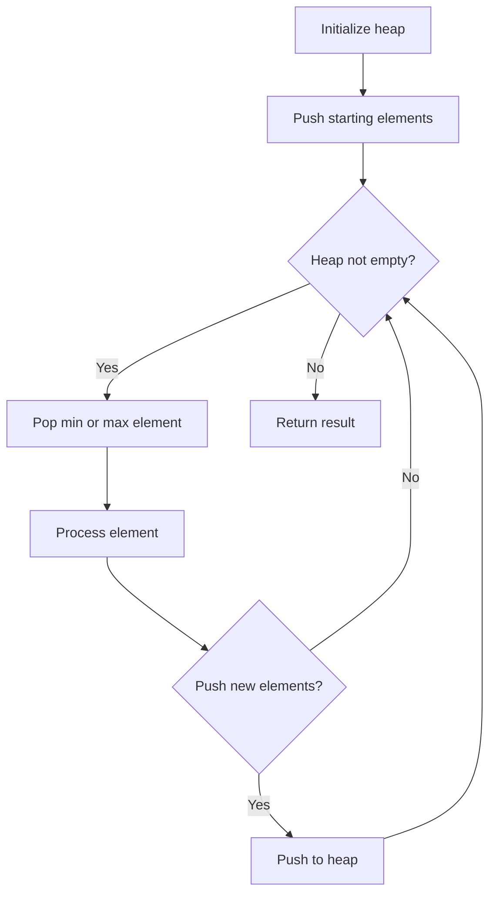
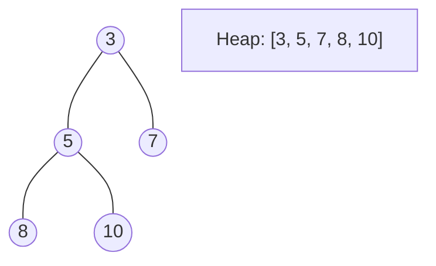
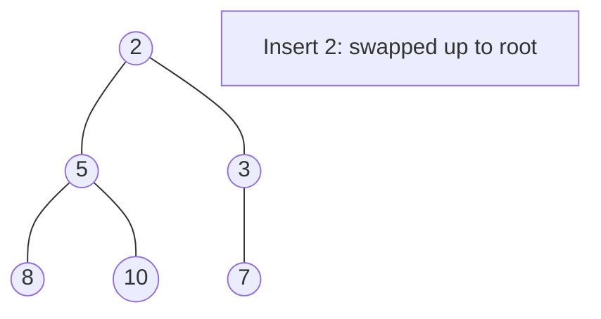
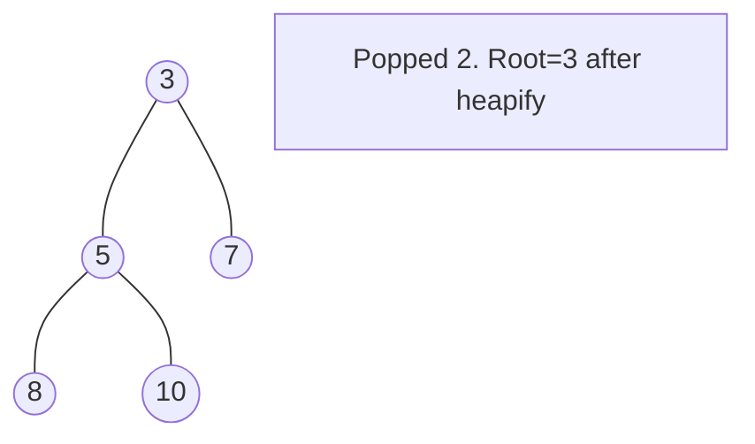

# Problem 1405: Longest Happy String

**Difficulty:** Medium  
**Tags:** String, Greedy, Heap (Priority Queue)  
**Pattern:** Heap / Priority Queue  
**Link:** [leetcode.com/problems/longest-happy-string](https://leetcode.com/problems/longest-happy-string/)

## Description

A string `s` is called **happy** if it satisfies the following conditions:

	- `s` only contains the letters `'a'`, `'b'`, and `'c'`.
	- `s` does not contain any of `"aaa"`, `"bbb"`, or `"ccc"` as a substring.
	- `s` contains **at most** `a` occurrences of the letter `'a'`.
	- `s` contains **at most** `b` occurrences of the letter `'b'`.
	- `s` contains **at most** `c` occurrences of the letter `'c'`.

Given three integers `a`, `b`, and `c`, return *the **longest possible happy **string*. If there are multiple longest happy strings, return *any of them*. If there is no such string, return *the empty string *`""`.

A **substring** is a contiguous sequence of characters within a string.

 

Example 1:

```

**Input:** a = 1, b = 1, c = 7
**Output:** "ccaccbcc"
**Explanation:** "ccbccacc" would also be a correct answer.

```

Example 2:

```

**Input:** a = 7, b = 1, c = 0
**Output:** "aabaa"
**Explanation:** It is the only correct answer in this case.

```

 

**Constraints:**

	- `0 <= a, b, c <= 100`
	- `a + b + c > 0`

## Approach: Heap / Priority Queue

Use a min-heap or max-heap to efficiently access the smallest/largest element. Push elements and pop the top to process in priority order.

## Pseudocode

```
1. Initialize heap (min or max)
2. Push initial elements onto heap
3. While heap not empty and condition:
   a. Pop top element (min or max)
   b. Process element
   c. Push new elements if needed
4. Return result
```

## Algorithm Flow



## Visual State Transitions

**Heap Operations (Min-Heap):**

**Frame 1: Initial heap**


**Frame 2: Insert 2 - bubble up**


**Frame 3: Pop minimum (2) - heapify down**



## Complexity Analysis

- **Time:** O(n log n)
- **Space:** O(n)

## Solution (Python3)

```python
class Solution:
    def longestDiverseString(self, a: int, b: int, c: int) -> str:
        # Heap/Priority Queue - O(n log k) time
        import heapq
        if not a:
            return ""
        # Min heap (negate for max heap)
        heap = []
        for val in a:
            heapq.heappush(heap, val)
            if len(heap) > (b if isinstance(b, int) else len(a)):
                heapq.heappop(heap)
        return heap[0] if heap else ""
```

## Solution (C++)

```cpp
#include <queue>
#include <string>
#include <vector>
using namespace std;

class Solution {
public:
    string longestDiverseString(int a, int b, int c) {
        // Heap/Priority Queue - O(n log k) time
        priority_queue<int, vector<int>, greater<int>> pq;
        for (int val : a) {
            pq.push(val);
            if ((int)pq.size() > b)
                pq.pop();
        }
        return pq.empty() ? "" : pq.top();
    }
};
```
