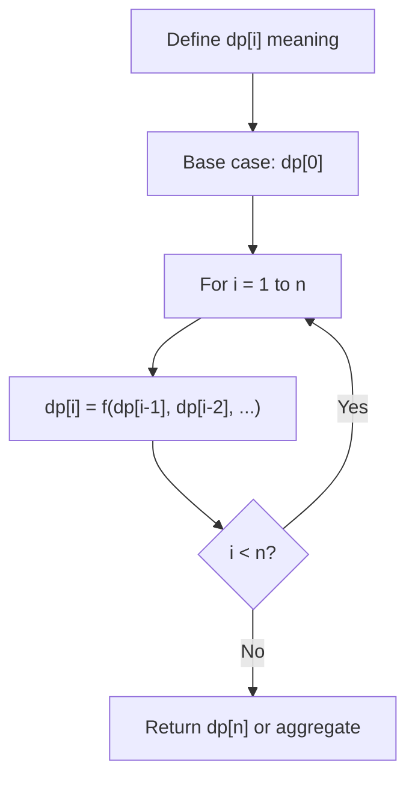
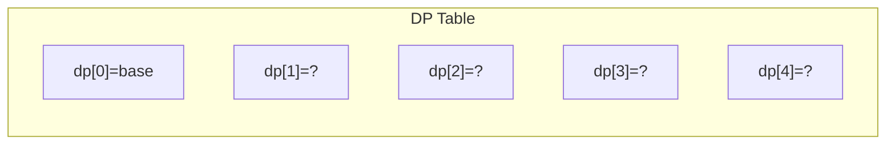
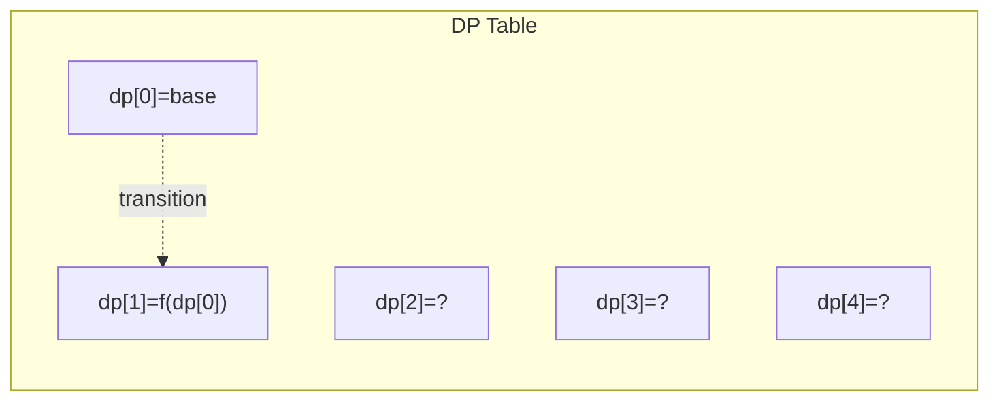
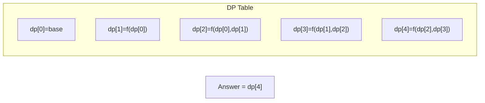

# Problem 1406: Stone Game III

**Difficulty:** Hard  
**Tags:** Array, Math, Dynamic Programming, Game Theory  
**Pattern:** Dynamic Programming (1D)  
**Link:** [leetcode.com/problems/stone-game-iii](https://leetcode.com/problems/stone-game-iii/)

## Description

Alice and Bob continue their games with piles of stones. There are several stones **arranged in a row**, and each stone has an associated value which is an integer given in the array `stoneValue`.

Alice and Bob take turns, with Alice starting first. On each player's turn, that player can take `1`, `2`, or `3` stones from the **first** remaining stones in the row.

The score of each player is the sum of the values of the stones taken. The score of each player is `0` initially.

The objective of the game is to end with the highest score, and the winner is the player with the highest score and there could be a tie. The game continues until all the stones have been taken.

Assume Alice and Bob **play optimally**.

Return `"Alice"`* if Alice will win, *`"Bob"`* if Bob will win, or *`"Tie"`* if they will end the game with the same score*.

 

Example 1:

```

**Input:** stoneValue = [1,2,3,7]
**Output:** "Bob"
**Explanation:** Alice will always lose. Her best move will be to take three piles and the score become 6. Now the score of Bob is 7 and Bob wins.

```

Example 2:

```

**Input:** stoneValue = [1,2,3,-9]
**Output:** "Alice"
**Explanation:** Alice must choose all the three piles at the first move to win and leave Bob with negative score.
If Alice chooses one pile her score will be 1 and the next move Bob's score becomes 5. In the next move, Alice will take the pile with value = -9 and lose.
If Alice chooses two piles her score will be 3 and the next move Bob's score becomes 3. In the next move, Alice will take the pile with value = -9 and also lose.
Remember that both play optimally so here Alice will choose the scenario that makes her win.

```

Example 3:

```

**Input:** stoneValue = [1,2,3,6]
**Output:** "Tie"
**Explanation:** Alice cannot win this game. She can end the game in a draw if she decided to choose all the first three piles, otherwise she will lose.

```

 

**Constraints:**

	- `1 <= stoneValue.length <= 5 * 10^4`
	- `-1000 <= stoneValue[i] <= 1000`

## Approach: Dynamic Programming (1D)

Break the problem into overlapping subproblems. Define dp[i] as the optimal value for the subproblem ending at or considering index i. Build the solution bottom-up, using previously computed dp values.

## Pseudocode

```
1. Define dp[i] = optimal value for subproblem i
2. Base case: dp[0] = initial value
3. For i from 1 to n:
   a. dp[i] = recurrence(dp[i-1], dp[i-2], ...)
4. Return dp[n] or max/min of dp
```

## Algorithm Flow



## Visual State Transitions

**1D Dynamic Programming Table Build:**

**Frame 1: Initialize base cases**


**Frame 2: Fill dp[1] from dp[0]**


**Frame 3: Fill remaining cells**



## Complexity Analysis

- **Time:** O(n)
- **Space:** O(n)

## Solution (Python3)

```python
class Solution:
    def stoneGameIII(self, stoneValue: List[int]) -> str:
        # Dynamic programming (1D) - O(n) time, O(n) space
        if not stoneValue:
            return 0
        n = len(stoneValue) if isinstance(stoneValue, list) else stoneValue
        dp = [0] * (n + 1)
        dp[0] = 1  # base case
        for i in range(1, n + 1):
            dp[i] = dp[i-1]  # transition (customize per problem)
            if i >= 2:
                dp[i] += dp[i-2]
        return dp[n]
```

## Solution (C++)

```cpp
#include <string>
#include <vector>
using namespace std;

class Solution {
public:
    string stoneGameIII(vector<int>& stoneValue) {
        // Dynamic programming (1D) - O(n) time, O(n) space
        int n = stoneValue;
        if (n <= 0) return 0;
        vector<int> dp(n + 1, 0);
        dp[0] = 1;
        for (int i = 1; i <= n; i++) {
            dp[i] = dp[i-1];
            if (i >= 2) dp[i] += dp[i-2];
        }
        return dp[n];
    }
};
```
