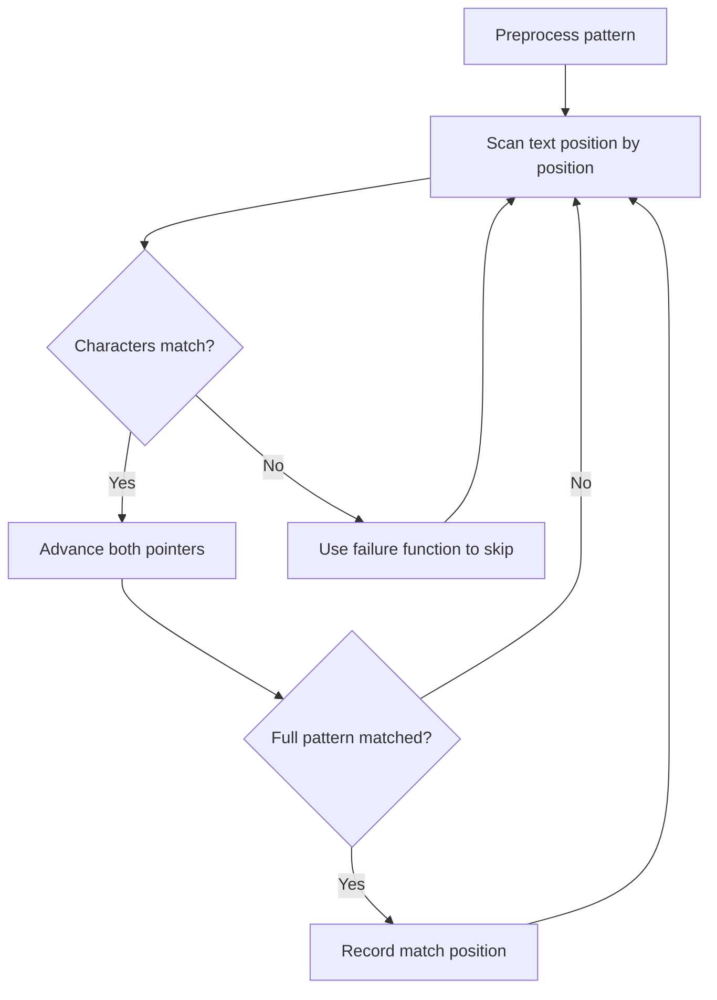

# Problem 1408: String Matching in an Array

**Difficulty:** Easy  
**Tags:** Array, String, String Matching  
**Pattern:** String Matching  
**Link:** [leetcode.com/problems/string-matching-in-an-array](https://leetcode.com/problems/string-matching-in-an-array/)

## Description

Given an array of string `words`, return all strings in* *`words`* *that are a substring of another word. You can return the answer in **any order**.

 

Example 1:

```

**Input:** words = ["mass","as","hero","superhero"]
**Output:** ["as","hero"]
**Explanation:** "as" is substring of "mass" and "hero" is substring of "superhero".
["hero","as"] is also a valid answer.

```

Example 2:

```

**Input:** words = ["leetcode","et","code"]
**Output:** ["et","code"]
**Explanation:** "et", "code" are substring of "leetcode".

```

Example 3:

```

**Input:** words = ["blue","green","bu"]
**Output:** []
**Explanation:** No string of words is substring of another string.

```

 

**Constraints:**

	- `1 <= words.length <= 100`
	- `1 <= words[i].length <= 30`
	- `words[i]` contains only lowercase English letters.
	- All the strings of `words` are **unique**.

## Approach: String Matching

Find pattern occurrences in text. Use KMP, Rabin-Karp, or Z-algorithm for efficient matching beyond brute force.

## Pseudocode

```
1. Preprocess pattern (build failure function / hash)
2. Scan text with pattern:
   a. Compare characters
   b. On mismatch: use preprocessed data to skip
   c. On full match: record position
3. Return matches
```

## Algorithm Flow



## Complexity Analysis

- **Time:** O(n + m)
- **Space:** O(m)

## Solution (Python3)

```python
class Solution:
    def stringMatching(self, words: List[str]) -> List[str]:
        # String matching (KMP/Rolling Hash) - O(n+m) time
        if not words or not words:
            return []
        n, m = len(words), len(words)
        # Build failure function for KMP
        fail = [0] * m
        j = 0
        for i in range(1, m):
            while j > 0 and words[i] != words[j]:
                j = fail[j-1]
            if words[i] == words[j]:
                j += 1
            fail[i] = j
        # Search
        j = 0
        for i in range(n):
            while j > 0 and words[i] != words[j]:
                j = fail[j-1]
            if words[i] == words[j]:
                j += 1
            if j == m:
                return i - m + 1
        return -1
```

## Solution (C++)

```cpp
#include <string>
#include <vector>
using namespace std;

class Solution {
public:
    vector<string> stringMatching(vector<string>& words) {
        // String matching (KMP) - O(n+m) time
        int n = words.size(), m = words.size();
        if (m == 0) return 0;
        vector<int> fail(m, 0);
        for (int i = 1, j = 0; i < m; i++) {
            while (j > 0 && words[i] != words[j]) j = fail[j-1];
            if (words[i] == words[j]) j++;
            fail[i] = j;
        }
        for (int i = 0, j = 0; i < n; i++) {
            while (j > 0 && words[i] != words[j]) j = fail[j-1];
            if (words[i] == words[j]) j++;
            if (j == m) return i - m + 1;
        }
        return -1;
    }
};
```
