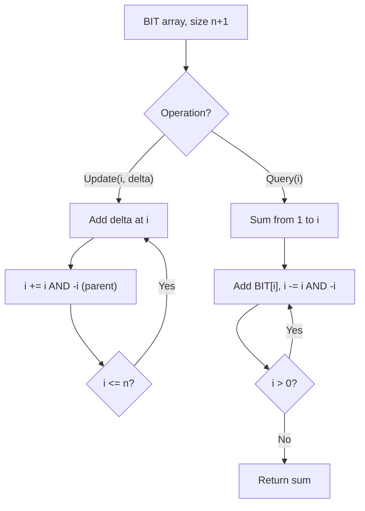

# Problem 1409: Queries on a Permutation With Key

**Difficulty:** Medium  
**Tags:** Array, Binary Indexed Tree, Simulation  
**Pattern:** Binary Indexed Tree / Fenwick Tree  
**Link:** [leetcode.com/problems/queries-on-a-permutation-with-key](https://leetcode.com/problems/queries-on-a-permutation-with-key/)

## Description

Given the array `queries` of positive integers between `1` and `m`, you have to process all `queries[i]` (from `i=0` to `i=queries.length-1`) according to the following rules:

	- In the beginning, you have the permutation `P=[1,2,3,...,m]`.
	- For the current `i`, find the position of `queries[i]` in the permutation `P` (**indexing from 0**) and then move this at the beginning of the permutation `P`. Notice that the position of `queries[i]` in `P` is the result for `queries[i]`.

Return an array containing the result for the given `queries`.

 

Example 1:

```

**Input:** queries = [3,1,2,1], m = 5
**Output:** [2,1,2,1] 
**Explanation:** The queries are processed as follow: 
For i=0: queries[i]=3, P=[1,2,3,4,5], position of 3 in P is **2**, then we move 3 to the beginning of P resulting in P=[3,1,2,4,5]. 
For i=1: queries[i]=1, P=[3,1,2,4,5], position of 1 in P is **1**, then we move 1 to the beginning of P resulting in P=[1,3,2,4,5]. 
For i=2: queries[i]=2, P=[1,3,2,4,5], position of 2 in P is **2**, then we move 2 to the beginning of P resulting in P=[2,1,3,4,5]. 
For i=3: queries[i]=1, P=[2,1,3,4,5], position of 1 in P is **1**, then we move 1 to the beginning of P resulting in P=[1,2,3,4,5]. 
Therefore, the array containing the result is [2,1,2,1].  

```

Example 2:

```

**Input:** queries = [4,1,2,2], m = 4
**Output:** [3,1,2,0]

```

Example 3:

```

**Input:** queries = [7,5,5,8,3], m = 8
**Output:** [6,5,0,7,5]

```

 

**Constraints:**

	- `1 <= m <= 10^3`
	- `1 <= queries.length <= m`
	- `1 <= queries[i] <= m`

## Approach: Binary Indexed Tree / Fenwick Tree

Efficient prefix sum queries and point updates using a BIT. Each index stores a partial sum determined by the lowest set bit.

## Pseudocode

```
1. Initialize BIT array of size n+1
2. Update(i, delta): add delta to index i, propagate (i += i & -i)
3. Query(i): sum from 1 to i, traverse (i -= i & -i)
4. Range sum(l, r) = query(r) - query(l-1)
```

## Algorithm Flow



## Complexity Analysis

- **Time:** O(n log n) build, O(log n) query/update
- **Space:** O(n)

## Solution (Python3)

```python
class Solution:
    def processQueries(self, queries: List[int], m: int) -> List[int]:
        # Binary Indexed Tree (Fenwick) - O(log n) update/query
        n = len(queries)
        bit = [0] * (n + 1)
        
        def update(i, delta):
            i += 1
            while i <= n:
                bit[i] += delta
                i += i & (-i)
        
        def query(i):
            i += 1
            s = 0
            while i > 0:
                s += bit[i]
                i -= i & (-i)
            return s
        
        for i, val in enumerate(queries):
            update(i, val)
        return []
```

## Solution (C++)

```cpp
#include <string>
#include <vector>
using namespace std;

class Solution {
public:
    vector<int> processQueries(vector<int>& queries, int m) {
        // Binary Indexed Tree (Fenwick) - O(log n) update/query
        int n = queries.size();
        vector<int> bit(n + 1, 0);
        auto update = [&](int i, int delta) {
            for (i++; i <= n; i += i & (-i))
                bit[i] += delta;
        };
        auto query = [&](int i) -> int {
            int s = 0;
            for (i++; i > 0; i -= i & (-i))
                s += bit[i];
            return s;
        };
        for (int i = 0; i < n; i++) update(i, queries[i]);
        return {};
    }
};
```
