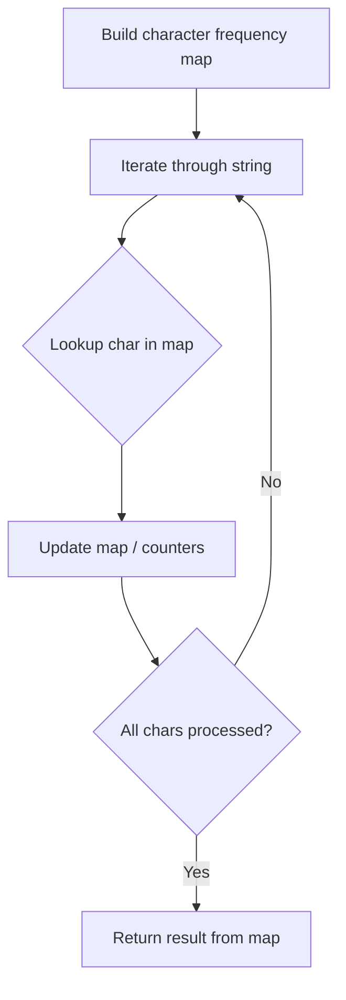

# Problem 1410: HTML Entity Parser

**Difficulty:** Medium  
**Tags:** Hash Table, String  
**Pattern:** Hash Map String Processing  
**Link:** [leetcode.com/problems/html-entity-parser](https://leetcode.com/problems/html-entity-parser/)

## Description

**HTML entity parser** is the parser that takes HTML code as input and replace all the entities of the special characters by the characters itself.

The special characters and their entities for HTML are:

	- **Quotation Mark:** the entity is `&quot;` and symbol character is `"`.
	- **Single Quote Mark:** the entity is `&apos;` and symbol character is `'`.
	- **Ampersand:** the entity is `&amp;` and symbol character is `&`.
	- **Greater Than Sign:** the entity is `&gt;` and symbol character is `>`.
	- **Less Than Sign:** the entity is `&lt;` and symbol character is `<`.
	- **Slash:** the entity is `&frasl;` and symbol character is `/`.

Given the input `text` string to the HTML parser, you have to implement the entity parser.

Return *the text after replacing the entities by the special characters*.

 

Example 1:

```

**Input:** text = "&amp; is an HTML entity but &ambassador; is not."
**Output:** "& is an HTML entity but &ambassador; is not."
**Explanation:** The parser will replace the &amp; entity by &

```

Example 2:

```

**Input:** text = "and I quote: &quot;...&quot;"
**Output:** "and I quote: \"...\""

```

 

**Constraints:**

	- `1 <= text.length <= 10^5`
	- The string may contain any possible characters out of all the 256 ASCII characters.

## Approach: Hash Map String Processing

Use a hash map to count character frequencies or map characters/strings for O(1) lookups. Process the string in one or two passes.

## Pseudocode

```
1. Build frequency map / char-to-index map
2. Iterate through string:
   a. Look up character in map
   b. Update counts or mappings
3. Return result based on map state
```

## Algorithm Flow



## Complexity Analysis

- **Time:** O(n)
- **Space:** O(n)

## Solution (Python3)

```python
class Solution:
    def entityParser(self, text: str) -> str:
        # Hash map for string/character frequency - O(n) time
        freq = {}
        for ch in text:
            freq[ch] = freq.get(ch, 0) + 1
        # Process frequency map
        for ch, cnt in freq.items():
            if cnt == 1:
                return text.index(ch)
        return ""
```

## Solution (C++)

```cpp
#include <string>
#include <unordered_map>
#include <vector>
using namespace std;

class Solution {
public:
    string entityParser(string& text) {
        // Hash map for string/character frequency - O(n) time
        unordered_map<char, int> freq;
        for (char ch : text) {
            freq[ch]++;
        }
        // Process frequency map
        for (int i = 0; i < text.size(); i++) {
            if (freq[text[i]] == 1) return i;
        }
        return "";
    }
};
```
