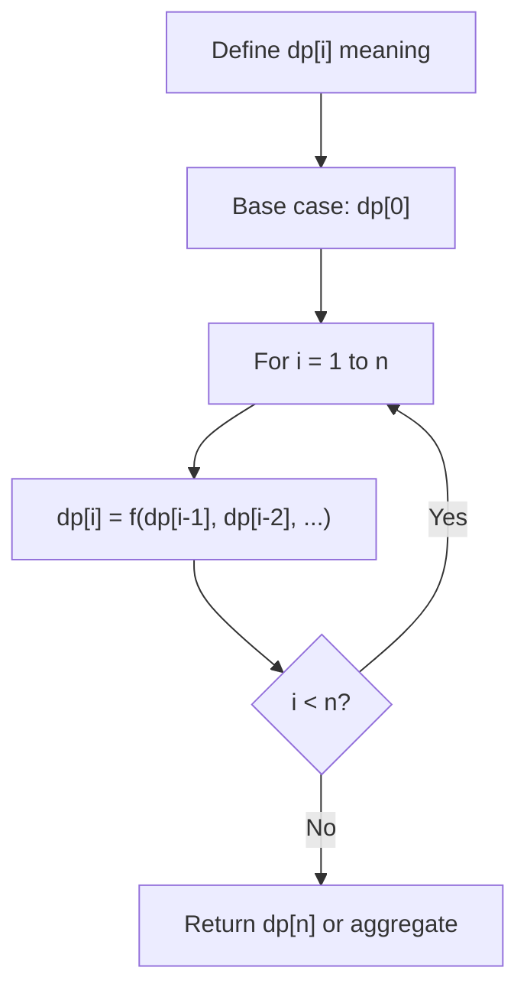
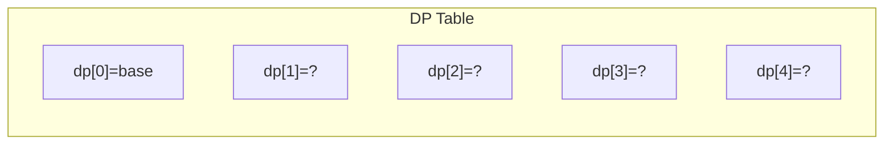
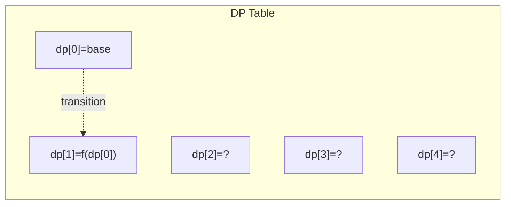
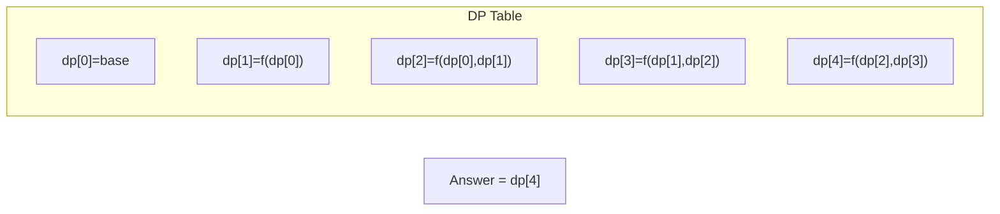

# Problem 1411: Number of Ways to Paint N × 3 Grid

**Difficulty:** Hard  
**Tags:** Dynamic Programming  
**Pattern:** Dynamic Programming (1D)  
**Link:** [leetcode.com/problems/number-of-ways-to-paint-n-3-grid](https://leetcode.com/problems/number-of-ways-to-paint-n-3-grid/)

## Description

You have a `grid` of size `n x 3` and you want to paint each cell of the grid with exactly one of the three colors: **Red**, **Yellow,** or **Green** while making sure that no two adjacent cells have the same color (i.e., no two cells that share vertical or horizontal sides have the same color).

Given `n` the number of rows of the grid, return *the number of ways* you can paint this `grid`. As the answer may grow large, the answer **must be** computed modulo `10^9 + 7`.

 

Example 1:

```

**Input:** n = 1
**Output:** 12
**Explanation:** There are 12 possible way to paint the grid as shown.

```

Example 2:

```

**Input:** n = 5000
**Output:** 30228214

```

 

**Constraints:**

	- `n == grid.length`
	- `1 <= n <= 5000`

## Approach: Dynamic Programming (1D)

Break the problem into overlapping subproblems. Define dp[i] as the optimal value for the subproblem ending at or considering index i. Build the solution bottom-up, using previously computed dp values.

## Pseudocode

```
1. Define dp[i] = optimal value for subproblem i
2. Base case: dp[0] = initial value
3. For i from 1 to n:
   a. dp[i] = recurrence(dp[i-1], dp[i-2], ...)
4. Return dp[n] or max/min of dp
```

## Algorithm Flow



## Visual State Transitions

**1D Dynamic Programming Table Build:**

**Frame 1: Initialize base cases**


**Frame 2: Fill dp[1] from dp[0]**


**Frame 3: Fill remaining cells**



## Complexity Analysis

- **Time:** O(n)
- **Space:** O(n)

## Solution (Python3)

```python
class Solution:
    def numOfWays(self, n: int) -> int:
        # Dynamic programming (1D) - O(n) time, O(n) space
        if not n:
            return 0
        n = len(n) if isinstance(n, list) else n
        dp = [0] * (n + 1)
        dp[0] = 1  # base case
        for i in range(1, n + 1):
            dp[i] = dp[i-1]  # transition (customize per problem)
            if i >= 2:
                dp[i] += dp[i-2]
        return dp[n]
```

## Solution (C++)

```cpp
#include <string>
#include <vector>
using namespace std;

class Solution {
public:
    int numOfWays(int n) {
        // Dynamic programming (1D) - O(n) time, O(n) space
        int n = n;
        if (n <= 0) return 0;
        vector<int> dp(n + 1, 0);
        dp[0] = 1;
        for (int i = 1; i <= n; i++) {
            dp[i] = dp[i-1];
            if (i >= 2) dp[i] += dp[i-2];
        }
        return dp[n];
    }
};
```
