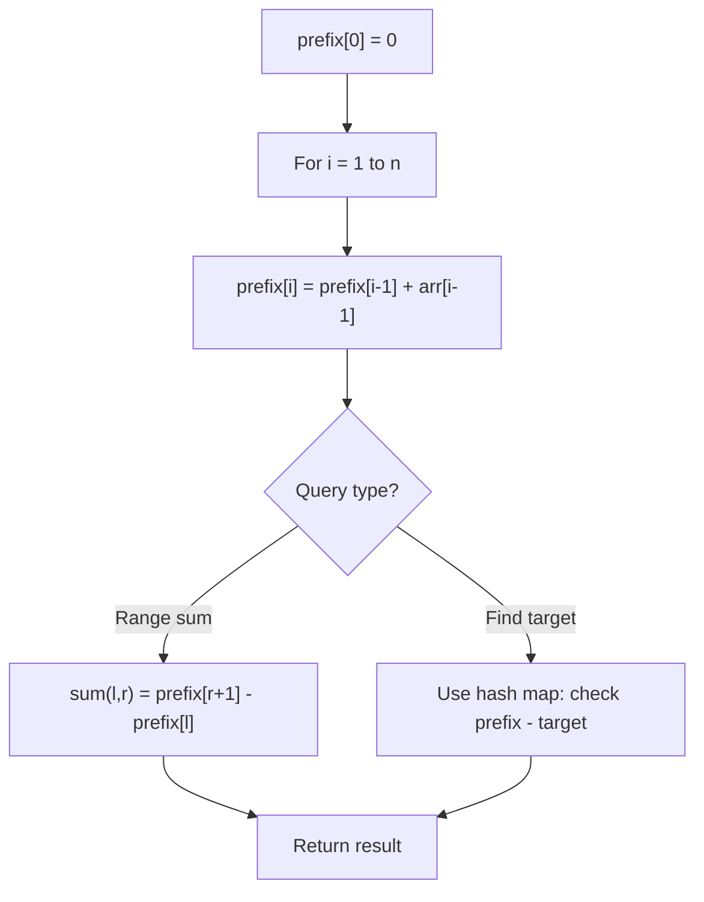

# Problem 1413: Minimum Value to Get Positive Step by Step Sum

**Difficulty:** Easy  
**Tags:** Array, Prefix Sum  
**Pattern:** Prefix Sum  
**Link:** [leetcode.com/problems/minimum-value-to-get-positive-step-by-step-sum](https://leetcode.com/problems/minimum-value-to-get-positive-step-by-step-sum/)

## Description

Given an array of integers `nums`, you start with an initial **positive** value *startValue**.*

In each iteration, you calculate the step by step sum of *startValue* plus elements in `nums` (from left to right).

Return the minimum **positive** value of *startValue* such that the step by step sum is never less than 1.

 

Example 1:

```

**Input:** nums = [-3,2,-3,4,2]
**Output:** 5
**Explanation: **If you choose startValue = 4, in the third iteration your step by step sum is less than 1.
**step by step sum**
**startValue = 4 | startValue = 5 | nums**
  (4 **-3** ) = 1  | (5 **-3** ) = 2    |  -3
  (1 **+2** ) = 3  | (2 **+2** ) = 4    |   2
  (3 **-3** ) = 0  | (4 **-3** ) = 1    |  -3
  (0 **+4** ) = 4  | (1 **+4** ) = 5    |   4
  (4 **+2** ) = 6  | (5 **+2** ) = 7    |   2

```

Example 2:

```

**Input:** nums = [1,2]
**Output:** 1
**Explanation:** Minimum start value should be positive. 

```

Example 3:

```

**Input:** nums = [1,-2,-3]
**Output:** 5

```

 

**Constraints:**

	- `1 <= nums.length <= 100`
	- `-100 <= nums[i] <= 100`

## Approach: Prefix Sum

Build a prefix sum array where prefix[i] = sum of elements 0..i-1. Any subarray sum [l..r] = prefix[r+1] - prefix[l]. Combine with hash map for O(n) subarray sum queries.

## Pseudocode

```
1. Build prefix sum array: prefix[0]=0, prefix[i]=prefix[i-1]+arr[i-1]
2. Use prefix sums to answer queries:
   - Subarray sum [l..r] = prefix[r+1] - prefix[l]
   - Or use hash map to find prefix[j]-prefix[i] == target
3. Return result
```

## Algorithm Flow



## Complexity Analysis

- **Time:** O(n)
- **Space:** O(n)

## Solution (Python3)

```python
class Solution:
    def minStartValue(self, nums: List[int]) -> int:
        # Prefix sum approach - O(n) time, O(n) space
        prefix = {0: -1}
        curr_sum = 0
        result = 0
        target = nums if isinstance(nums, int) else 0
        for i, val in enumerate(nums):
            curr_sum += val
            if curr_sum - target in prefix:
                result = max(result, i - prefix[curr_sum - target])
            if curr_sum not in prefix:
                prefix[curr_sum] = i
        return result
```

## Solution (C++)

```cpp
#include <algorithm>
#include <string>
#include <unordered_map>
#include <vector>
using namespace std;

class Solution {
public:
    int minStartValue(vector<int>& nums) {
        // Prefix sum approach - O(n) time, O(n) space
        unordered_map<int, int> prefix;
        prefix[0] = -1;
        int curr_sum = 0, result = 0;
        int target = nums;
        for (int i = 0; i < (int)nums.size(); i++) {
            curr_sum += nums[i];
            if (prefix.count(curr_sum - target)) {
                result = max(result, i - prefix[curr_sum - target]);
            }
            if (!prefix.count(curr_sum)) {
                prefix[curr_sum] = i;
            }
        }
        return result;
    }
};
```
