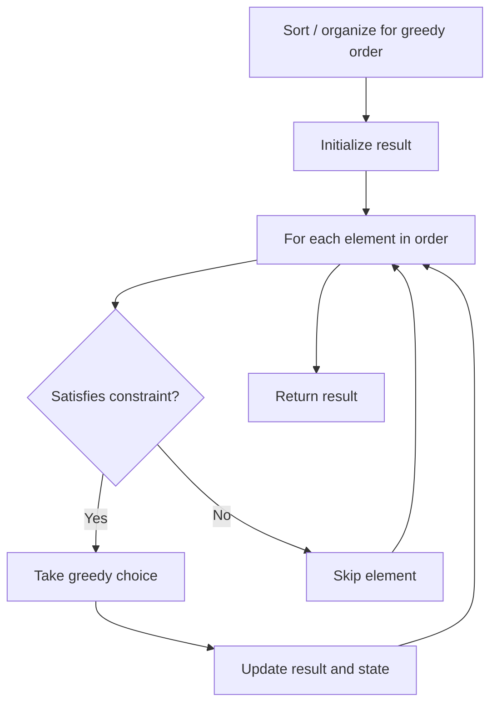

# Problem 1414: Find the Minimum Number of Fibonacci Numbers Whose Sum Is K

**Difficulty:** Medium  
**Tags:** Math, Greedy  
**Pattern:** Greedy  
**Link:** [leetcode.com/problems/find-the-minimum-number-of-fibonacci-numbers-whose-sum-is-k](https://leetcode.com/problems/find-the-minimum-number-of-fibonacci-numbers-whose-sum-is-k/)

## Description

Given an integer `k`, *return the minimum number of Fibonacci numbers whose sum is equal to *`k`. The same Fibonacci number can be used multiple times.

The Fibonacci numbers are defined as:

	- `F1 = 1`
	- `F2 = 1`
	- `Fn = Fn-1 + Fn-2` for `n > 2.`

It is guaranteed that for the given constraints we can always find such Fibonacci numbers that sum up to `k`.
 

Example 1:

```

**Input:** k = 7
**Output:** 2 
**Explanation:** The Fibonacci numbers are: 1, 1, 2, 3, 5, 8, 13, ... 
For k = 7 we can use 2 + 5 = 7.
```

Example 2:

```

**Input:** k = 10
**Output:** 2 
**Explanation:** For k = 10 we can use 2 + 8 = 10.

```

Example 3:

```

**Input:** k = 19
**Output:** 3 
**Explanation:** For k = 19 we can use 1 + 5 + 13 = 19.

```

 

**Constraints:**

	- `1 <= k <= 10^9`

## Approach: Greedy

Make the locally optimal choice at each step, trusting it leads to a global optimum. Greedy works when the problem has the greedy-choice property and optimal substructure.

## Pseudocode

```
1. Sort or organize data for greedy ordering
2. Initialize result
3. For each element in greedy order:
   a. If element satisfies constraint:
      - Take the greedy choice
      - Update result and state
4. Return result
```

## Algorithm Flow



## Complexity Analysis

- **Time:** O(n log n)
- **Space:** O(1)

## Solution (Python3)

```python
class Solution:
    def findMinFibonacciNumbers(self, k: int) -> int:
        # Greedy approach - O(n) time
        result = 0
        curr_max = 0
        for i in range(len(k)):
            if isinstance(k[i], int):
                curr_max = max(curr_max, k[i])
                result = max(result, curr_max)
            else:
                result += 1
        return result
```

## Solution (C++)

```cpp
#include <algorithm>
#include <string>
#include <vector>
using namespace std;

class Solution {
public:
    int findMinFibonacciNumbers(int k) {
        // Greedy approach - O(n) time
        int result = 0, curr_max = 0;
        for (int i = 0; i < (int)k.size(); i++) {
            curr_max = max(curr_max, k[i]);
            result = max(result, curr_max);
        }
        return result;
    }
};
```
