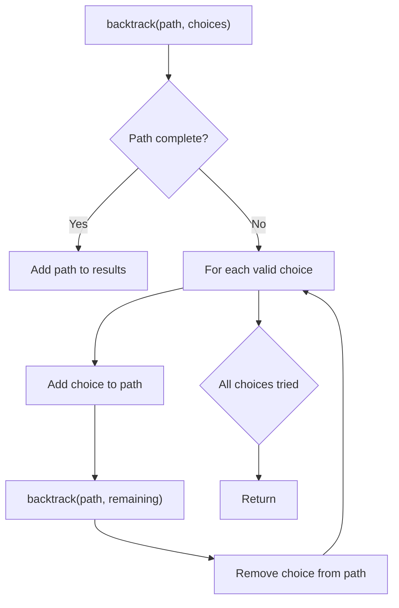
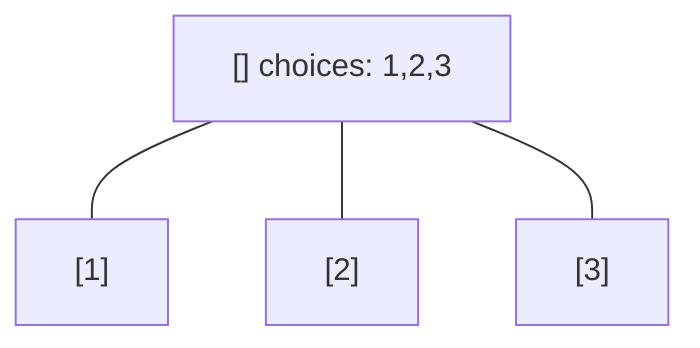
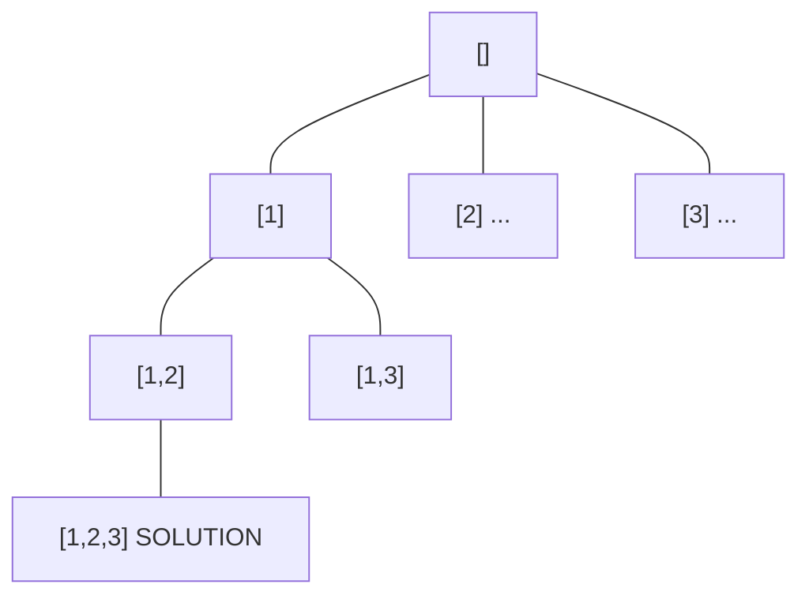
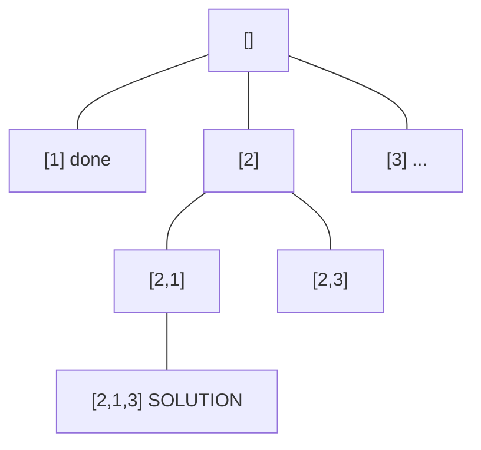
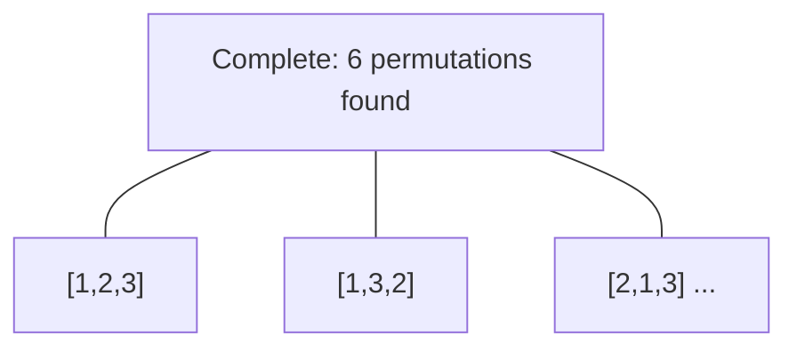

# Problem 1415: The k-th Lexicographical String of All Happy Strings of Length n

**Difficulty:** Medium  
**Tags:** String, Backtracking  
**Pattern:** Backtracking  
**Link:** [leetcode.com/problems/the-k-th-lexicographical-string-of-all-happy-strings-of-length-n](https://leetcode.com/problems/the-k-th-lexicographical-string-of-all-happy-strings-of-length-n/)

## Description

A **happy string** is a string that:

	- consists only of letters of the set `['a', 'b', 'c']`.
	- `s[i] != s[i + 1]` for all values of `i` from `1` to `s.length - 1` (string is 1-indexed).

For example, strings **"abc", "ac", "b"** and **"abcbabcbcb"** are all happy strings and strings **"aa", "baa"** and **"ababbc"** are not happy strings.

Given two integers `n` and `k`, consider a list of all happy strings of length `n` sorted in lexicographical order.

Return *the kth string* of this list or return an **empty string** if there are less than `k` happy strings of length `n`.

 

Example 1:

```

**Input:** n = 1, k = 3
**Output:** "c"
**Explanation:** The list ["a", "b", "c"] contains all happy strings of length 1. The third string is "c".

```

Example 2:

```

**Input:** n = 1, k = 4
**Output:** ""
**Explanation:** There are only 3 happy strings of length 1.

```

Example 3:

```

**Input:** n = 3, k = 9
**Output:** "cab"
**Explanation:** There are 12 different happy string of length 3 ["aba", "abc", "aca", "acb", "bab", "bac", "bca", "bcb", "cab", "cac", "cba", "cbc"]. You will find the 9th string = "cab"

```

 

**Constraints:**

	- `1 <= n <= 10`
	- `1 <= k <= 100`

## Approach: Backtracking

Explore all possible solutions by building candidates incrementally. At each step, make a choice and recurse. If the choice leads to a dead end, undo the choice (backtrack) and try the next option.

## Pseudocode

```
1. Define backtrack(path, choices):
   a. If path is a complete solution: add to results
   b. For each choice in choices:
      - If choice is valid:
        * Add choice to path
        * backtrack(path, remaining_choices)
        * Remove choice from path (backtrack)
2. Call backtrack([], all_choices)
```

## Algorithm Flow



## Visual State Transitions

**Backtracking Decision Tree:**

**Frame 1: Root - start with empty path**


**Frame 2: Explore branch [1]**


**Frame 3: Backtrack, explore [2]**


**Frame 4: All solutions found**



## Complexity Analysis

- **Time:** O(k^n) or O(n!)
- **Space:** O(n)

## Solution (Python3)

```python
class Solution:
    def getHappyString(self, n: int, k: int) -> str:
        # Backtracking - O(2^n) or O(n!) time
        result = []
        
        def backtrack(path, start):
            result.append(path[:])
            for i in range(start, len(n)):
                path.append(n[i])
                backtrack(path, i + 1)
                path.pop()
        
        backtrack([], 0)
        return result
```

## Solution (C++)

```cpp
#include <functional>
#include <string>
#include <vector>
using namespace std;

class Solution {
public:
    string getHappyString(int n, int k) {
        // Backtracking - O(2^n) or O(n!) time
        vector<vector<int>> result;
        vector<int> path;
        function<void(int)> backtrack = [&](int start) {
            result.push_back(path);
            for (int i = start; i < (int)n.size(); i++) {
                path.push_back(n[i]);
                backtrack(i + 1);
                path.pop_back();
            }
        };
        backtrack(0);
        return result;
    }
};
```
