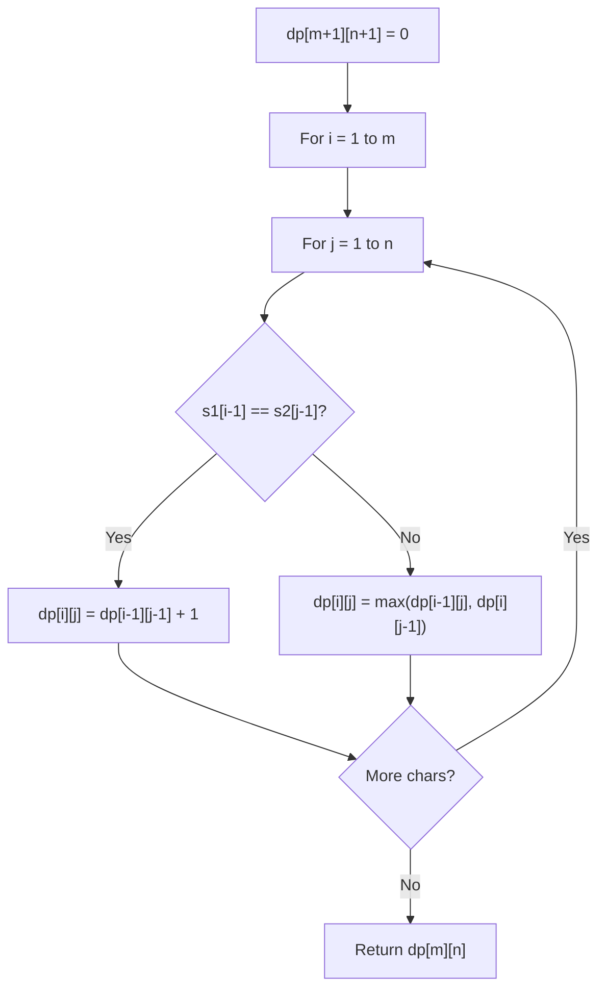

# Problem 1416: Restore The Array

**Difficulty:** Hard  
**Tags:** String, Dynamic Programming  
**Pattern:** Dynamic Programming (String)  
**Link:** [leetcode.com/problems/restore-the-array](https://leetcode.com/problems/restore-the-array/)

## Description

A program was supposed to print an array of integers. The program forgot to print whitespaces and the array is printed as a string of digits `s` and all we know is that all integers in the array were in the range `[1, k]` and there are no leading zeros in the array.

Given the string `s` and the integer `k`, return *the number of the possible arrays that can be printed as *`s`* using the mentioned program*. Since the answer may be very large, return it **modulo** `10^9 + 7`.

 

Example 1:

```

**Input:** s = "1000", k = 10000
**Output:** 1
**Explanation:** The only possible array is [1000]

```

Example 2:

```

**Input:** s = "1000", k = 10
**Output:** 0
**Explanation:** There cannot be an array that was printed this way and has all integer >= 1 and <= 10.

```

Example 3:

```

**Input:** s = "1317", k = 2000
**Output:** 8
**Explanation:** Possible arrays are [1317],[131,7],[13,17],[1,317],[13,1,7],[1,31,7],[1,3,17],[1,3,1,7]

```

 

**Constraints:**

	- `1 <= s.length <= 10^5`
	- `s` consists of only digits and does not contain leading zeros.
	- `1 <= k <= 10^9`

## Approach: Dynamic Programming (String)

Compare or match two strings using a 2D DP table. dp[i][j] represents the answer for substrings s1[0..i-1] and s2[0..j-1]. Common patterns: LCS, edit distance, regex matching.

## Pseudocode

```
1. Create dp[m+1][n+1]
2. Initialize base cases
3. For i from 1 to m:
   For j from 1 to n:
     If s1[i-1] == s2[j-1]: dp[i][j] = dp[i-1][j-1] + 1
     Else: dp[i][j] = best of (dp[i-1][j], dp[i][j-1], dp[i-1][j-1])
4. Return dp[m][n]
```

## Algorithm Flow



## Complexity Analysis

- **Time:** O(m * n)
- **Space:** O(m * n)

## Solution (Python3)

```python
class Solution:
    def numberOfArrays(self, s: str, k: int) -> int:
        # String DP - O(m*n) time and space
        m, n = len(s), len(k)
        dp = [[0] * (n + 1) for _ in range(m + 1)]
        for i in range(1, m + 1):
            for j in range(1, n + 1):
                if s[i-1] == k[j-1]:
                    dp[i][j] = dp[i-1][j-1] + 1
                else:
                    dp[i][j] = max(dp[i-1][j], dp[i][j-1])
        return dp[m][n]
```

## Solution (C++)

```cpp
#include <algorithm>
#include <string>
#include <vector>
using namespace std;

class Solution {
public:
    int numberOfArrays(string& s, int k) {
        // String DP - O(m*n) time and space
        int m = s.size(), n = k.size();
        vector<vector<int>> dp(m + 1, vector<int>(n + 1, 0));
        for (int i = 1; i <= m; i++) {
            for (int j = 1; j <= n; j++) {
                if (s[i-1] == k[j-1])
                    dp[i][j] = dp[i-1][j-1] + 1;
                else
                    dp[i][j] = max(dp[i-1][j], dp[i][j-1]);
            }
        }
        return dp[m][n];
    }
};
```
