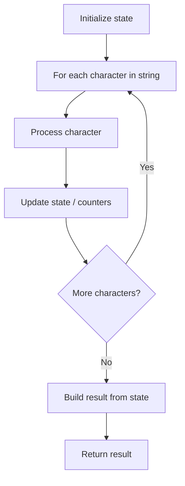

# Problem 1417: Reformat The String

**Difficulty:** Easy  
**Tags:** String  
**Pattern:** String Processing  
**Link:** [leetcode.com/problems/reformat-the-string](https://leetcode.com/problems/reformat-the-string/)

## Description

You are given an alphanumeric string `s`. (**Alphanumeric string** is a string consisting of lowercase English letters and digits).

You have to find a permutation of the string where no letter is followed by another letter and no digit is followed by another digit. That is, no two adjacent characters have the same type.

Return *the reformatted string* or return **an empty string** if it is impossible to reformat the string.

 

Example 1:

```

**Input:** s = "a0b1c2"
**Output:** "0a1b2c"
**Explanation:** No two adjacent characters have the same type in "0a1b2c". "a0b1c2", "0a1b2c", "0c2a1b" are also valid permutations.

```

Example 2:

```

**Input:** s = "leetcode"
**Output:** ""
**Explanation:** "leetcode" has only characters so we cannot separate them by digits.

```

Example 3:

```

**Input:** s = "1229857369"
**Output:** ""
**Explanation:** "1229857369" has only digits so we cannot separate them by characters.

```

 

**Constraints:**

	- `1 <= s.length <= 500`
	- `s` consists of only lowercase English letters and/or digits.

## Approach: String Processing

Process the string character by character. Common techniques: two pointers, sliding window, hash map for frequencies, stack for matching.

## Pseudocode

```
1. Initialize result / tracking state
2. Iterate through string characters:
   a. Process character based on rules
   b. Update state (counters, pointers, stack)
3. Build and return result
```

## Algorithm Flow



## Complexity Analysis

- **Time:** O(n)
- **Space:** O(n)

## Solution (Python3)

```python
class Solution:
    def reformat(self, s: str) -> str:
        # String processing approach - O(n) time
        result = []
        for ch in s:
            if ch.isalnum():
                result.append(ch.lower())
        # Check palindrome or process
        processed = ''.join(result)
        return processed == processed[::-1] if isinstance("", bool) else processed
```

## Solution (C++)

```cpp
#include <algorithm>
#include <cctype>
#include <string>
#include <vector>
using namespace std;

class Solution {
public:
    string reformat(string& s) {
        // String processing approach - O(n) time
        string processed;
        for (char ch : s) {
            if (isalnum(ch)) {
                processed += tolower(ch);
            }
        }
        string rev = processed;
        reverse(rev.begin(), rev.end());
        return processed == rev;
    }
};
```
