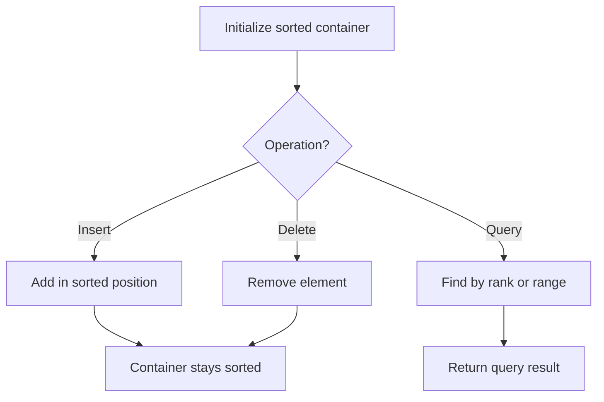

# Problem 1418: Display Table of Food Orders in a Restaurant

**Difficulty:** Medium  
**Tags:** Array, Hash Table, String, Sorting, Ordered Set  
**Pattern:** Ordered Set / SortedList  
**Link:** [leetcode.com/problems/display-table-of-food-orders-in-a-restaurant](https://leetcode.com/problems/display-table-of-food-orders-in-a-restaurant/)

## Description

Given the array `orders`, which represents the orders that customers have done in a restaurant. More specifically `orders[i]=[customerNamei,tableNumberi,foodItemi]` where `customerNamei` is the name of the customer, `tableNumberi` is the table customer sit at, and `foodItemi` is the item customer orders.


*Return the restaurant's “**display table**”*. The “**display table**” is a table whose row entries denote how many of each food item each table ordered. The first column is the table number and the remaining columns correspond to each food item in alphabetical order. The first row should be a header whose first column is “Table”, followed by the names of the food items. Note that the customer names are not part of the table. Additionally, the rows should be sorted in numerically increasing order.


 

Example 1:


```

**Input:** orders = [["David","3","Ceviche"],["Corina","10","Beef Burrito"],["David","3","Fried Chicken"],["Carla","5","Water"],["Carla","5","Ceviche"],["Rous","3","Ceviche"]]
**Output:** [["Table","Beef Burrito","Ceviche","Fried Chicken","Water"],["3","0","2","1","0"],["5","0","1","0","1"],["10","1","0","0","0"]] 
Explanation:
The displaying table looks like:
**Table,Beef Burrito,Ceviche,Fried Chicken,Water**
3    ,0           ,2      ,1            ,0
5    ,0           ,1      ,0            ,1
10   ,1           ,0      ,0            ,0
For the table 3: David orders "Ceviche" and "Fried Chicken", and Rous orders "Ceviche".
For the table 5: Carla orders "Water" and "Ceviche".
For the table 10: Corina orders "Beef Burrito". 

```


Example 2:


```

**Input:** orders = [["James","12","Fried Chicken"],["Ratesh","12","Fried Chicken"],["Amadeus","12","Fried Chicken"],["Adam","1","Canadian Waffles"],["Brianna","1","Canadian Waffles"]]
**Output:** [["Table","Canadian Waffles","Fried Chicken"],["1","2","0"],["12","0","3"]] 
**Explanation:** 
For the table 1: Adam and Brianna order "Canadian Waffles".
For the table 12: James, Ratesh and Amadeus order "Fried Chicken".

```


Example 3:


```

**Input:** orders = [["Laura","2","Bean Burrito"],["Jhon","2","Beef Burrito"],["Melissa","2","Soda"]]
**Output:** [["Table","Bean Burrito","Beef Burrito","Soda"],["2","1","1","1"]]

```


 

**Constraints:**


	- `1 <= orders.length <= 5 * 10^4`
	- `orders[i].length == 3`
	- `1 <= customerNamei.length, foodItemi.length <= 20`
	- `customerNamei` and `foodItemi` consist of lowercase and uppercase English letters and the space character.
	- `tableNumberi `is a valid integer between `1` and `500`.

## Approach: Ordered Set / SortedList

Maintain elements in sorted order for efficient insertion, deletion, and rank queries. Use balanced BST, skip list, or sorted container.

## Pseudocode

```
1. Initialize sorted container
2. For each operation:
   - Insert: add element in sorted position O(log n)
   - Delete: remove element O(log n)
   - Query: find kth element, count, or range O(log n)
3. Return results
```

## Algorithm Flow



## Complexity Analysis

- **Time:** O(n log n)
- **Space:** O(n)

## Solution (Python3)

```python
class Solution:
    def displayTable(self, orders: List[List[str]]) -> List[List[str]]:
        # Ordered set / SortedList - O(n log n) time
        from sortedcontainers import SortedList
        sl = SortedList()
        result = 0
        for val in orders:
            pos = sl.bisect_left(val)
            if pos < len(sl):
                result = max(result, sl[pos] - val)
            sl.add(val)
        return result
```

## Solution (C++)

```cpp
#include <algorithm>
#include <set>
#include <string>
#include <vector>
using namespace std;

class Solution {
public:
    vector<vector<string>> displayTable(vector<vector<string>>& orders) {
        // Ordered set - O(n log n) time
        set<int> ordered;
        int result = 0;
        for (int val : orders) {
            auto it = ordered.lower_bound(val);
            if (it != ordered.end()) {
                result = max(result, *it - val);
            }
            ordered.insert(val);
        }
        return result;
    }
};
```
