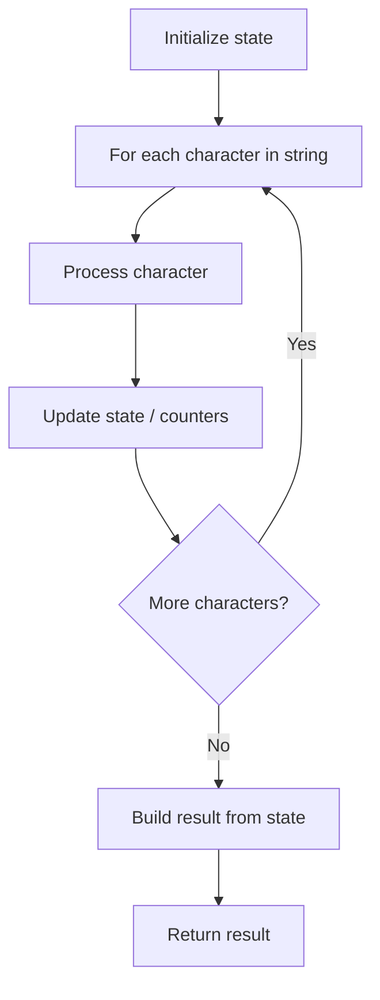

# Problem 1419: Minimum Number of Frogs Croaking

**Difficulty:** Medium  
**Tags:** String, Counting  
**Pattern:** String Processing  
**Link:** [leetcode.com/problems/minimum-number-of-frogs-croaking](https://leetcode.com/problems/minimum-number-of-frogs-croaking/)

## Description

You are given the string `croakOfFrogs`, which represents a combination of the string `"croak"` from different frogs, that is, multiple frogs can croak at the same time, so multiple `"croak"` are mixed.

*Return the minimum number of *different* frogs to finish all the croaks in the given string.*

A valid `"croak"` means a frog is printing five letters `'c'`, `'r'`, `'o'`, `'a'`, and `'k'` **sequentially**. The frogs have to print all five letters to finish a croak. If the given string is not a combination of a valid `"croak"` return `-1`.

 

Example 1:

```

**Input:** croakOfFrogs = "croakcroak"
**Output:** 1 
**Explanation:** One frog yelling "croak**"** twice.

```

Example 2:

```

**Input:** croakOfFrogs = "crcoakroak"
**Output:** 2 
**Explanation:** The minimum number of frogs is two. 
The first frog could yell "**cr**c**oak**roak".
The second frog could yell later "cr**c**oak**roak**".

```

Example 3:

```

**Input:** croakOfFrogs = "croakcrook"
**Output:** -1
**Explanation:** The given string is an invalid combination of "croak**"** from different frogs.

```

 

**Constraints:**

	- `1 <= croakOfFrogs.length <= 10^5`
	- `croakOfFrogs` is either `'c'`, `'r'`, `'o'`, `'a'`, or `'k'`.

## Approach: String Processing

Process the string character by character. Common techniques: two pointers, sliding window, hash map for frequencies, stack for matching.

## Pseudocode

```
1. Initialize result / tracking state
2. Iterate through string characters:
   a. Process character based on rules
   b. Update state (counters, pointers, stack)
3. Build and return result
```

## Algorithm Flow



## Complexity Analysis

- **Time:** O(n)
- **Space:** O(n)

## Solution (Python3)

```python
class Solution:
    def minNumberOfFrogs(self, croakOfFrogs: str) -> int:
        # String processing approach - O(n) time
        result = []
        for ch in croakOfFrogs:
            if ch.isalnum():
                result.append(ch.lower())
        # Check palindrome or process
        processed = ''.join(result)
        return processed == processed[::-1] if isinstance(0, bool) else processed
```

## Solution (C++)

```cpp
#include <algorithm>
#include <cctype>
#include <string>
#include <vector>
using namespace std;

class Solution {
public:
    int minNumberOfFrogs(string& croakOfFrogs) {
        // String processing approach - O(n) time
        string processed;
        for (char ch : croakOfFrogs) {
            if (isalnum(ch)) {
                processed += tolower(ch);
            }
        }
        string rev = processed;
        reverse(rev.begin(), rev.end());
        return processed == rev;
    }
};
```
