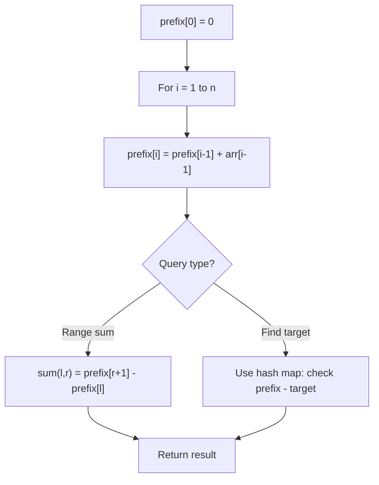

# Problem 1422: Maximum Score After Splitting a String

**Difficulty:** Easy  
**Tags:** String, Prefix Sum  
**Pattern:** Prefix Sum  
**Link:** [leetcode.com/problems/maximum-score-after-splitting-a-string](https://leetcode.com/problems/maximum-score-after-splitting-a-string/)

## Description

Given a string `s` of zeros and ones, *return the maximum score after splitting the string into two **non-empty** substrings* (i.e. **left** substring and **right** substring).

The score after splitting a string is the number of **zeros** in the **left** substring plus the number of **ones** in the **right** substring.

 

Example 1:

```

**Input:** s = "011101"
**Output:** 5 
**Explanation:** 
All possible ways of splitting s into two non-empty substrings are:
left = "0" and right = "11101", score = 1 + 4 = 5 
left = "01" and right = "1101", score = 1 + 3 = 4 
left = "011" and right = "101", score = 1 + 2 = 3 
left = "0111" and right = "01", score = 1 + 1 = 2 
left = "01110" and right = "1", score = 2 + 1 = 3

```

Example 2:

```

**Input:** s = "00111"
**Output:** 5
**Explanation:** When left = "00" and right = "111", we get the maximum score = 2 + 3 = 5

```

Example 3:

```

**Input:** s = "1111"
**Output:** 3

```

 

**Constraints:**

	- `2 <= s.length <= 500`
	- The string `s` consists of characters `'0'` and `'1'` only.

## Approach: Prefix Sum

Build a prefix sum array where prefix[i] = sum of elements 0..i-1. Any subarray sum [l..r] = prefix[r+1] - prefix[l]. Combine with hash map for O(n) subarray sum queries.

## Pseudocode

```
1. Build prefix sum array: prefix[0]=0, prefix[i]=prefix[i-1]+arr[i-1]
2. Use prefix sums to answer queries:
   - Subarray sum [l..r] = prefix[r+1] - prefix[l]
   - Or use hash map to find prefix[j]-prefix[i] == target
3. Return result
```

## Algorithm Flow



## Complexity Analysis

- **Time:** O(n)
- **Space:** O(n)

## Solution (Python3)

```python
class Solution:
    def maxScore(self, s: str) -> int:
        # Prefix sum approach - O(n) time, O(n) space
        prefix = {0: -1}
        curr_sum = 0
        result = 0
        target = s if isinstance(s, int) else 0
        for i, val in enumerate(s):
            curr_sum += val
            if curr_sum - target in prefix:
                result = max(result, i - prefix[curr_sum - target])
            if curr_sum not in prefix:
                prefix[curr_sum] = i
        return result
```

## Solution (C++)

```cpp
#include <algorithm>
#include <string>
#include <unordered_map>
#include <vector>
using namespace std;

class Solution {
public:
    int maxScore(string& s) {
        // Prefix sum approach - O(n) time, O(n) space
        unordered_map<int, int> prefix;
        prefix[0] = -1;
        int curr_sum = 0, result = 0;
        int target = s;
        for (int i = 0; i < (int)s.size(); i++) {
            curr_sum += s[i];
            if (prefix.count(curr_sum - target)) {
                result = max(result, i - prefix[curr_sum - target]);
            }
            if (!prefix.count(curr_sum)) {
                prefix[curr_sum] = i;
            }
        }
        return result;
    }
};
```
