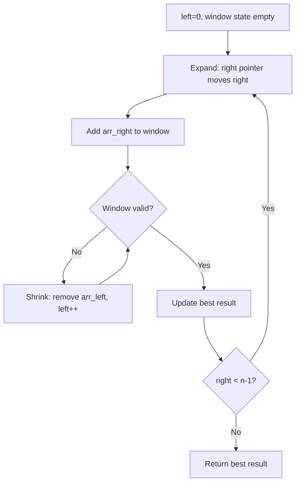
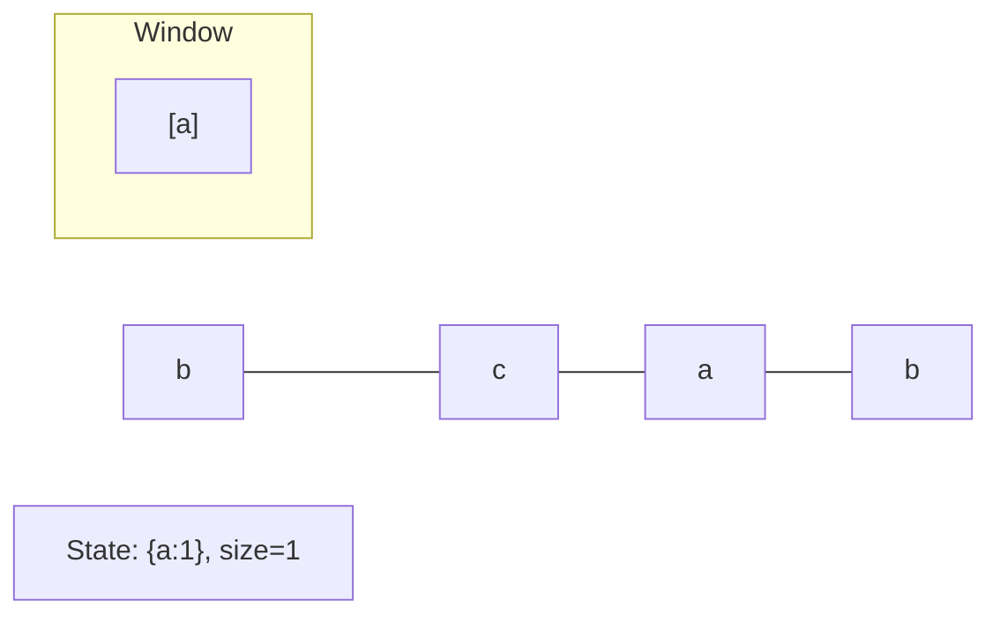
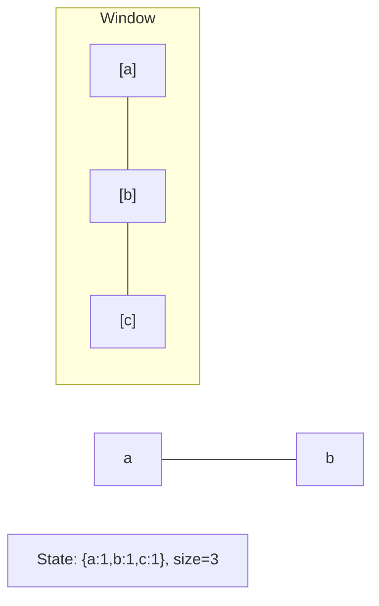
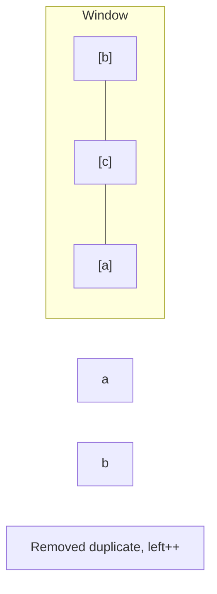
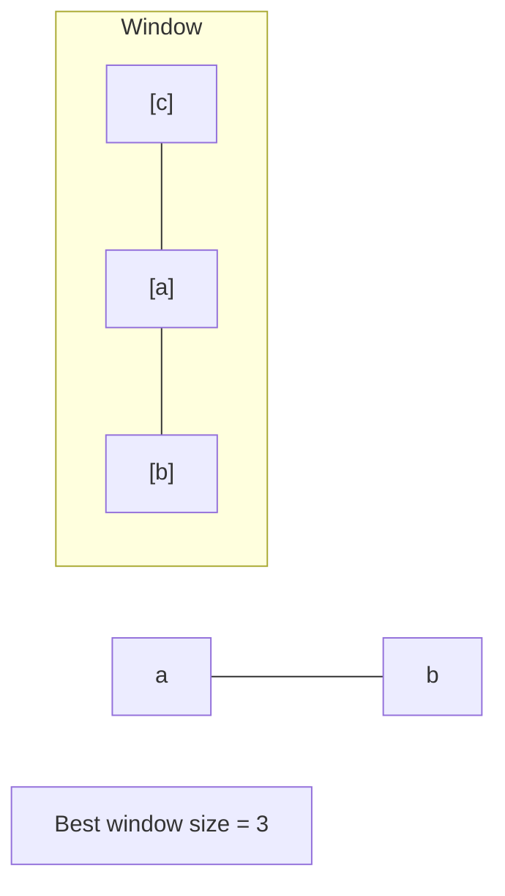

# Problem 1423: Maximum Points You Can Obtain from Cards

**Difficulty:** Medium  
**Tags:** Array, Sliding Window, Prefix Sum  
**Pattern:** Sliding Window  
**Link:** [leetcode.com/problems/maximum-points-you-can-obtain-from-cards](https://leetcode.com/problems/maximum-points-you-can-obtain-from-cards/)

## Description

There are several cards **arranged in a row**, and each card has an associated number of points. The points are given in the integer array `cardPoints`.

In one step, you can take one card from the beginning or from the end of the row. You have to take exactly `k` cards.

Your score is the sum of the points of the cards you have taken.

Given the integer array `cardPoints` and the integer `k`, return the *maximum score* you can obtain.

 

Example 1:

```

**Input:** cardPoints = [1,2,3,4,5,6,1], k = 3
**Output:** 12
**Explanation:** After the first step, your score will always be 1. However, choosing the rightmost card first will maximize your total score. The optimal strategy is to take the three cards on the right, giving a final score of 1 + 6 + 5 = 12.

```

Example 2:

```

**Input:** cardPoints = [2,2,2], k = 2
**Output:** 4
**Explanation:** Regardless of which two cards you take, your score will always be 4.

```

Example 3:

```

**Input:** cardPoints = [9,7,7,9,7,7,9], k = 7
**Output:** 55
**Explanation:** You have to take all the cards. Your score is the sum of points of all cards.

```

 

**Constraints:**

	- `1 <= cardPoints.length <= 10^5`
	- `1 <= cardPoints[i] <= 10^4`
	- `1 <= k <= cardPoints.length`

## Approach: Sliding Window

Maintain a window over the data using two pointers. Expand the right boundary to include new elements, and shrink the left boundary when the window constraint is violated. Track the optimal window.

## Pseudocode

```
1. Initialize left = 0, result = initial_value
2. For right in range(n):
   a. Add element at right to window state
   b. While window is invalid:
      - Remove element at left from window state
      - left++
   c. Update result = best of (result, window size/value)
3. Return result
```

## Algorithm Flow



## Visual State Transitions

**Sliding Window Step-by-Step:**

**Frame 1: Initial window (left=0, right=0)**


**Frame 2: Expand right (right=2)**


**Frame 3: Violation - shrink left**


**Frame 4: Continue expanding**



## Complexity Analysis

- **Time:** O(n)
- **Space:** O(k)

## Solution (Python3)

```python
class Solution:
    def maxScore(self, cardPoints: List[int], k: int) -> int:
        # Sliding window approach - O(n) time, O(k) space
        from collections import defaultdict
        window = defaultdict(int)
        left = 0
        result = 0
        for right in range(len(cardPoints)):
            window[cardPoints[right]] += 1
            while len(window) > (k if isinstance(k, int) else len(cardPoints)):
                window[cardPoints[left]] -= 1
                if window[cardPoints[left]] == 0:
                    del window[cardPoints[left]]
                left += 1
            result = max(result, right - left + 1)
        return result
```

## Solution (C++)

```cpp
#include <algorithm>
#include <string>
#include <unordered_map>
#include <vector>
using namespace std;

class Solution {
public:
    int maxScore(vector<int>& cardPoints, int k) {
        // Sliding window approach - O(n) time, O(k) space
        unordered_map<char, int> window;
        int left = 0, result = 0;
        for (int right = 0; right < cardPoints.size(); right++) {
            window[cardPoints[right]]++;
            while ((int)window.size() > k) {
                window[cardPoints[left]]--;
                if (window[cardPoints[left]] == 0)
                    window.erase(cardPoints[left]);
                left++;
            }
            result = max(result, right - left + 1);
        }
        return result;
    }
};
```
