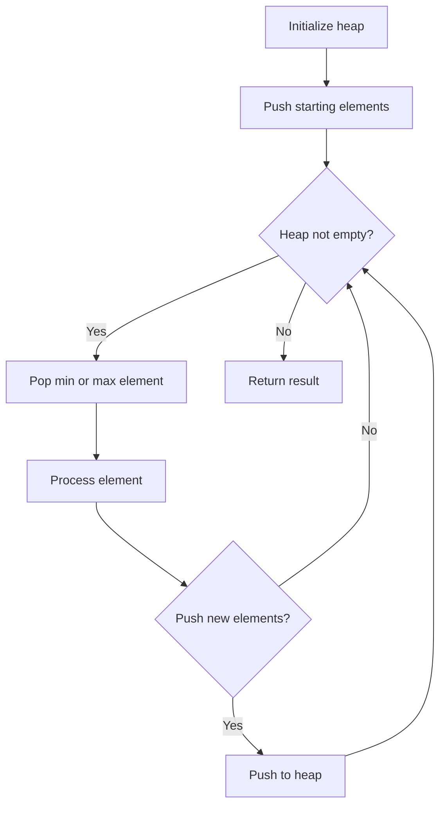
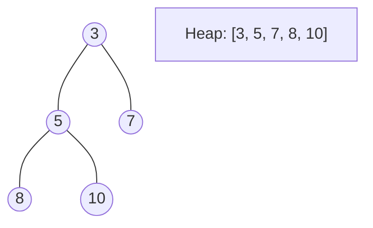
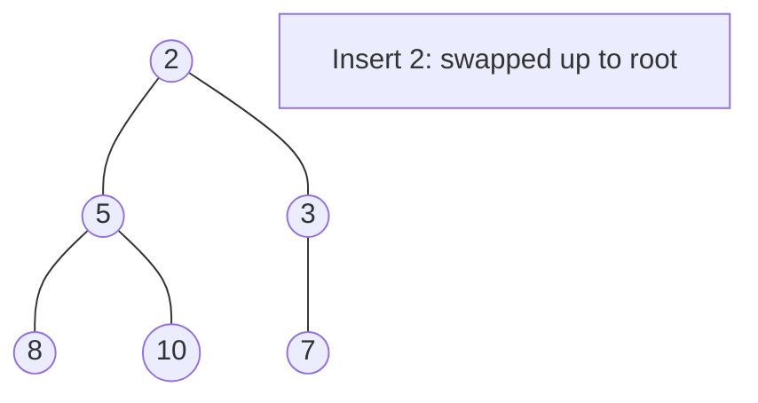
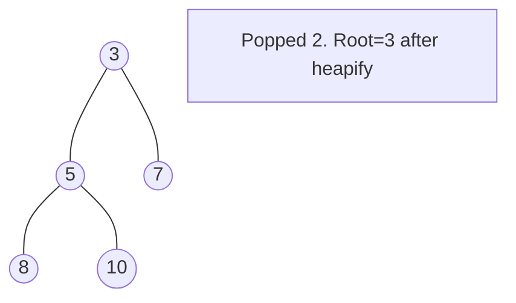

# Problem 1424: Diagonal Traverse II

**Difficulty:** Medium  
**Tags:** Array, Sorting, Heap (Priority Queue)  
**Pattern:** Heap / Priority Queue  
**Link:** [leetcode.com/problems/diagonal-traverse-ii](https://leetcode.com/problems/diagonal-traverse-ii/)

## Description

Given a 2D integer array `nums`, return *all elements of *`nums`* in diagonal order as shown in the below images*.

 

Example 1:

```

**Input:** nums = [[1,2,3],[4,5,6],[7,8,9]]
**Output:** [1,4,2,7,5,3,8,6,9]

```

Example 2:

```

**Input:** nums = [[1,2,3,4,5],[6,7],[8],[9,10,11],[12,13,14,15,16]]
**Output:** [1,6,2,8,7,3,9,4,12,10,5,13,11,14,15,16]

```

 

**Constraints:**

	- `1 <= nums.length <= 10^5`
	- `1 <= nums[i].length <= 10^5`
	- `1 <= sum(nums[i].length) <= 10^5`
	- `1 <= nums[i][j] <= 10^5`

## Approach: Heap / Priority Queue

Use a min-heap or max-heap to efficiently access the smallest/largest element. Push elements and pop the top to process in priority order.

## Pseudocode

```
1. Initialize heap (min or max)
2. Push initial elements onto heap
3. While heap not empty and condition:
   a. Pop top element (min or max)
   b. Process element
   c. Push new elements if needed
4. Return result
```

## Algorithm Flow



## Visual State Transitions

**Heap Operations (Min-Heap):**

**Frame 1: Initial heap**


**Frame 2: Insert 2 - bubble up**


**Frame 3: Pop minimum (2) - heapify down**



## Complexity Analysis

- **Time:** O(n log n)
- **Space:** O(n)

## Solution (Python3)

```python
class Solution:
    def findDiagonalOrder(self, nums: List[List[int]]) -> List[int]:
        # Heap/Priority Queue - O(n log k) time
        import heapq
        if not nums:
            return []
        # Min heap (negate for max heap)
        heap = []
        for val in nums:
            heapq.heappush(heap, val)
            if len(heap) > (nums if isinstance(nums, int) else len(nums)):
                heapq.heappop(heap)
        return heap[0] if heap else []
```

## Solution (C++)

```cpp
#include <queue>
#include <string>
#include <vector>
using namespace std;

class Solution {
public:
    vector<int> findDiagonalOrder(vector<vector<int>>& nums) {
        // Heap/Priority Queue - O(n log k) time
        priority_queue<int, vector<int>, greater<int>> pq;
        for (int val : nums) {
            pq.push(val);
            if ((int)pq.size() > nums)
                pq.pop();
        }
        return pq.empty() ? {} : pq.top();
    }
};
```
