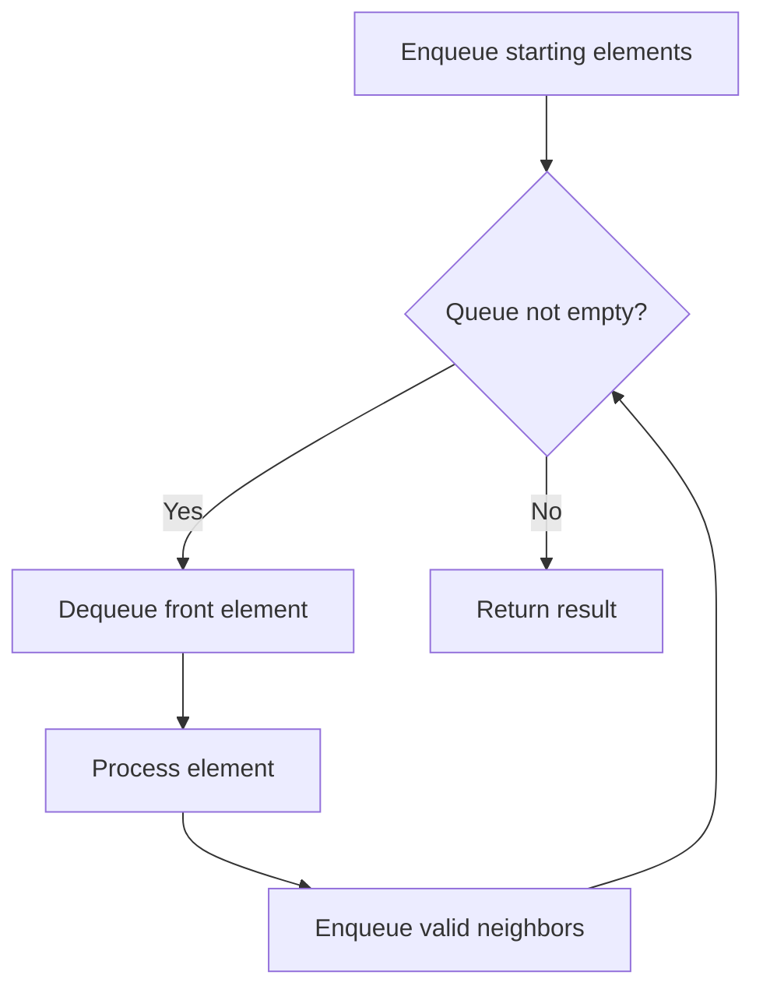

# Problem 1429: First Unique Number

**Difficulty:** Medium  
**Tags:** Array, Hash Table, Design, Queue, Data Stream  
**Pattern:** Queue / BFS  
**Link:** [leetcode.com/problems/first-unique-number](https://leetcode.com/problems/first-unique-number/)

## Description

*(Premium problem -- description requires LeetCode subscription)*

## Approach: Queue / BFS

Use a queue (FIFO) for level-order or breadth-first processing. Enqueue starting elements, then process level by level.

## Pseudocode

```
1. Initialize queue with starting element(s)
2. While queue is not empty:
   a. Dequeue front element
   b. Process element
   c. Enqueue valid neighbors/children
3. Return result
```

## Algorithm Flow



## Complexity Analysis

- **Time:** O(n)
- **Space:** O(n)

## Solution (Python3)

```python
class Solution:
    pass
```

## Solution (C++)

```cpp
class Solution {
public:
    // Design problem stub
};
```
