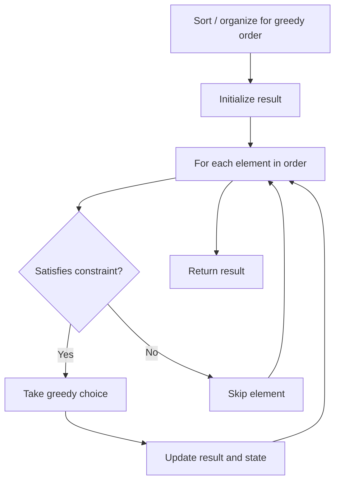

# Problem 1432: Max Difference You Can Get From Changing an Integer

**Difficulty:** Medium  
**Tags:** Math, Greedy  
**Pattern:** Greedy  
**Link:** [leetcode.com/problems/max-difference-you-can-get-from-changing-an-integer](https://leetcode.com/problems/max-difference-you-can-get-from-changing-an-integer/)

## Description

You are given an integer `num`. You will apply the following steps to `num` **two** separate times:

	- Pick a digit `x (0 <= x <= 9)`.
	- Pick another digit `y (0 <= y <= 9)`. Note `y` can be equal to `x`.
	- Replace all the occurrences of `x` in the decimal representation of `num` by `y`.

Let `a` and `b` be the two results from applying the operation to `num` *independently*.

Return *the max difference* between `a` and `b`.

Note that neither `a` nor `b` may have any leading zeros, and **must not** be 0.

 

Example 1:

```

**Input:** num = 555
**Output:** 888
**Explanation:** The first time pick x = 5 and y = 9 and store the new integer in a.
The second time pick x = 5 and y = 1 and store the new integer in b.
We have now a = 999 and b = 111 and max difference = 888

```

Example 2:

```

**Input:** num = 9
**Output:** 8
**Explanation:** The first time pick x = 9 and y = 9 and store the new integer in a.
The second time pick x = 9 and y = 1 and store the new integer in b.
We have now a = 9 and b = 1 and max difference = 8

```

 

**Constraints:**

	- `1 <= num <= 10^8`

## Approach: Greedy

Make the locally optimal choice at each step, trusting it leads to a global optimum. Greedy works when the problem has the greedy-choice property and optimal substructure.

## Pseudocode

```
1. Sort or organize data for greedy ordering
2. Initialize result
3. For each element in greedy order:
   a. If element satisfies constraint:
      - Take the greedy choice
      - Update result and state
4. Return result
```

## Algorithm Flow



## Complexity Analysis

- **Time:** O(n log n)
- **Space:** O(1)

## Solution (Python3)

```python
class Solution:
    def maxDiff(self, num: int) -> int:
        # Greedy approach - O(n) time
        result = 0
        curr_max = 0
        for i in range(len(num)):
            if isinstance(num[i], int):
                curr_max = max(curr_max, num[i])
                result = max(result, curr_max)
            else:
                result += 1
        return result
```

## Solution (C++)

```cpp
#include <algorithm>
#include <string>
#include <vector>
using namespace std;

class Solution {
public:
    int maxDiff(int num) {
        // Greedy approach - O(n) time
        int result = 0, curr_max = 0;
        for (int i = 0; i < (int)num.size(); i++) {
            curr_max = max(curr_max, num[i]);
            result = max(result, curr_max);
        }
        return result;
    }
};
```
