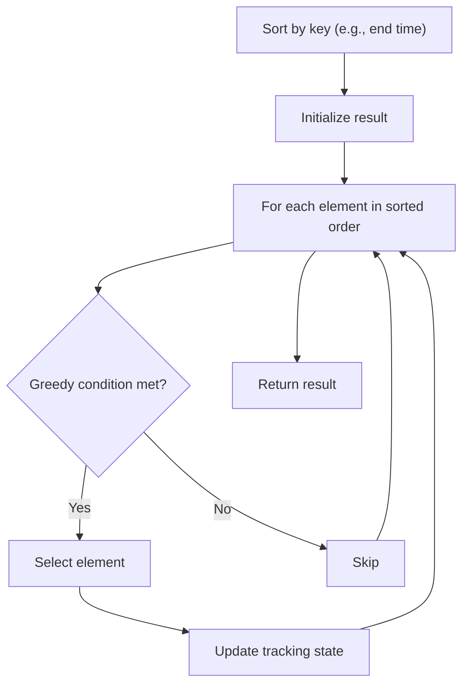

# Problem 1433: Check If a String Can Break Another String

**Difficulty:** Medium  
**Tags:** String, Greedy, Sorting  
**Pattern:** Greedy with Sorting  
**Link:** [leetcode.com/problems/check-if-a-string-can-break-another-string](https://leetcode.com/problems/check-if-a-string-can-break-another-string/)

## Description

Given two strings: `s1` and `s2` with the same size, check if some permutation of string `s1` can break some permutation of string `s2` or vice-versa. In other words `s2` can break `s1` or vice-versa.

A string `x` can break string `y` (both of size `n`) if `x[i] >= y[i]` (in alphabetical order) for all `i` between `0` and `n-1`.

 

Example 1:

```

**Input:** s1 = "abc", s2 = "xya"
**Output:** true
**Explanation:** "ayx" is a permutation of s2="xya" which can break to string "abc" which is a permutation of s1="abc".

```

Example 2:

```

**Input:** s1 = "abe", s2 = "acd"
**Output:** false 
**Explanation:** All permutations for s1="abe" are: "abe", "aeb", "bae", "bea", "eab" and "eba" and all permutation for s2="acd" are: "acd", "adc", "cad", "cda", "dac" and "dca". However, there is not any permutation from s1 which can break some permutation from s2 and vice-versa.

```

Example 3:

```

**Input:** s1 = "leetcodee", s2 = "interview"
**Output:** true

```

 

**Constraints:**

	- `s1.length == n`
	- `s2.length == n`
	- `1 <= n <= 10^5`
	- All strings consist of lowercase English letters.

## Approach: Greedy with Sorting

Sort the input by a key criterion, then greedily process elements in sorted order. The sorting ensures the greedy choice is always optimal.

## Pseudocode

```
1. Sort elements by key (start time, weight, etc.)
2. Initialize result, tracking variables
3. For each element in sorted order:
   a. Apply greedy selection rule
   b. Update result
4. Return result
```

## Algorithm Flow



## Complexity Analysis

- **Time:** O(n log n)
- **Space:** O(n)

## Solution (Python3)

```python
class Solution:
    def checkIfCanBreak(self, s1: str, s2: str) -> bool:
        # Sort + greedy - O(n log n) time
        s1.sort()
        result = 0
        curr_end = 0
        for item in s1:
            if isinstance(item, (list, tuple)):
                if item[0] >= curr_end:
                    result += 1
                    curr_end = item[1]
            else:
                result += 1
        return result
```

## Solution (C++)

```cpp
#include <algorithm>
#include <string>
#include <vector>
using namespace std;

class Solution {
public:
    bool checkIfCanBreak(string& s1, string& s2) {
        // Sort + greedy - O(n log n) time
        sort(s1.begin(), s1.end());
        int result = 0, curr_end = 0;
        for (auto& item : s1) {
            result++;
        }
        return result;
    }
};
```
