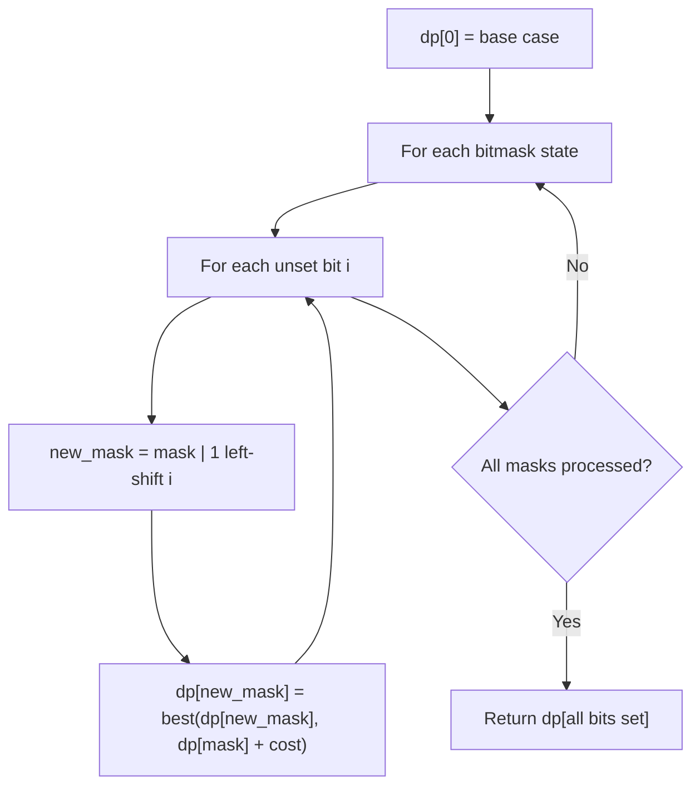

# Problem 1434: Number of Ways to Wear Different Hats to Each Other

**Difficulty:** Hard  
**Tags:** Array, Dynamic Programming, Bit Manipulation, Bitmask  
**Pattern:** Dynamic Programming (Bitmask)  
**Link:** [leetcode.com/problems/number-of-ways-to-wear-different-hats-to-each-other](https://leetcode.com/problems/number-of-ways-to-wear-different-hats-to-each-other/)

## Description

There are `n` people and `40` types of hats labeled from `1` to `40`.

Given a 2D integer array `hats`, where `hats[i]` is a list of all hats preferred by the `i^th` person.

Return the number of ways that `n` people can wear **different** hats from each other.

Since the answer may be too large, return it modulo `10^9 + 7`.

 

Example 1:

```

**Input:** hats = [[3,4],[4,5],[5]]
**Output:** 1
**Explanation:** There is only one way to choose hats given the conditions. 
First person chooses hat 3, Second person chooses hat 4 and last one hat 5.

```

Example 2:

```

**Input:** hats = [[3,5,1],[3,5]]
**Output:** 4
**Explanation:** There are 4 ways to choose hats:
(3,5), (5,3), (1,3) and (1,5)

```

Example 3:

```

**Input:** hats = [[1,2,3,4],[1,2,3,4],[1,2,3,4],[1,2,3,4]]
**Output:** 24
**Explanation:** Each person can choose hats labeled from 1 to 4.
Number of Permutations of (1,2,3,4) = 24.

```

 

**Constraints:**

	- `n == hats.length`
	- `1 <= n <= 10`
	- `1 <= hats[i].length <= 40`
	- `1 <= hats[i][j] <= 40`
	- `hats[i]` contains a list of **unique** integers.

## Approach: Dynamic Programming (Bitmask)

Use bitmask to represent subsets of n elements. dp[mask] = optimal value when the selected subset is represented by mask. Iterate over all masks and transitions.

## Pseudocode

```
1. dp[0] = base case
2. For mask from 0 to 2^n - 1:
   a. For each bit i not set in mask:
      - new_mask = mask | (1 << i)
      - dp[new_mask] = best of dp[new_mask], dp[mask] + cost(i)
3. Return dp[(1 << n) - 1]
```

## Algorithm Flow



## Complexity Analysis

- **Time:** O(2^n * n)
- **Space:** O(2^n)

## Solution (Python3)

```python
class Solution:
    def numberWays(self, hats: List[List[int]]) -> int:
        # Bitmask DP - O(2^n * n) time
        n = len(hats)
        dp = [float('inf')] * (1 << n)
        dp[0] = 0
        for mask in range(1 << n):
            bits = bin(mask).count('1')
            for i in range(n):
                if mask & (1 << i):
                    continue
                new_mask = mask | (1 << i)
                dp[new_mask] = min(dp[new_mask], dp[mask] + 1)
        return dp[(1 << n) - 1]
```

## Solution (C++)

```cpp
#include <algorithm>
#include <climits>
#include <string>
#include <vector>
using namespace std;

class Solution {
public:
    int numberWays(vector<vector<int>>& hats) {
        // Bitmask DP - O(2^n * n) time
        int n = hats.size();
        vector<int> dp(1 << n, INT_MAX);
        dp[0] = 0;
        for (int mask = 0; mask < (1 << n); mask++) {
            for (int i = 0; i < n; i++) {
                if (mask & (1 << i)) continue;
                int new_mask = mask | (1 << i);
                dp[new_mask] = min(dp[new_mask], dp[mask] + 1);
            }
        }
        return dp[(1 << n) - 1];
    }
};
```
