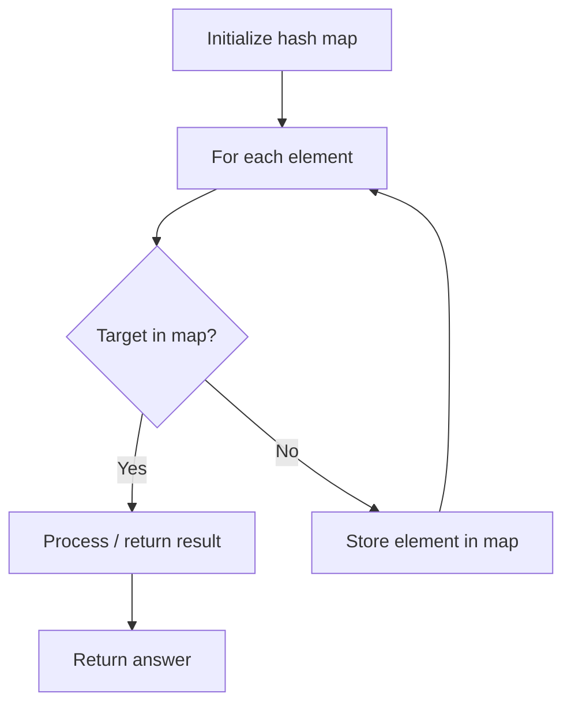

# Problem 1436: Destination City

**Difficulty:** Easy  
**Tags:** Array, Hash Table, String  
**Pattern:** Hash Map Lookup  
**Link:** [leetcode.com/problems/destination-city](https://leetcode.com/problems/destination-city/)

## Description

You are given the array `paths`, where `paths[i] = [cityAi, cityBi]` means there exists a direct path going from `cityAi` to `cityBi`. *Return the destination city, that is, the city without any path outgoing to another city.*

It is guaranteed that the graph of paths forms a line without any loop, therefore, there will be exactly one destination city.

 

Example 1:

```

**Input:** paths = [["London","New York"],["New York","Lima"],["Lima","Sao Paulo"]]
**Output:** "Sao Paulo" 
**Explanation:** Starting at "London" city you will reach "Sao Paulo" city which is the destination city. Your trip consist of: "London" -> "New York" -> "Lima" -> "Sao Paulo".

```

Example 2:

```

**Input:** paths = [["B","C"],["D","B"],["C","A"]]
**Output:** "A"
**Explanation:** All possible trips are: 
"D" -> "B" -> "C" -> "A". 
"B" -> "C" -> "A". 
"C" -> "A". 
"A". 
Clearly the destination city is "A".

```

Example 3:

```

**Input:** paths = [["A","Z"]]
**Output:** "Z"

```

 

**Constraints:**

	- `1 <= paths.length <= 100`
	- `paths[i].length == 2`
	- `1 <= cityAi.length, cityBi.length <= 10`
	- `cityAi != cityBi`
	- All strings consist of lowercase and uppercase English letters and the space character.

## Approach: Hash Map Lookup

Use a hash map (dictionary) to store elements for O(1) lookup. Iterate through the input, checking membership or counting frequencies in the map.

## Pseudocode

```
1. Initialize hash map
2. Iterate through elements:
   a. Check if target/complement exists in map
   b. If found: process result
   c. Otherwise: store element in map
3. Return result
```

## Algorithm Flow



## Complexity Analysis

- **Time:** O(n)
- **Space:** O(n)

## Solution (Python3)

```python
class Solution:
    def destCity(self, paths: List[List[str]]) -> str:
        # Hash map approach - O(n) time, O(n) space
        seen = {}
        for i, val in enumerate(paths):
            complement = paths - val
            if complement in seen:
                return [seen[complement], i]
            seen[val] = i
        return ""
```

## Solution (C++)

```cpp
#include <string>
#include <unordered_map>
#include <vector>
using namespace std;

class Solution {
public:
    string destCity(vector<vector<string>>& paths) {
        // Hash map approach - O(n) time, O(n) space
        unordered_map<int, int> seen;
        for (int i = 0; i < paths.size(); i++) {
            int complement = paths - paths[i];
            if (seen.count(complement)) {
                return {seen[complement], i};
            }
            seen[paths[i]] = i;
        }
        return "";
    }
};
```
