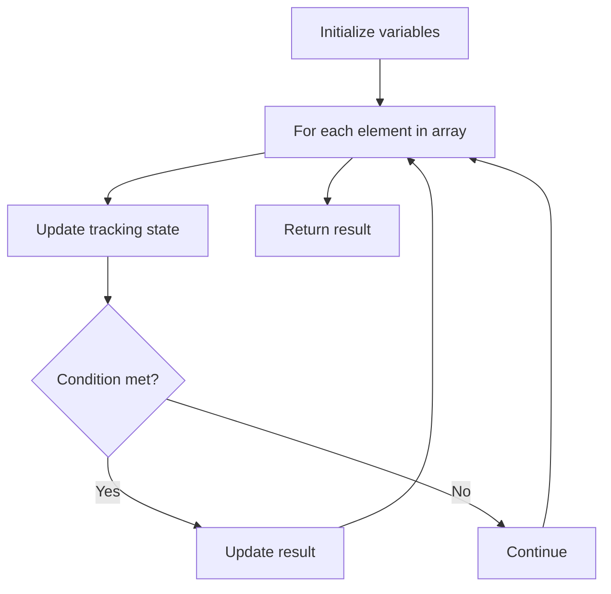

# Problem 1437: Check If All 1's Are at Least Length K Places Away

**Difficulty:** Easy  
**Tags:** Array  
**Pattern:** Array Processing  
**Link:** [leetcode.com/problems/check-if-all-1s-are-at-least-length-k-places-away](https://leetcode.com/problems/check-if-all-1s-are-at-least-length-k-places-away/)

## Description

Given an binary array `nums` and an integer `k`, return `true`* if all *`1`*'s are at least *`k`* places away from each other, otherwise return *`false`.

 

Example 1:

```

**Input:** nums = [1,0,0,0,1,0,0,1], k = 2
**Output:** true
**Explanation:** Each of the 1s are at least 2 places away from each other.

```

Example 2:

```

**Input:** nums = [1,0,0,1,0,1], k = 2
**Output:** false
**Explanation:** The second 1 and third 1 are only one apart from each other.

```

 

**Constraints:**

	- `1 <= nums.length <= 10^5`
	- `0 <= k <= nums.length`
	- `nums[i]` is `0` or `1`

## Approach: Array Processing

Process the array with a linear scan, tracking state variables. Look for patterns: running maximum/minimum, counting, or transformations.

## Pseudocode

```
1. Initialize tracking variables
2. Iterate through array:
   a. Update tracking state
   b. Check conditions
   c. Update result
3. Return result
```

## Algorithm Flow



## Complexity Analysis

- **Time:** O(n)
- **Space:** O(1)

## Solution (Python3)

```python
class Solution:
    def kLengthApart(self, nums: List[int], k: int) -> bool:
        # Array processing - O(n) time
        result = False
        for i in range(len(nums)):
            # Process element
            pass
        return result
```

## Solution (C++)

```cpp
#include <string>
#include <vector>
using namespace std;

class Solution {
public:
    bool kLengthApart(vector<int>& nums, int k) {
        // Array processing - O(n) time
        for (int i = 0; i < (int)nums.size(); i++) {
            // Process element
        }
        return false;
    }
};
```
