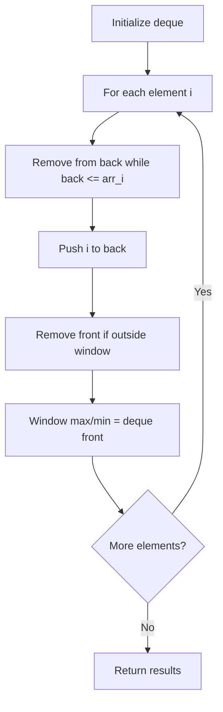

# Problem 1438: Longest Continuous Subarray With Absolute Diff Less Than or Equal to Limit

**Difficulty:** Medium  
**Tags:** Array, Queue, Sliding Window, Heap (Priority Queue), Ordered Set, Monotonic Queue  
**Pattern:** Monotonic Queue / Deque  
**Link:** [leetcode.com/problems/longest-continuous-subarray-with-absolute-diff-less-than-or-equal-to-limit](https://leetcode.com/problems/longest-continuous-subarray-with-absolute-diff-less-than-or-equal-to-limit/)

## Description

Given an array of integers `nums` and an integer `limit`, return the size of the longest **non-empty** subarray such that the absolute difference between any two elements of this subarray is less than or equal to `limit`*.*

 

Example 1:

```

**Input:** nums = [8,2,4,7], limit = 4
**Output:** 2 
**Explanation:** All subarrays are: 
[8] with maximum absolute diff |8-8| = 0 <= 4.
[8,2] with maximum absolute diff |8-2| = 6 > 4. 
[8,2,4] with maximum absolute diff |8-2| = 6 > 4.
[8,2,4,7] with maximum absolute diff |8-2| = 6 > 4.
[2] with maximum absolute diff |2-2| = 0 <= 4.
[2,4] with maximum absolute diff |2-4| = 2 <= 4.
[2,4,7] with maximum absolute diff |2-7| = 5 > 4.
[4] with maximum absolute diff |4-4| = 0 <= 4.
[4,7] with maximum absolute diff |4-7| = 3 <= 4.
[7] with maximum absolute diff |7-7| = 0 <= 4. 
Therefore, the size of the longest subarray is 2.

```

Example 2:

```

**Input:** nums = [10,1,2,4,7,2], limit = 5
**Output:** 4 
**Explanation:** The subarray [2,4,7,2] is the longest since the maximum absolute diff is |2-7| = 5 <= 5.

```

Example 3:

```

**Input:** nums = [4,2,2,2,4,4,2,2], limit = 0
**Output:** 3

```

 

**Constraints:**

	- `1 <= nums.length <= 10^5`
	- `1 <= nums[i] <= 10^9`
	- `0 <= limit <= 10^9`

## Approach: Monotonic Queue / Deque

Use a deque to maintain a monotonic window of elements. Remove from the back to maintain order, remove from the front when elements leave the window.

## Pseudocode

```
1. Initialize deque
2. For each element:
   a. Remove from back while deque back <= current
   b. Add current to back
   c. Remove from front if outside window
   d. Front of deque is the window max/min
3. Return results
```

## Algorithm Flow



## Complexity Analysis

- **Time:** O(n)
- **Space:** O(k)

## Solution (Python3)

```python
class Solution:
    def longestSubarray(self, nums: List[int], limit: int) -> int:
        # Monotonic deque - O(n) time
        from collections import deque
        dq = deque()  # store indices
        result = []
        k = limit if isinstance(limit, int) else 1
        for i in range(len(nums)):
            while dq and dq[0] < i - k + 1:
                dq.popleft()
            while dq and nums[dq[-1]] < nums[i]:
                dq.pop()
            dq.append(i)
            if i >= k - 1:
                result.append(nums[dq[0]])
        return result
```

## Solution (C++)

```cpp
#include <deque>
#include <string>
#include <vector>
using namespace std;

class Solution {
public:
    int longestSubarray(vector<int>& nums, int limit) {
        // Monotonic deque - O(n) time
        deque<int> dq;
        vector<int> result;
        int k = limit;
        for (int i = 0; i < (int)nums.size(); i++) {
            while (!dq.empty() && dq.front() < i - k + 1)
                dq.pop_front();
            while (!dq.empty() && nums[dq.back()] < nums[i])
                dq.pop_back();
            dq.push_back(i);
            if (i >= k - 1)
                result.push_back(nums[dq.front()]);
        }
        return result;
    }
};
```
